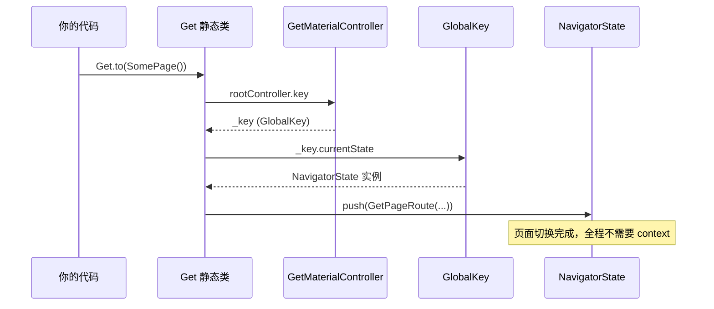
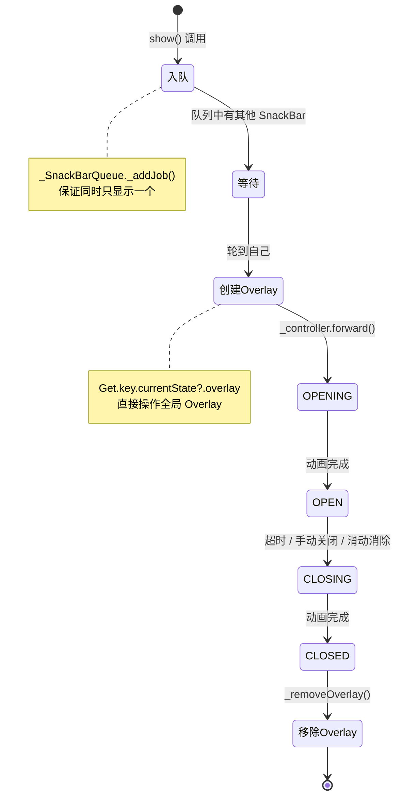
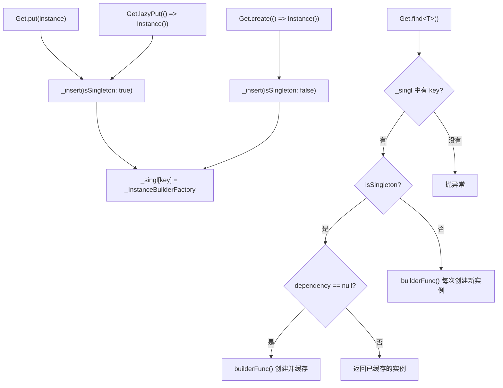
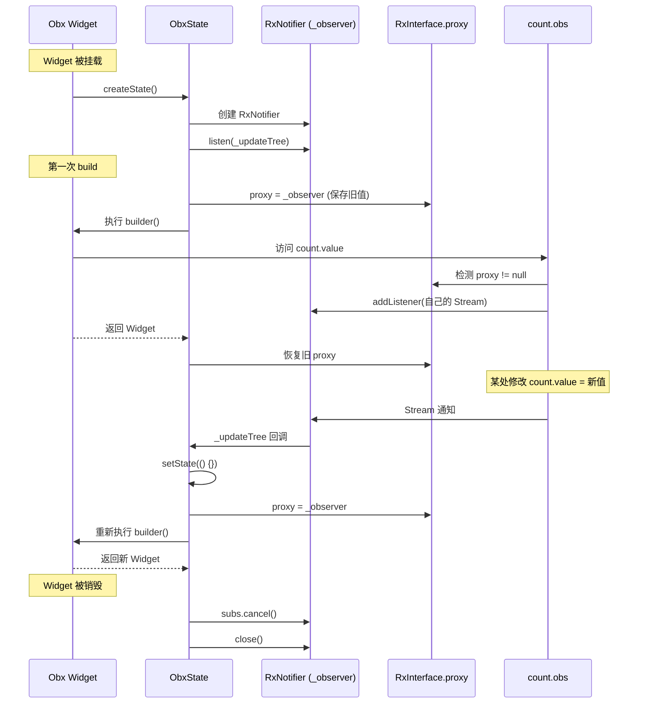
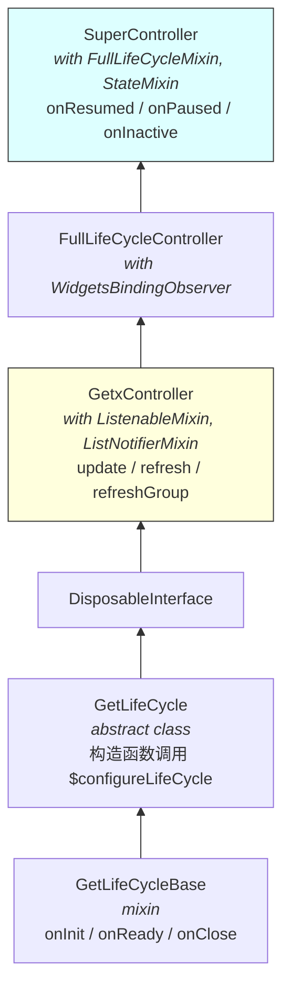
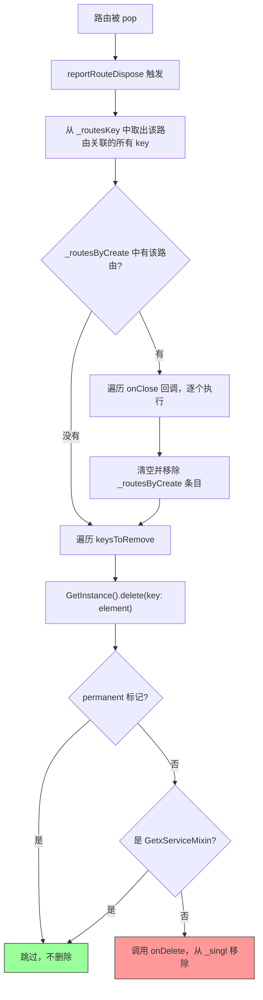
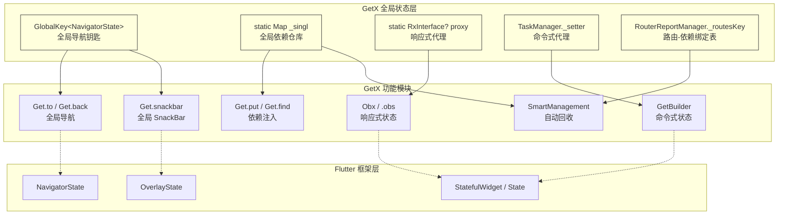

在武侠小说里，评价一门武功，不能只看招式好不好看，要看内功心法是否扎实。一套花拳绣腿可能观赏性极佳，但遇到真正的高手就不堪一击；一套朴实无华的基本功，反而能在实战中立于不败之地。

GetX 作为 Flutter 社区中下载量最高的第三方包之一，它的"招式"大家都见过——`Get.to()`、`.obs`、`Obx`、`Get.find()`。用起来确实行云流水。但它的"内功心法"是什么？它是怎么做到"不需要 context"的？这套心法有多深的功力，又有什么破绽？

这篇文章不吹不黑，从源码层面拆解 GetX 4.7.3 的五大核心模块。拆完之后，你自己判断这套功夫值不值得练。

---

#### 一、全局导航：花盆底下藏钥匙

Flutter 原生的导航需要 `context`，因为 `Navigator.of(context)` 要沿着 Widget 树向上找最近的 `NavigatorState`。就像你在一栋大楼里找物业办公室，得从你所在的楼层一层层问上去。

GetX 的思路完全不同：我不找了，我直接把物业办公室的电话号码贴在大楼门口，谁都能打。

---

##### 1. 钥匙藏在哪

```dart
---->[get_navigation/src/root/root_controller.dart#GetMaterialController]----
class GetMaterialController extends SuperController {
  var _key = GlobalKey<NavigatorState>(debugLabel: 'Key Created by default');

  Map<dynamic, GlobalKey<NavigatorState>> keys = {};

  GlobalKey<NavigatorState> get key => _key;
}
```

`GetMaterialController` 是一个单例控制器，应用启动时就创建好了。它持有一个 `GlobalKey<NavigatorState>`——这就是那把藏在花盆底下的钥匙。

停下来想想：`GlobalKey` 是什么？它是 Flutter 框架提供的一种全局唯一标识符，能跨越 Widget 树直接定位到某个 `State`。GetX 用它来直接拿到 `NavigatorState`，不需要沿着树去找。

---

##### 2. 钥匙怎么用

当你调用 `Get.to(SomePage())` 时，底层的调用链是这样的：



`GetMaterialApp` 启动时把这个 `GlobalKey` 传给了 `MaterialApp` 的 `navigatorKey` 参数。Flutter 框架创建 `NavigatorState` 时就和这个 key 绑定了，之后任何地方通过 `Get.key.currentState` 都能直接拿到它。

原理不复杂，就是提前把钥匙藏好，用的时候直接取。

---

##### 3. 这把钥匙的边界

花盆底下藏钥匙，进门确实方便了，不用每次翻口袋找（context）。但这个方案有两个硬伤：

**只有一把钥匙。** `_key` 是全局唯一的。如果你的应用有嵌套 Navigator——比如底部 Tab 导航，每个 Tab 内部还有自己的页面栈——这把钥匙只能开最外面那扇门。Flutter 原生的 `Navigator.of(context)` 能根据 context 的位置找到最近的 Navigator，GetX 做不到。

**钥匙和门必须配套。** 如果你不用 `GetMaterialApp` 而用原生的 `MaterialApp`，这把钥匙就没有被注册到门锁上，所有 `Get.to()` 都会失效。你的代码和 `GetMaterialApp` 产生了隐式耦合。

如果你的项目只有单层导航，这两个问题都不会暴露。但项目一旦复杂起来，嵌套路由是迟早的事。到那时候再迁移，成本就高了。

---

#### 二、全局 SnackBar：自己搭台唱戏

Flutter 原生的 SnackBar 通过 `ScaffoldMessenger.of(context)` 找到最近的 `Scaffold`，在它的 Overlay 上显示。就像你在商场里找服务台投诉，得先找到你所在楼层的服务台。

GetX 的做法是：我不找服务台了，我自己在商场大门口摆个摊，谁来都行。

---

##### 1. 舞台搭在哪

```dart
---->[get_navigation/src/snackbar/snackbar_controller.dart#_configureOverlay]----
void _configureOverlay() {
  _overlayState = Get.key.currentState?.overlay; // tag1
  _overlayEntries.clear();
  _overlayEntries.addAll(_createOverlayEntries(_getBodyWidget()));
  _overlayState!.insertAll(_overlayEntries); // tag2
  _configureSnackBarDisplay();
}
```

`tag1` 处通过全局 Navigator 的 key 拿到 `OverlayState`，`tag2` 处直接往 Overlay 里插入 `OverlayEntry`。整个过程不经过 `ScaffoldMessenger`，不依赖任何 `Scaffold`。

这意味着什么？在没有 `Scaffold` 的页面也能弹 SnackBar。听起来很自由，但也意味着 SnackBar 脱离了 Material Design 的管理体系。

---

##### 2. 队列管理：值得称赞的设计

这里要说句公道话，GetX 的 SnackBar 队列系统设计得不错：

```dart
---->[snackbar_controller.dart#_SnackBarQueue]----
class _SnackBarQueue {
  final _queue = GetQueue();
  final _snackbarList = <SnackbarController>[];

  Future<void> _addJob(SnackbarController job) async {
    _snackbarList.add(job);
    final data = await _queue.add(job._show);
    _snackbarList.remove(job);
    return data;
  }
}
```

多个 SnackBar 不会互相覆盖，而是排队依次显示。Flutter 早期版本的 `ScaffoldMessenger` 在这方面做得不好，多个 SnackBar 会堆叠在一起，体验很差。GetX 的队列方案确实更优雅，这是它在产品体验上的用心之处。

---

##### 3. 动画实现

SnackBar 的进出动画也是自己实现的，用 `AnimationController` + `AlignmentTween` 控制位置，用 `BackdropFilter` 实现模糊背景：

```dart
---->[snackbar_controller.dart#_createAnimationController]----
AnimationController _createAnimationController() {
  return AnimationController(
    duration: snackbar.animationDuration,
    debugLabel: '$runtimeType',
    vsync: _overlayState!, // Overlay 充当 TickerProvider
  );
}
```

动画的 `vsync` 直接用 `OverlayState` 提供。这段代码写得很规范，`AnimationController` 的创建和销毁都有对应的生命周期管理，不会出现"动画还在跑但 Widget 已经没了"的问题。

---

##### 4. SnackBar 的完整生命周期



---

##### 5. 利与弊

利：队列管理、自定义动画、不依赖 Scaffold（灵活性高）。

弊：脱离了 Material Design 的 SnackBar 规范。`ScaffoldMessenger` 会自动处理 SnackBar 和 `FloatingActionButton` 的位置关系、和路由切换的联动。GetX 的 SnackBar 是独立于路由的 Overlay，页面切走了 SnackBar 可能还挂在那里。就像你在 A 商场的服务台投诉，结果走到 B 商场了，投诉单还贴在 A 商场门口。

---

#### 三、依赖注入：一个全局大字典

Flutter 社区的依赖注入方案（`provider`、`Riverpod`）都是基于 Widget 树的——依赖挂在树上，子树通过 `context` 查找。就像公司的组织架构，你要找财务部，得沿着组织架构图往上找。

GetX 走了完全不同的路：我不要组织架构图了，我搞一个全公司的通讯录，按名字查就行。

---

##### 1. 通讯录长什么样

```dart
---->[get_instance/src/get_instance.dart#GetInstance]----
class GetInstance {
  factory GetInstance() => _getInstance ??= const GetInstance._();
  const GetInstance._();
  static GetInstance? _getInstance;

  static final Map<String, _InstanceBuilderFactory> _singl = {}; // tag1
}
```

`tag1` 处就是那本"通讯录"。所有通过 `Get.put()` 注册的实例，都存在这个静态 Map 里。key 是 `类型名 + tag` 的字符串拼接：

```dart
---->[get_instance/src/get_instance.dart#_getKey]----
String _getKey(Type type, String? name) {
  return name == null ? type.toString() : type.toString() + name;
}
```

给你三秒钟，想想这个 key 的设计有什么隐患。

答案：字符串拼接。`MyController` + `"home"` 和 `MyControllerh` + `"ome"` 理论上会产生相同的 key。虽然实际中几乎不会碰到，但这种设计在类型安全上是有缺口的。更重要的是，`tag` 是个字符串，拼错了编译器帮不了你，只能运行时报错。

---

##### 2. 存取过程

存：

```dart
---->[get_instance/src/get_instance.dart#put]----
S put<S>(S dependency, {String? tag, bool permanent = false}) {
  _insert(
    isSingleton: true,
    name: tag,
    permanent: permanent,
    builder: () => dependency,
  );
  return find<S>(tag: tag);
}
```

取：

```dart
---->[get_instance/src/get_instance.dart#find]----
S find<S>({String? tag}) {
  final key = _getKey(S, tag);
  if (isRegistered<S>(tag: tag)) {
    final dep = _singl[key];
    final i = _initDependencies<S>(name: tag);
    return i ?? dep.getDependency() as S;
  } else {
    throw '"$S" not found. You need to call "Get.put($S())"';
  }
}
```

整个过程非常直白：`put` 往 Map 里塞，`find` 从 Map 里取。没有树查找，没有 `InheritedWidget`，就是一个全局字典。

这种简单有它的好处——学习成本几乎为零。但简单也意味着没有结构。`provider` 的依赖挂在 Widget 树上，不同子树天然就是不同的作用域；GetX 的依赖全在一个 Map 里，两个页面想用同一个类型但不同实例的 ViewModel，只能靠 `tag` 字符串区分。

---

##### 3. 懒加载与工厂模式

`_InstanceBuilderFactory` 这个内部类设计得不错，它同时支持单例和工厂两种模式：

```dart
---->[get_instance/src/get_instance.dart#getDependency]----
S getDependency() {
  if (isSingleton!) {
    if (dependency == null) {
      dependency = builderFunc(); // 懒加载：第一次 find 时才创建
    }
    return dependency!;
  } else {
    return builderFunc(); // 工厂模式：每次 find 都创建新实例
  }
}
```



`Get.lazyPut()` 注册的是 builder 函数而不是实例，第一次 `find` 时才执行创建——就像你在通讯录里存的不是电话号码，而是"打 114 查号"的指令，需要的时候才真正去查。`Get.create()` 则是每次 `find` 都创建新实例。这个设计覆盖了大多数依赖注入的使用场景，实用性很强。

如果你现在对"单例"和"工厂"这两个模式还不太清楚，不用急。简单理解：单例是"全公司共用一台打印机"，工厂是"每个人领一台新的"。先知道有这两种模式就够了。

---

#### 四、响应式状态：最精巧的机器

如果说 GetX 的导航和依赖注入是"简单粗暴"，那它的响应式系统（`.obs` + `Obx`）是真正有技术含量的设计。这套机制有三层，我们从底往上看：`ListNotifierMixin` → `RxInterface.proxy` → `ObxState`。

就像拆一台精密手表，先看齿轮（底层通知），再看发条（依赖收集），最后看表盘（Widget 重建）。

---

##### 1. 底层齿轮：ListNotifierMixin

GetX 的所有状态通知都建立在 `ListNotifierMixin` 之上。它维护了两个数据结构：

```dart
---->[get_state_manager/src/simple/list_notifier.dart#ListNotifierMixin]----
mixin ListNotifierMixin on ListenableMixin {
  List<GetStateUpdate?>? _updaters = <GetStateUpdate?>[];  // tag1: 全局监听列表
  HashMap<Object?, List<GetStateUpdate>>? _updatersGroupIds =
      HashMap<Object?, List<GetStateUpdate>>();  // tag2: 分组监听列表
}
```

`tag1` 处的 `_updaters` 是一个回调列表，调用 `refresh()` 时遍历执行所有回调。`tag2` 处的 `_updatersGroupIds` 支持按 `id` 分组通知——这就是 `GetBuilder(id: 'myId')` 能实现局部更新的底层机制。

```dart
---->[list_notifier.dart#refresh]----
void refresh() {
  _notifyUpdate();
}

void _notifyUpdate() {
  for (var element in _updaters!) {
    element!();  // 遍历执行所有回调
  }
}
```

和 Flutter 的 `ChangeNotifier` 思路类似，区别在于 GetX 多了一个分组通知的能力。就像群发消息和定向私聊的区别——`refresh()` 是群发，`refreshGroup(id)` 是只发给某个群。

`GetxController` 的 `update()` 方法就是调用这里的 `refresh()` 或 `refreshGroup(id)`：

```dart
---->[get_controllers.dart#GetxController]----
abstract class GetxController extends DisposableInterface
    with ListenableMixin, ListNotifierMixin {
  void update([List<Object>? ids, bool condition = true]) {
    if (!condition) return;
    if (ids == null) {
      refresh();  // 通知所有监听者
    } else {
      for (final id in ids) {
        refreshGroup(id);  // 只通知指定 id 的监听者
      }
    }
  }
}
```

---

##### 2. 隐藏角色：TaskManager

`ListNotifierMixin` 中有一个容易被忽略的方法 `notifyChildrens()`：

```dart
---->[list_notifier.dart#notifyChildrens]----
void notifyChildrens() {
  TaskManager.instance.notify(_updaters);
}
```

`TaskManager` 是一个单例，它的作用是在 `GetBuilder` 的 build 过程中自动注册监听。这个设计很巧妙，值得细看：

```dart
---->[list_notifier.dart#TaskManager]----
class TaskManager {
  static TaskManager get instance => _instance ??= TaskManager._();
  GetStateUpdate? _setter;
  List<VoidCallback>? _remove;

  Widget exchange(
    List<VoidCallback> disposers,
    GetStateUpdate setState,
    Widget Function(BuildContext) builder,
    BuildContext context,
  ) {
    _remove = disposers;
    _setter = setState;       // tag3: 保存当前 GetBuilder 的 setState
    final result = builder(context);  // tag4: 执行 build
    _remove = null;
    _setter = null;           // tag5: 清理
    return result;
  }

  void notify(List<GetStateUpdate?>? updaters) {
    if (_setter != null) {
      if (!updaters!.contains(_setter)) {
        updaters.add(_setter);  // tag6: 把 setState 注册到 controller 的监听列表
        _remove!.add(() => updaters.remove(_setter));
      }
    }
  }
}
```

看到了吗？`tag3` 到 `tag5` 是一个经典的 save/restore 模式：在 build 期间设置一个全局变量（`_setter`），让 controller 的 getter 自动注册监听，build 完了再清理。

`TaskManager` 和后面要讲的 `RxInterface.proxy` 是同一个设计思路——区别是 `TaskManager` 服务于 `GetBuilder`（命令式更新），`RxInterface.proxy` 服务于 `Obx`（响应式更新）。两套机制并行存在，这也是 GetX 代码量比较大的原因之一。

---

##### 3. 发条：RxInterface.proxy 的自动依赖收集

这是 GetX 响应式系统的核心，也是最精巧的部分。

先看现象：你写了 `Obx(() => Text('${count.value}'))`，修改 `count.value` 之后，`Text` 自动重建了。问题是——框架怎么知道这个 `Obx` 依赖了 `count`？你没有显式声明过。

带着这个问题，看源码：

```dart
---->[get_rx/src/rx_types/rx_core/rx_interface.dart#RxInterface]----
abstract class RxInterface<T> {
  static RxInterface? proxy; // tag7: 全局静态代理

  static T notifyChildren<T>(RxNotifier observer, ValueGetter<T> builder) {
    final oldObserver = RxInterface.proxy; // tag8: 保存旧的
    RxInterface.proxy = observer;          // tag9: 设置新的
    final result = builder();              // tag10: 执行 build
    if (!observer.canUpdate) {
      RxInterface.proxy = oldObserver;
      throw """
      [Get] the improper use of a GetX has been detected...
      """;
    }
    RxInterface.proxy = oldObserver;       // tag11: 恢复旧的
    return result;
  }
}
```

`tag8` 到 `tag11` 又是一个 save/restore 模式。在 `builder()` 执行期间（`tag10`），任何 `.obs` 变量被访问时，它的 getter 会检测 `proxy` 是否存在，如果存在就把自己注册到 `proxy` 的监听列表中。

打个比方：你走进一家自助餐厅（`builder()` 开始执行），门口有个服务员拿着小本子（`proxy`）。你每拿一道菜（访问一个 `.obs` 变量），服务员就在本子上记一笔。等你吃完离开（`builder()` 执行完毕），服务员就知道你点了哪些菜。下次这些菜有更新，就通知你来重新取。

这里还有一个防御性设计值得注意：如果 builder 执行完后 `observer.canUpdate` 为 false（意味着没有任何 `.obs` 变量被访问），直接抛异常并给出清晰的错误提示。这说明作者考虑到了 `Obx` 被误用的场景——你用了 `Obx` 但里面没有任何响应式变量，框架会告诉你"你用错了"。

---

##### 4. 表盘：ObxState 的完整链路

把上面的齿轮和发条装起来，看 `Obx` Widget 的完整工作流程：

```dart
---->[rx_obx_widget.dart#ObxState]----
class ObxState extends State<ObxWidget> {
  final _observer = RxNotifier();       // tag12: 创建观察者
  late StreamSubscription subs;

  @override
  void initState() {
    super.initState();
    subs = _observer.listen(_updateTree, cancelOnError: false); // tag13: 订阅
  }

  void _updateTree(_) {
    if (mounted) {
      setState(() {});  // tag14: 收到通知时触发重建
    }
  }

  @override
  void dispose() {
    subs.cancel();      // tag15: 取消订阅
    _observer.close();  // tag16: 关闭观察者
    super.dispose();
  }

  @override
  Widget build(BuildContext context) =>
      RxInterface.notifyChildren(_observer, widget.build); // tag17: 设置 proxy 并执行 build
}
```

完整链路：



这个设计有几个值得注意的点：

- `mounted` 检查（`tag14`）：防止 Widget 已销毁后还调用 `setState`，这是正确的防御性编程
- `dispose` 中的清理（`tag15`、`tag16`）：订阅和观察者都有对应的清理逻辑，不会内存泄漏
- 嵌套 Obx 的处理：save/restore 机制确保内层 Obx 不会覆盖外层的 proxy

说实话，这套机制设计得相当精巧。如果你之前觉得 `.obs` + `Obx` 只是"语法糖"，看完源码应该会改观——它背后是一套完整的自动依赖收集和精准通知系统。

---

##### 5. 和 Flutter InheritedWidget 的对比

| 维度 | Flutter InheritedWidget | GetX .obs + Obx |
|------|------------------------|-----------------|
| 依赖收集方式 | 显式调用 `of(context)` | 隐式，build 时自动收集 |
| 存储位置 | 每个 Element 的 `_dependencies` Set | 全局静态 `proxy` + 各 Rx 变量的监听列表 |
| 通知机制 | `notifyClients` 遍历 `_dependents` | Stream 通知所有 listener |
| 作用域 | 树结构，天然支持局部覆盖 | 全局，无作用域概念 |
| 生命周期 | Element 销毁时自动清理 | 需要 `onClose` 或 SmartManagement |
| DevTools 可见性 | Widget Inspector 可见 | 不可见 |

两种方案各有取舍。GetX 的隐式收集确实更简洁，写起来爽。但代价是失去了树结构带来的作用域和自动清理能力。这不是谁好谁坏的问题，是你愿意用什么换什么的问题。

---

#### 五、生命周期管理：InternalFinalCallback 的巧思

在看 SmartManagement 之前，先看 GetX 的生命周期设计。这里有一个很有意思的技巧，值得单独拿出来聊。

---

##### 1. 防覆写的 InternalFinalCallback

```dart
---->[get_instance/src/lifecycle.dart#GetLifeCycleBase]----
class InternalFinalCallback<T> {
  ValueUpdater<T>? _callback;
  InternalFinalCallback({ValueUpdater<T>? callback}) : _callback = callback;
  T call() => _callback!.call();
}

mixin GetLifeCycleBase {
  final onStart = InternalFinalCallback<void>();  // tag1
  final onDelete = InternalFinalCallback<void>(); // tag2

  void onInit() {}
  void onReady() {}
  void onClose() {}

  bool _initialized = false;
  bool _isClosed = false;

  void _onStart() {
    if (_initialized) return;  // tag3: 防止重复初始化
    onInit();
    _initialized = true;
  }

  void _onDelete() {
    if (_isClosed) return;  // tag4: 防止重复销毁
    _isClosed = true;
    onClose();
  }

  void $configureLifeCycle() {
    _checkIfAlreadyConfigured();
    onStart._callback = _onStart;  // tag5: 绑定内部回调
    onDelete._callback = _onDelete;
  }
}
```

停下来想想 `tag1` 和 `tag2` 处的设计。`onStart` 和 `onDelete` 用 `final` 声明，类型是 `InternalFinalCallback` 而不是普通方法。这意味着子类无法覆写它们。

Dart 没有 `final method` 的概念，但通过把方法变成 `final` 字段，间接实现了"不可覆写"的效果。就像你家的保险箱，钥匙孔是焊死的，只能用配套的钥匙开，不能换锁。`onInit` 和 `onClose` 是给开发者覆写的"普通门"，但 `onStart` 和 `onDelete` 是框架内部的"保险箱门"，不应该被开发者意外覆写。

这个技巧很聪明，在语言层面保证了框架的调度入口不会被破坏。

`tag3` 和 `tag4` 处的防重复检查也很重要——防止 Controller 被多次初始化或多次销毁。这种防御性编程在框架代码中是必须的。

---

##### 2. GetxController 的继承链



`GetxController` 同时混入了 `ListNotifierMixin`（通知机制）和继承了 `DisposableInterface`（生命周期）。这就是为什么一个 `GetxController` 既能 `update()` 通知 Widget 重建，又有 `onInit` / `onClose` 生命周期回调——两套能力在继承链上合流了。

`FullLifeCycleController` 更进一步，混入了 `WidgetsBindingObserver`，可以监听应用的前后台切换：

```dart
---->[get_controllers.dart#FullLifeCycleMixin]----
mixin FullLifeCycleMixin on FullLifeCycleController {
  @override
  void onInit() {
    super.onInit();
    ambiguate(WidgetsBinding.instance)?.addObserver(this);
  }

  @override
  void onClose() {
    ambiguate(WidgetsBinding.instance)?.removeObserver(this);
    super.onClose();
  }

  @override
  void didChangeAppLifecycleState(AppLifecycleState state) {
    switch (state) {
      case AppLifecycleState.resumed: onResumed(); break;
      case AppLifecycleState.inactive: onInactive(); break;
      case AppLifecycleState.paused: onPaused(); break;
      case AppLifecycleState.detached: onDetached(); break;
      case AppLifecycleState.hidden: onHidden(); break;
    }
  }
}
```

这个设计让 Controller 可以感知应用的前后台状态。需要在后台暂停定时器、断开 WebSocket 连接的场景，用 `SuperController` 就能搞定，不需要自己去注册 `WidgetsBindingObserver`。实用性很强。

---

#### 六、SmartManagement：路由绑定的依赖回收

GetX 宣传的"智能内存管理"，底层实现在 `RouterReportManager` 中。这套机制的核心思路是：把依赖和路由绑定，路由退出时自动回收关联的依赖。

听起来很美好，但魔鬼在细节里。

---

##### 1. 路由和依赖的绑定

```dart
---->[get_navigation/src/router_report.dart#RouterReportManager]----
class RouterReportManager<T> {
  static final Map<Route?, List<String>> _routesKey = {};  // tag1: 路由 → 依赖 key 列表
  static final Map<Route?, HashSet<Function>> _routesByCreate = {};  // tag2: 路由 → onClose 回调列表
  static Route? _current;  // tag3: 当前路由

  static void reportCurrentRoute(Route newRoute) {
    _current = newRoute;
  }

  static void reportDependencyLinkedToRoute(String depedencyKey) {
    if (_current == null) return;
    if (_routesKey.containsKey(_current)) {
      _routesKey[_current!]!.add(depedencyKey);
    } else {
      _routesKey[_current] = <String>[depedencyKey];
    }
  }
}
```

当你在某个页面中调用 `Get.put(MyController())` 时，`_initDependencies` 方法会调用 `reportDependencyLinkedToRoute`，把这个 Controller 的 key 和当前路由绑定。就像你入住酒店，前台把你的房卡号和房间号关联起来，退房时一并回收。

---

##### 2. 路由退出时的清理



源码实现：

```dart
---->[router_report.dart#_removeDependencyByRoute]----
static void _removeDependencyByRoute(Route routeName) {
  final keysToRemove = <String>[];
  _routesKey[routeName]?.forEach(keysToRemove.add);  // tag4: 收集要删除的 key

  if (_routesByCreate.containsKey(routeName)) {
    for (final onClose in _routesByCreate[routeName]!) {
      onClose();  // tag5: 调用 onClose 回调
    }
    _routesByCreate[routeName]!.clear();
    _routesByCreate.remove(routeName);
  }

  for (final element in keysToRemove) {
    final value = GetInstance().delete(key: element);  // tag6: 从 _singl 中删除
    if (value) {
      _routesKey[routeName]?.remove(element);
    }
  }
}
```

路由被 dispose 时，`reportRouteDispose` 被调用，遍历该路由关联的所有依赖 key（`tag4`），逐个调用 `GetInstance().delete()`（`tag6`）从全局 Map 中移除。

---

##### 3. 边界条件：魔鬼在细节里

这套机制在"一个页面对应一组 Controller"的简单场景下工作得很好。但有几个边界条件，踩过坑的都懂：

**跨页面共享的 Controller。** 如果 ControllerA 在页面 A 中 `put`，页面 B 也在用它，页面 A 退出时 ControllerA 会被回收，页面 B 就崩了。解决方案是标记 `permanent: true`，但这又意味着永远不会被回收——从"自动管理"变成了"永不释放"。

**`_current` 的时序问题。** `_current` 是在路由切换时更新的。如果你在路由切换的过渡动画期间 `put` 一个 Controller，`_current` 可能还是旧路由，导致 Controller 被关联到错误的路由上。这种 bug 非常隐蔽，排查起来很头疼。

**`Get.create()` 的回调去重。** 通过 `_routesByCreate` 单独管理，用 `HashSet<Function>` 存储 `onClose` 回调。但 `Function` 的相等性比较在 Dart 中是基于引用的，如果同一个 Controller 被多次创建，回调可能重复执行。

相比之下，Flutter 的 `provider` 方案更简单：依赖挂在 Widget 树上，Widget 销毁时 `dispose` 自动调用。不需要猜测"这个 Controller 属于哪个路由"，因为它就挂在那个 Widget 上，Widget 没了它就没了。就像你把钥匙挂在自己脖子上，人走钥匙走，不需要什么"智能回收系统"。

---

#### 七、全貌：五个全局变量撑起一个框架

从源码层面看完 GetX 的五大核心模块，用一张图看全貌：



五个全局变量/静态字段，撑起了 GetX 的整个功能体系。这张图值得多看几眼。

---

##### 1. 统一的设计哲学

GetX 的所有模块都遵循同一个设计哲学：**用全局状态替代树查找**。导航用全局 GlobalKey，依赖注入用全局 HashMap，响应式用全局 proxy，SnackBar 用全局 Overlay。

这个哲学是一致的，不是东拼西凑的。你可以不认同这个方向，但不能说它没有设计。

---

##### 2. 代码质量

源码整体可读性不错，关键路径有注释，错误处理也比较完善。SnackBar 的队列管理和动画实现是工程质量较高的部分。依赖注入的 `_InstanceBuilderFactory` 设计也很实用。响应式系统的 proxy + save/restore 机制有真正的技术含量。

社区里有人说"GetX 源码写得很烂"——这话说得太笼统了。哪个模块烂？烂在哪里？你看过源码没有？人云亦云是技术成长最大的敌人。

---

##### 3. 状态管理的评价

GetX 的状态管理是整个框架中设计最用心的部分，没有之一。

响应式那套（`.obs` + `Obx`），proxy 的 save/restore 自动依赖收集，不需要你显式声明"我依赖了谁"，build 的时候访问了哪个变量就自动订阅哪个，写起来确实舒服。命令式那套（`GetBuilder` + `update()`），`TaskManager` 在 build 期间偷偷把 `setState` 注册进去，分组通知也比 `ChangeNotifier` 的全量通知更精细。两套机制并行，覆盖面很广。

但问题也在"两套并行"上。`Obx` 和 `GetBuilder` 是两套完全独立的通知链路，一个走 Stream，一个走回调列表。新手很容易搞混——用了 `.obs` 却套了 `GetBuilder`，或者用了 `update()` 却套了 `Obx`，结果 UI 不刷新，排查半天。一个框架里同时维护两套状态机制，心智负担不比 `provider` + `ChangeNotifier` 少多少。

另外，响应式变量是全局的，没有作用域隔离。`provider` 或 `Riverpod` 的状态挂在树上，不同子树天然隔离；GetX 的 `.obs` 变量挂在 Controller 上，Controller 挂在全局 Map 里。两个页面想用同一个类型但状态独立的 Controller，又得靠 `tag` 字符串——前面说过了，这条路走不远。

公道地说，如果你的项目状态结构简单、页面间共享状态不多，GetX 的状态管理体验是很好的。proxy 机制的设计水平放在整个 Flutter 社区的三方包里，也算得上精巧。只是当项目规模上来之后，"全局字典"的局限性会从状态管理这个口子最先暴露出来。

---

##### 4. 天花板在哪

全局方案的天花板是 `作用域`。当项目复杂到需要：

- 不同子树有不同的主题
- 不同 Tab 有独立的导航栈
- 同一类型的 ViewModel 在不同页面有不同实例
- 嵌套路由中精确控制依赖的生命周期

这些场景下，全局方案就会撞墙。Flutter 的树结构天然支持这些，因为每个节点都有自己的 context，查找是局部的。GetX 的全局方案把树拍平了，局部性也就没了。

就像一个小公司，老板一个人管所有事，效率很高。但公司长到 500 人的时候，还是一个人管所有事，那就是灾难。组织架构（树结构）存在的意义，就是在规模增长时提供局部自治的能力。

---

##### 4. 适用场景

如果你的项目满足以下条件，GetX 的设计是够用的：

- 单层导航，没有嵌套 Navigator
- 全局状态为主，很少需要局部作用域
- 团队规模小，约定大于规范
- 快速原型或中小型项目

如果你的项目有以下特征，建议认真评估：

- 复杂的导航结构（Tab + 嵌套页面栈）
- 大量需要局部作用域的状态
- 团队规模大，需要明确的依赖关系和可测试性
- 长期维护的商业项目

这不是在说 GetX 不好，是在说它有自己的适用边界。每个技术方案都有，没有例外。

---

#### 碎碎念

写这篇文章的过程中，我对 GetX 的看法有了一些变化。之前只看到它"绕过 context"的表象，觉得是在走捷径。读完源码之后发现，它的响应式系统（proxy + save/restore）确实有巧思，SnackBar 的队列管理也比 Flutter 早期的实现更好，`InternalFinalCallback` 的防覆写技巧也很聪明。

但工程决策上的问题也是实实在在的：全家桶的维护负担、全局方案的天花板、SmartManagement 的边界条件。这些不是代码写得好不好的问题，是架构选择的问题。

认识事物是一个过程。很多人在初学 Flutter 的时候觉得 GetX 好用得不得了，这很正常——因为那个阶段你的项目还没复杂到需要作用域隔离。也有人在项目踩坑之后一棍子把 GetX 打死，这也不对——你踩的坑可能是你自己没理解它的边界，而不是它本身有多差。

说到底，GetX 一切的"魔法"都建立在同一个东西上——全局的大字典。导航是字典里存了一把 GlobalKey，依赖注入是字典里存了实例，响应式是字典里存了一个 proxy，路由回收是字典里存了绑定关系。你把这本字典拿走，GetX 什么都不是。

Flutter 的 context 机制是一棵树，GetX 的机制是一本字典。树有层级、有作用域、有自动清理；字典只有 key-value，简单直接，但也只能简单直接。理解了这一点，GetX 的所有优势和所有局限，都不言自明了。

技术方案没有绝对的好坏，只有适不适合。了解它的内功心法，才能判断这套功夫适不适合你的战场。不要因为别人说好就觉得好，也不要因为别人说不好就觉得不好。自己去看源码，自己去验证。

---

我是张风捷特烈，如果你对 Flutter 框架的源码分析感兴趣，欢迎关注。这是「状态管理大乱斗」系列的第一篇，下一篇我们拆解 Bloc——看看事件驱动的状态机是怎么用 500 行代码做到极致简洁的。