### 大道至简 - Bloc 源码全面评析 | 状态管理源码评析②

##### 引言：

你去一家料理店，点了一份寿司。厨师不会问你"要不要加辣椒"、"要不要换成全麦饭"——菜单上写什么就做什么，流程清清楚楚。你说"一份三文鱼寿司"（事件），厨师按照固定流程处理（事件处理器），端出一盘寿司（新状态）。整个过程可预测、可追溯、不会出意外。

Bloc 的设计哲学就是这家料理店：**事件进，状态出，中间的过程严格可控。**

GetX 像路边摊，什么都能做，灵活但没规矩。Riverpod 像一家米其林餐厅，食材供应链精密复杂。Bloc 像一家标准化连锁店——流程固定、品控稳定、可复制性强。

这篇文章从源码层面拆解 Bloc 的核心实现。你会发现，Bloc 的源码量出奇地少——核心包只有 7 个文件，加起来不到 500 行有效代码。但这 500 行代码的设计密度非常高，每一行都有它存在的理由。

---

#### 一、BlocBase：Bloc 和 Cubit 的共同祖先

Bloc 库有两个核心类：`Bloc`（事件驱动）和 `Cubit`（方法驱动）。它们共享一个基类 `BlocBase`。

---

##### 1. 接口体系：层层递进

在看 `BlocBase` 之前，先看它实现的接口链。这个设计非常讲究：

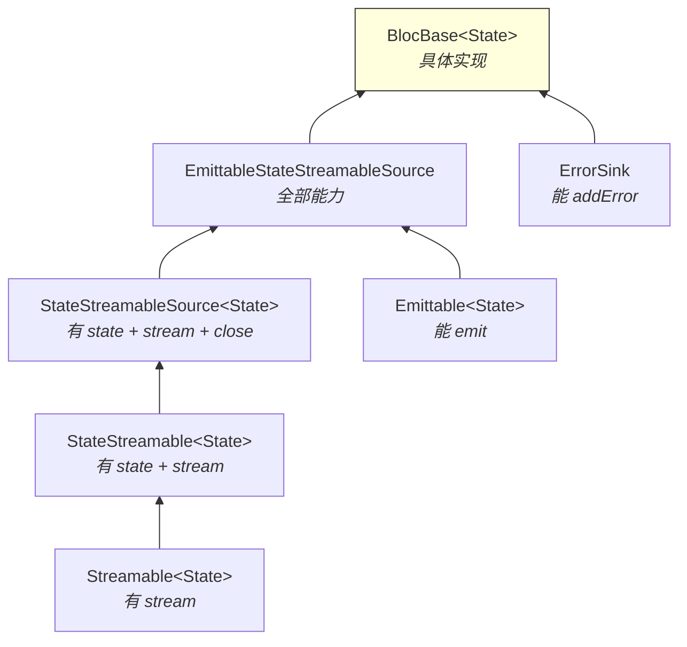

每个接口只定义一个能力：`Streamable` 只有 `stream`，`StateStreamable` 加了 `state`，`Closable` 加了 `close`，`Emittable` 加了 `emit`。最后 `BlocBase` 把所有能力组合在一起。

这是接口隔离原则（ISP）的教科书级实现。`BlocBuilder` 只需要 `StateStreamable`（能读 state 和 stream），不需要知道 `emit` 和 `close` 的存在。`BlocProvider` 需要 `StateStreamableSource`（还要能 close），但不需要 `emit`。每个消费者只依赖自己需要的最小接口。

如果你在自己的项目中设计过"一个类实现了太多功能，但不同的使用方只需要其中一部分"的问题，这个接口拆分方式值得学习。

---

##### 2. BlocBase 的核心实现

```dart
---->[packages/bloc/lib/src/bloc_base.dart#BlocBase]----
abstract class BlocBase<State>
    implements EmittableStateStreamableSource<State>, ErrorSink {

  BlocBase(this._state) {
    _blocObserver.onCreate(this);  // tag1: 创建时通知观察者
  }

  final _blocObserver = Bloc.observer;
  late final _stateController = StreamController<State>.broadcast(); // tag2

  State _state;
  bool _emitted = false;  // tag3: 是否已经 emit 过

  @override
  State get state => _state;

  @override
  Stream<State> get stream => _stateController.stream;

  @override
  bool get isClosed => _stateController.isClosed;
}
```

`tag2` 处用了 `StreamController.broadcast()`——广播流，允许多个监听者。这是 Bloc 的状态分发基础：多个 `BlocBuilder` 可以同时监听同一个 Bloc。

`tag3` 处的 `_emitted` 标志很有意思，下面 `emit` 方法会用到它。

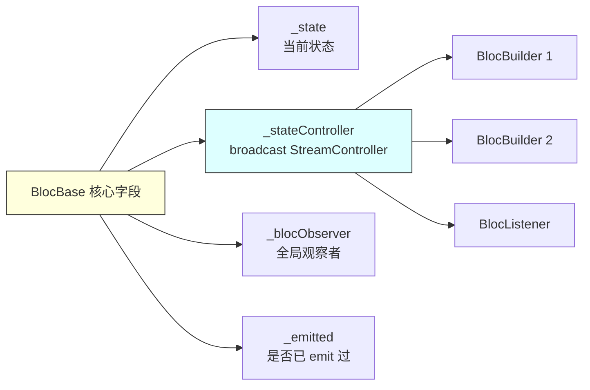

---

##### 3. emit：状态变更的唯一入口

```dart
---->[packages/bloc/lib/src/bloc_base.dart#BlocBase#emit]----
void emit(State state) {
  try {
    if (isClosed) {
      throw StateError('Cannot emit new states after calling close');  // tag4
    }
    if (state == _state && _emitted) return;  // tag5: 相同状态不重复 emit
    onChange(Change<State>(currentState: this.state, nextState: state));  // tag6
    _state = state;
    _stateController.add(_state);  // tag7: 通过 Stream 分发
    _emitted = true;
  } catch (error, stackTrace) {
    onError(error, stackTrace);
    rethrow;
  }
}
```

这个方法只有十几行，但信息密度很高：

`tag4`：关闭后不能 emit，直接抛异常。没有静默失败，错误暴露得越早越好。

`tag5`：**相同状态不重复 emit。** 但注意 `&& _emitted` 这个条件——第一次 emit 时即使和初始状态相同也会通过。这是为了允许"emit 初始状态"的场景（比如在 `onInit` 中确认初始状态）。

`tag6`：emit 之前先调用 `onChange`，通知观察者"状态要变了"。注意是在 `_state = state` 之前调用的——观察者看到的是变更前的快照。

`tag7`：通过 `StreamController.add` 把新状态推送给所有监听者。

停下来想想：为什么要用 `==` 比较来跳过相同状态？

因为 `BlocBuilder` 监听的是 Stream，每次 `add` 都会触发 Widget 重建。如果你在事件处理器中不小心 emit 了和当前相同的状态，没有这个检查的话 Widget 会白白重建一次。这是一个简单但有效的性能优化。

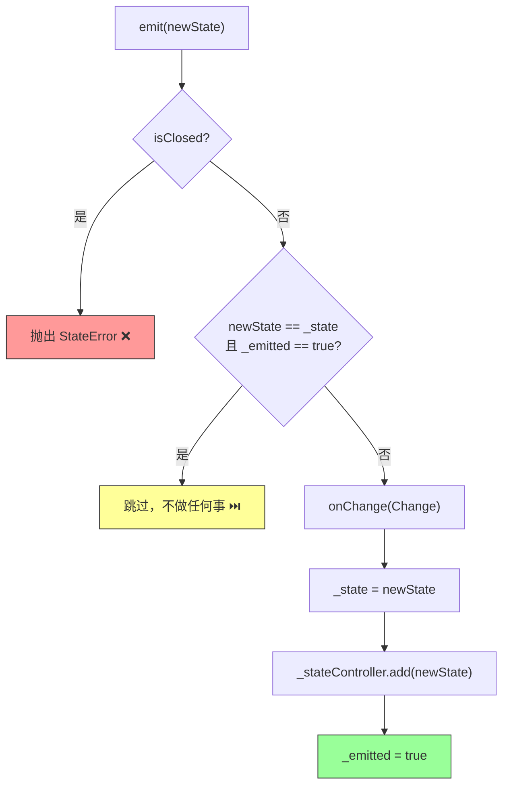

---

##### 4. Change 和 Transition：可追溯的状态变更

```dart
---->[packages/bloc/lib/src/change.dart#Change]----
class Change<State> {
  const Change({required this.currentState, required this.nextState});
  final State currentState;
  final State nextState;
}

---->[packages/bloc/lib/src/transition.dart#Transition]----
class Transition<Event, State> extends Change<State> {
  const Transition({
    required State currentState,
    required this.event,
    required State nextState,
  }) : super(currentState: currentState, nextState: nextState);

  final Event event;
}
```

`Change` 记录"从什么状态变到什么状态"，`Transition` 在此基础上多了"因为什么事件"。`Cubit` 产生 `Change`，`Bloc` 产生 `Transition`。

这两个类都是 `@immutable` 的，并且正确实现了 `==` 和 `hashCode`。这意味着你可以安全地比较两个 Transition 是否相同，也可以把它们存到 Set 或当 Map 的 key。

这个设计让 Bloc 的每一次状态变更都是可追溯的。配合 `BlocObserver`，你可以在一个地方看到整个应用的所有状态变更历史——这对调试和日志记录极其有用。

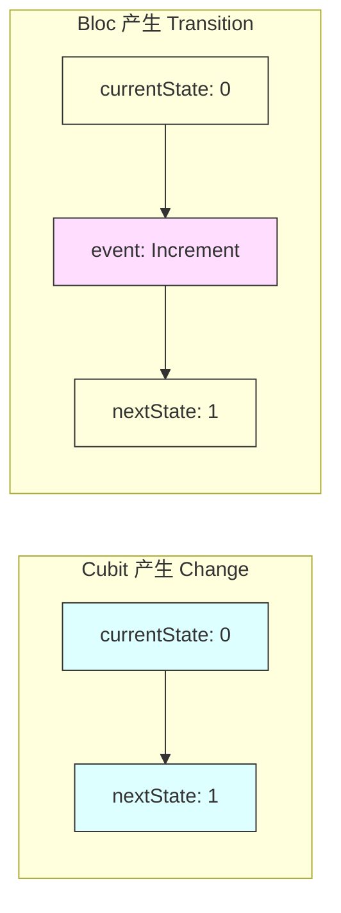

---

#### 二、Cubit：极简的状态管理

`Cubit` 是 Bloc 库中最简单的状态管理方案。它的源码只有一行有效代码：

```dart
---->[packages/bloc/lib/src/cubit.dart#Cubit]----
abstract class Cubit<State> extends BlocBase<State> {
  Cubit(State initialState) : super(initialState);
}
```

没了。真的就这么多。

`Cubit` 继承 `BlocBase`，不添加任何新功能。它的全部能力——`emit`、`state`、`stream`、`onChange`、`onError`、`close`——都来自 `BlocBase`。

---

##### 使用方式

```dart
---->[示例代码]----
class CounterCubit extends Cubit<int> {
  CounterCubit() : super(0);

  void increment() => emit(state + 1);  // 直接调用 emit
  void decrement() => emit(state - 1);
}
```

Cubit 的哲学是：你定义方法，方法里调用 `emit`，完事。没有事件、没有事件处理器、没有事件转换器。

如果你的状态变更逻辑很简单（"点击按钮，数字加一"），Cubit 就够了。引入 Bloc 的事件系统是过度设计。

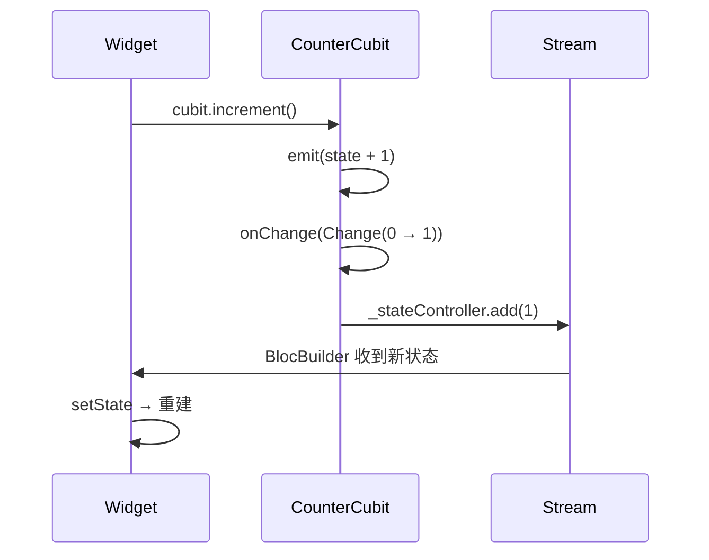

---

#### 三、Bloc：事件驱动的状态机

`Bloc` 在 `BlocBase` 的基础上加了一套完整的事件处理系统。这是 Bloc 库最核心、也是设计最精巧的部分。

---

##### 1. 事件的入口：add

```dart
---->[packages/bloc/lib/src/bloc.dart#Bloc#add]----
void add(Event event) {
  assert(() {
    final handlerExists = _handlers.any((handler) => handler.isType(event));
    if (!handlerExists) {
      final eventType = event.runtimeType;
      throw StateError(
        'add($eventType) was called without a registered event handler.\n'
        'Make sure to register a handler via on<$eventType>((event, emit) {...})',
      );
    }
    return true;
  }());
  try {
    onEvent(event);                // tag1: 通知观察者
    _eventController.add(event);   // tag2: 把事件推入 Stream
  } catch (error, stackTrace) {
    onError(error, stackTrace);
    rethrow;
  }
}
```

`tag1` 处先通知观察者"有事件进来了"，`tag2` 处把事件推入 `_eventController`——一个广播 StreamController。

注意 `assert` 块里的检查：如果你 `add` 了一个没有注册处理器的事件类型，debug 模式下直接抛异常，并且错误信息告诉你该怎么修。这种"错误信息即文档"的做法在 Bloc 源码中随处可见。

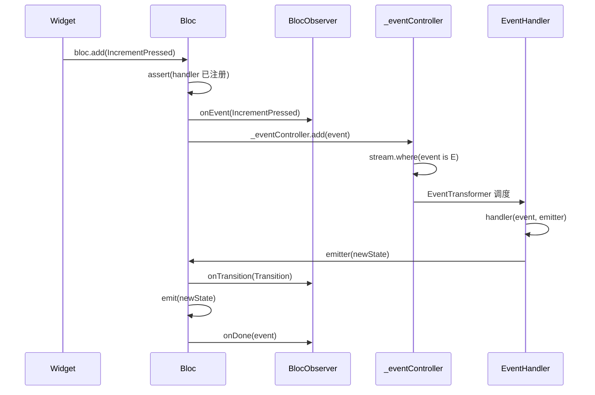

---

##### 2. 事件处理器的注册：on<E>

这是 Bloc 最核心的方法，也是设计最精巧的部分：

```dart
---->[packages/bloc/lib/src/bloc.dart#Bloc#on]----
void on<E extends Event>(
  EventHandler<E, State> handler, {
  EventTransformer<E>? transformer,
}) {
  assert(() {
    final handlerExists = _handlers.any((handler) => handler.type == E);
    if (handlerExists) {
      throw StateError(
        'on<$E> was called multiple times. '
        'There should only be a single event handler per event type.',
      );
    }
    _handlers.add(_Handler(isType: (dynamic e) => e is E, type: E));
    return true;
  }());

  final subscription = (transformer ?? _eventTransformer)(
    _eventController.stream.where((event) => event is E).cast<E>(), // tag3
    (dynamic event) {
      void onEmit(State state) {
        if (isClosed) return;
        if (this.state == state && _emitted) return;
        onTransition(
          Transition(currentState: this.state, event: event as E, nextState: state),
        );
        emit(state);
      }

      final emitter = _Emitter(onEmit);  // tag4: 创建 Emitter
      final controller = StreamController<E>.broadcast(
        sync: true,
        onCancel: emitter.cancel,
      );

      Future<void> handleEvent() async {
        void tearDown() {
          emitter.complete();
          _emitters.remove(emitter);
          if (!controller.isClosed) controller.close();
        }

        try {
          _emitters.add(emitter);
          await handler(event as E, emitter);  // tag5: 执行用户的处理函数
          onDone(event);
        } catch (error, stackTrace) {
          onError(error, stackTrace);
          onDone(event as E, error, stackTrace);
          rethrow;
        } finally {
          tearDown();  // tag6: 清理
        }
      }

      handleEvent();
      return controller.stream;
    },
  ).listen(null);
  _subscriptions.add(subscription);
}
```

这段代码信息量很大，一层层拆：

**tag3**：从全局事件流中过滤出类型为 `E` 的事件。`where` + `cast` 实现了类型安全的事件分发——每个 `on<E>` 只处理自己关心的事件类型。

**tag4**：为每个事件创建一个 `_Emitter` 实例。`_Emitter` 包装了 `emit` 方法，加了生命周期管理（是否已完成、是否已取消）。

**tag5**：执行用户定义的处理函数。注意这里用了 `await`——事件处理器可以是异步的。

**tag6**：无论成功还是失败，`finally` 块都会执行清理。`emitter.complete()` 标记这个 emitter 已完成，之后再调用 `emit` 会触发 assert 错误。

---

##### 3. Emitter：防止滥用的安全阀

```dart
---->[packages/bloc/lib/src/emitter.dart#_Emitter]----
class _Emitter<State> implements Emitter<State> {
  _Emitter(this._emit);

  final void Function(State state) _emit;
  final _completer = Completer<void>();
  final _disposables = <FutureOr<void> Function()>[];

  var _isCanceled = false;
  var _isCompleted = false;

  @override
  void call(State state) {
    assert(
      !_isCompleted,
      '''
emit was called after an event handler completed normally.
This is usually due to an unawaited future in an event handler.
Please make sure to await all asynchronous operations with event handlers
and use emit.isDone after asynchronous operations before calling emit() to
ensure the event handler has not completed.

  **BAD**
  on<Event>((event, emit) {
    future.whenComplete(() => emit(...));
  });

  **GOOD**
  on<Event>((event, emit) async {
    await future.whenComplete(() => emit(...));
  });
''',
    );
    if (!_isCanceled) _emit(state);
  }
}
```

这个 assert 信息写得非常好——不仅告诉你"出了什么错"，还告诉你"为什么会出这个错"和"怎么修"。这是 Bloc 源码中最值得学习的地方之一：**错误信息就是最好的文档。**

`_Emitter` 有三种状态：活跃、已完成、已取消。事件处理器正常结束后 emitter 被标记为 completed，之后再 emit 就会触发 assert。事件被取消（比如 `restartable` 策略下新事件到来）时 emitter 被标记为 canceled，emit 调用会被静默忽略。

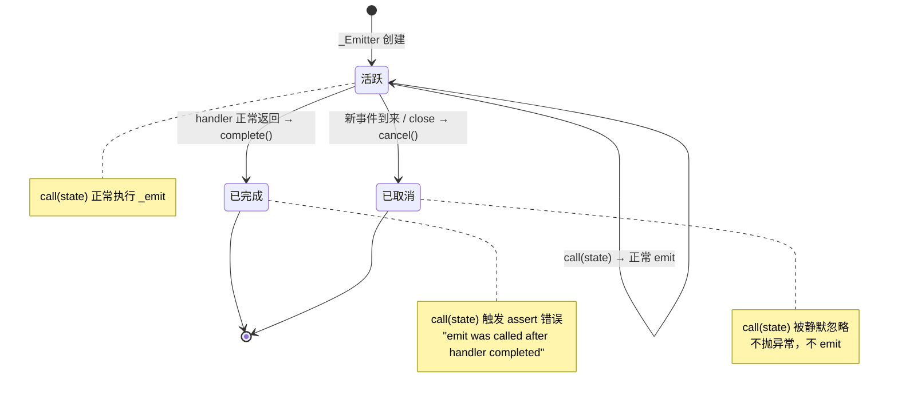

---

##### 4. EventTransformer：并发策略的抽象

```dart
---->[packages/bloc/lib/src/bloc.dart]----
typedef EventTransformer<Event> = Stream<Event> Function(
  Stream<Event> events,
  EventMapper<Event> mapper,
);
```

`EventTransformer` 是一个函数类型：接收事件流和映射函数，返回处理后的事件流。通过替换这个函数，你可以改变事件的处理策略。

`bloc_concurrency` 包提供了四种策略：

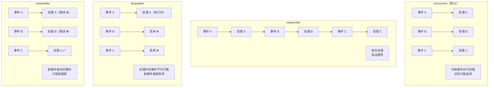

看看它们的源码实现：

```dart
---->[packages/bloc_concurrency/lib/src/sequential.dart]----
EventTransformer<Event> sequential<Event>() {
  return (events, mapper) => events.asyncExpand(mapper);
}

---->[packages/bloc_concurrency/lib/src/restartable.dart]----
EventTransformer<Event> restartable<Event>() {
  return (events, mapper) => events.switchMap(mapper);
}

---->[packages/bloc_concurrency/lib/src/concurrent.dart]----
EventTransformer<Event> concurrent<Event>() {
  return (events, mapper) => events.concurrentAsyncExpand(mapper);
}
```

每个策略只有一行代码！它们利用 Dart Stream 的操作符（`asyncExpand`、`switchMap`、`concurrentAsyncExpand`）来实现不同的并发行为。

这个设计的精妙之处在于：并发策略不是硬编码在 Bloc 内部的，而是通过 `EventTransformer` 这个抽象注入的。你甚至可以写自己的策略——比如"防抖"（debounce）、"节流"（throttle）、"批量处理"（buffer）。

给你三秒钟，想想搜索框的场景应该用哪个策略。

答案：`restartable`。用户每输入一个字符就触发搜索事件，`restartable` 会取消上一次搜索，只保留最新的。这样不会有多个搜索请求同时进行，也不会显示过期的搜索结果。

---

#### 四、BlocObserver：全局的监控摄像头

```dart
---->[packages/bloc/lib/src/bloc_observer.dart#BlocObserver]----
abstract class BlocObserver {
  const BlocObserver();

  void onCreate(BlocBase<dynamic> bloc) {}
  void onEvent(Bloc<dynamic, dynamic> bloc, Object? event) {}
  void onChange(BlocBase<dynamic> bloc, Change<dynamic> change) {}
  void onTransition(Bloc<dynamic, dynamic> bloc, Transition<dynamic, dynamic> transition) {}
  void onError(BlocBase<dynamic> bloc, Object error, StackTrace stackTrace) {}
  void onDone(Bloc<dynamic, dynamic> bloc, Object? event, [Object? error, StackTrace? stackTrace]) {}
  void onClose(BlocBase<dynamic> bloc) {}
}
```

`BlocObserver` 是一个全局的观察者，可以监听所有 Bloc/Cubit 的生命周期事件。通过 `Bloc.observer = MyObserver()` 设置。

七个回调覆盖了完整的生命周期：创建 → 事件 → 状态变更 → 事件处理完成 → 错误 → 关闭。

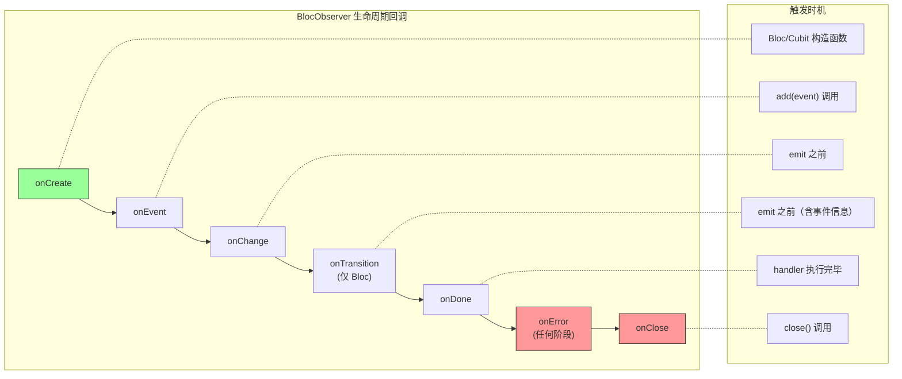

这个设计在实际项目中非常有用：

```dart
---->[示例代码]----
class AppBlocObserver extends BlocObserver {
  @override
  void onTransition(Bloc bloc, Transition transition) {
    super.onTransition(bloc, transition);
    log('${bloc.runtimeType}: ${transition.event} → ${transition.nextState}');
  }

  @override
  void onError(BlocBase bloc, Object error, StackTrace stackTrace) {
    super.onError(bloc, error, stackTrace);
    crashlytics.recordError(error, stackTrace);
  }
}
```

一个 Observer 就能实现全局日志和错误上报。不需要在每个 Bloc 里重复写。

Bloc 还提供了 `MultiBlocObserver`，支持注册多个观察者：

```dart
---->[packages/bloc/lib/src/bloc_observer.dart#MultiBlocObserver]----
class MultiBlocObserver implements BlocObserver {
  const MultiBlocObserver({required this.observers});
  final List<BlocObserver> observers;

  @override
  void onChange(BlocBase<dynamic> bloc, Change<dynamic> change) {
    for (final observer in observers) {
      observer.onChange(bloc, change);
    }
  }
  // ... 其他回调同理
}
```

日志归日志，错误上报归错误上报，性能监控归性能监控。职责分离，互不干扰。

---

#### 五、flutter_bloc：和 Widget 树的集成

Bloc 的核心包是纯 Dart 的，不依赖 Flutter。`flutter_bloc` 负责把 Bloc 接入 Widget 树。

---

##### 1. BlocProvider：基于 provider 的依赖注入

```dart
---->[packages/flutter_bloc/lib/src/bloc_provider.dart#BlocProvider]----
class BlocProvider<T extends StateStreamableSource<Object?>>
    extends SingleChildStatelessWidget {

  const BlocProvider({
    required T Function(BuildContext context) create,
    Key? key,
    this.child,
    this.lazy = true,
  }) : _create = create, _value = null;

  Widget buildWithChild(BuildContext context, Widget? child) {
    final value = _value;
    return value != null
        ? InheritedProvider<T>.value(
            value: value,
            startListening: _startListening,
            child: child,
          )
        : InheritedProvider<T>(
            create: _create,
            dispose: (_, bloc) => bloc.close(),  // tag1: 自动 close
            startListening: _startListening,
            child: child,
          );
  }

  static VoidCallback _startListening(
    InheritedContext<StateStreamable<dynamic>?> e,
    StateStreamable<dynamic> value,
  ) {
    final subscription = value.stream.listen(
      (dynamic _) => e.markNeedsNotifyDependents(),  // tag2: 状态变化时通知依赖者
    );
    return subscription.cancel;
  }
}
```

`BlocProvider` 底层用的是 `provider` 包的 `InheritedProvider`。这不是重新发明轮子——`provider` 已经把 InheritedWidget 的复杂性封装好了，`flutter_bloc` 直接复用。

`tag1` 处：`BlocProvider` 创建的 Bloc 会在 Widget 销毁时自动 `close`。你不需要手动管理 Bloc 的生命周期。

`tag2` 处：当 Bloc 的 stream 有新状态时，调用 `markNeedsNotifyDependents` 通知所有通过 `context.watch` 或 `context.select` 依赖这个 Bloc 的 Widget。

这个设计意味着 Bloc 的依赖注入完全基于 Widget 树——和 Flutter 的 `InheritedWidget` 机制一脉相承。不同子树可以有不同的 Bloc 实例，天然支持作用域隔离。

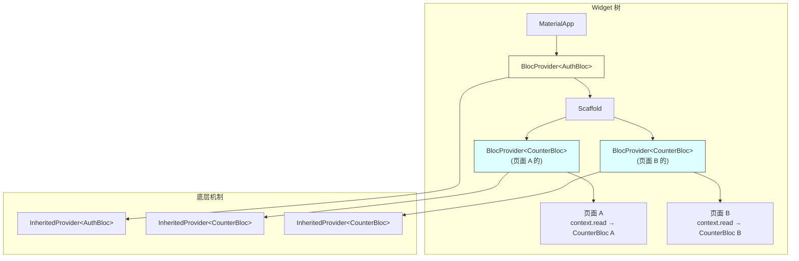

---

##### 2. BlocBuilder：状态驱动 UI

```dart
---->[packages/flutter_bloc/lib/src/bloc_builder.dart#_BlocBuilderBaseState]----
class _BlocBuilderBaseState<B extends StateStreamable<S>, S>
    extends State<BlocBuilderBase<B, S>> {
  late B _bloc;
  late S _state;

  @override
  Widget build(BuildContext context) {
    if (widget.bloc == null) {
      context.select<B, bool>((bloc) => identical(_bloc, bloc));  // tag3
    }
    return BlocListener<B, S>(
      bloc: _bloc,
      listenWhen: widget.buildWhen,
      listener: (context, state) => setState(() => _state = state),  // tag4
      child: widget.build(context, _state),
    );
  }
}
```

停下来想想 `tag3` 和 `tag4` 的设计。

`tag3`：用 `context.select` 监听 Bloc 的引用是否变化（不是状态变化）。如果父级的 `BlocProvider` 提供了一个新的 Bloc 实例，`BlocBuilder` 会重建。

`tag4`：`BlocBuilder` 内部其实是一个 `BlocListener`！状态变化时 listener 调用 `setState`，触发 Widget 重建。这是一个很聪明的复用——`BlocBuilder` = `BlocListener` + `setState`。

这也解释了为什么 `BlocBuilder` 的 `buildWhen` 和 `BlocListener` 的 `listenWhen` 是同一个类型——因为底层就是同一个机制。

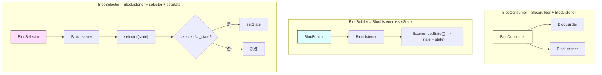

---

##### 3. BlocListener：副作用的正确姿势

```dart
---->[packages/flutter_bloc/lib/src/bloc_listener.dart#_BlocListenerBaseState]----
void _subscribe() {
  _subscription = _bloc.stream.listen((state) {
    if (!mounted) return;  // tag5: 防止 Widget 销毁后回调
    if (widget.listenWhen?.call(_previousState, state) ?? true) {
      widget.listener(context, state);  // tag6: 执行副作用
    }
    _previousState = state;
  });
}
```

`tag5` 处的 `mounted` 检查是必须的——Stream 的回调是异步的，可能在 Widget 销毁后才到达。

`tag6` 处执行用户定义的副作用。注意 `listener` 接收的是 `BuildContext`，所以你可以在里面做导航、弹对话框等需要 context 的操作。

`BlocListener` 和 `BlocBuilder` 的核心区别：`BlocListener` 不触发 Widget 重建，只执行回调。导航、SnackBar、对话框这些副作用应该用 `BlocListener`，不应该用 `BlocBuilder`。

---

##### 4. BlocSelector：精准重建

```dart
---->[packages/flutter_bloc/lib/src/bloc_selector.dart#_BlocSelectorState]----
@override
Widget build(BuildContext context) {
  return BlocListener<B, S>(
    bloc: _bloc,
    listener: (context, state) {
      final selectedState = widget.selector(state);
      if (_state != selectedState) setState(() => _state = selectedState);  // tag7
    },
    child: widget.builder(context, _state),
  );
}
```

`tag7` 处：先用 `selector` 提取关心的部分，然后用 `!=` 比较。只有提取出的值变了才 `setState`。

这和 Riverpod 的 `select` 是同一个思路，但实现方式不同：Riverpod 的 select 在 Provider 层做过滤，Bloc 的 BlocSelector 在 Widget 层做过滤。效果一样，都是减少不必要的重建。

---

#### 六、close：优雅的关闭流程

Bloc 的 `close` 方法值得单独拿出来看，因为它处理了异步关闭的复杂性：

```dart
---->[packages/bloc/lib/src/bloc.dart#Bloc#close]----
Future<void> close() async {
  await _eventController.close();           // tag1: 关闭事件流
  for (final emitter in _emitters) {
    emitter.cancel();                       // tag2: 取消所有进行中的 emitter
  }
  await Future.wait<void>(_emitters.map((e) => e.future));  // tag3: 等待所有 emitter 完成
  await Future.wait<void>(_subscriptions.map((s) => s.cancel()));  // tag4: 取消所有订阅
  return super.close();                     // tag5: 关闭状态流
}
```

关闭顺序很讲究：

1. `tag1`：先关闭事件流，不再接受新事件
2. `tag2`：取消所有正在处理的事件
3. `tag3`：等待所有 emitter 的 future 完成（确保清理逻辑执行完毕）
4. `tag4`：取消所有 Stream 订阅
5. `tag5`：最后关闭状态流

如果顺序反了——比如先关闭状态流再取消 emitter——正在处理的事件可能会尝试 emit 到一个已关闭的 StreamController，导致异常。

这种"先停止输入，再清理进行中的任务，最后关闭输出"的关闭模式，在任何涉及异步流的系统中都适用。

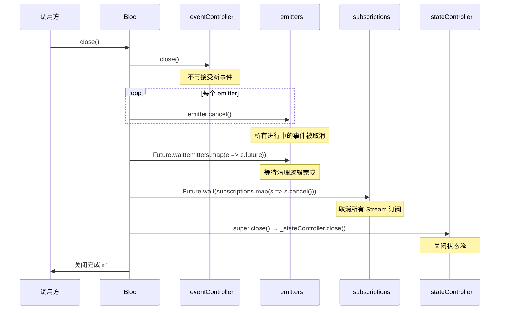

---

#### 七、源码中值得学习的设计模式

---

##### 1. 错误信息即文档

Bloc 的 assert 信息写得极其详细，不仅告诉你"出了什么错"，还给出"BAD"和"GOOD"的代码示例。这比"Invalid state"这种错误信息有用一万倍。

在你自己的项目中，每个 assert 和异常都应该回答三个问题：出了什么错？为什么会出这个错？怎么修？

---

##### 2. 接口隔离

`Streamable` → `StateStreamable` → `StateStreamableSource` 的接口链，让每个消费者只依赖自己需要的最小接口。`BlocBuilder` 不需要知道 `emit` 的存在，`BlocProvider` 不需要知道 `addError` 的存在。

---

##### 3. 策略模式（EventTransformer）

并发策略不是硬编码的，而是通过 `EventTransformer` 注入的。这让你可以在不修改 Bloc 源码的情况下改变事件处理行为。四种策略各一行代码，利用 Dart Stream 的操作符实现。

---

##### 4. 组合优于继承

`BlocBuilder` 内部复用了 `BlocListener`，而不是从一个公共基类继承。`BlocConsumer` 组合了 `BlocBuilder` 和 `BlocListener`。这种组合方式比继承更灵活，也更容易理解。

---

##### 5. 不可变的状态变更记录

`Change` 和 `Transition` 是不可变的值对象，正确实现了 `==` 和 `hashCode`。这让状态变更历史可以被安全地存储、比较和传递。

---

#### 八、Bloc vs GetX：两条相反的路

上一篇我们拆解了 GetX，这里做个对比。Bloc 和 GetX 的设计哲学几乎完全相反：

| 维度 | Bloc | Cubit | GetX |
|------|------|-------|------|
| 状态变更方式 | 事件驱动 | 方法调用 | 方法调用 / .obs |
| 可追溯性 | Transition 记录事件+状态 | Change 记录状态 | 无 |
| 并发控制 | EventTransformer 四种策略 | 无 | 无 |
| 依赖注入 | BlocProvider (InheritedWidget) | 同 Bloc | 全局 Map |
| 作用域 | Widget 树，天然隔离 | Widget 树 | 全局，无隔离 |
| 测试 | bloc_test 包，结构化 | 同 Bloc | 手动 |
| 源码量 | ~500 行 | 继承 BlocBase | ~数千行 |
| 学习曲线 | 中（事件概念） | 低 | 低 |

GetX 追求"最少的代码做最多的事"，Bloc 追求"最可预测的方式做该做的事"。GetX 的 API 更简洁，但缺乏约束；Bloc 的 API 更啰嗦，但每一步都有迹可循。

后面两篇我们还会拆解 Provider 和 Riverpod，到时候再做四方的完整对比。

---

##### 什么时候用 Bloc，什么时候用 Cubit

简单规则：

- **状态变更逻辑简单**（点击按钮改个数字）→ Cubit
- **需要追溯"因为什么事件导致了什么状态变更"** → Bloc
- **需要并发控制**（搜索防抖、请求去重）→ Bloc + EventTransformer
- **需要全局监控所有状态变更** → Bloc + BlocObserver

大多数场景下 Cubit 就够了。Bloc 的事件系统在复杂业务逻辑中才能体现价值——比如电商的下单流程、支付流程、多步骤表单。

---

#### 九、Bloc 的天花板在哪

---

##### 1. 样板代码

一个 Bloc 需要定义：事件基类、具体事件类、状态基类、具体状态类、Bloc 类。一个简单的功能可能需要 5 个类。Cubit 好一些，但状态类还是要定义。

`freezed` 包可以减少样板代码，但引入了代码生成的依赖。

---

##### 2. 没有内置的依赖追踪

Bloc 之间的依赖关系需要手动管理。如果 BlocA 依赖 BlocB 的状态，你需要在 BlocA 中手动监听 BlocB 的 stream。Riverpod 的 `ref.watch` 自动处理这个问题。

---

##### 3. 没有内置的异步状态封装

Riverpod 有 `AsyncValue`（loading/data/error），Bloc 没有。你需要自己定义 loading、success、failure 状态类。虽然不难，但每个 Bloc 都要写一遍。

---

##### 4. 事件类的膨胀

复杂的 Bloc 可能有十几个事件类型。事件类的定义和维护是一个实实在在的成本。Dart 3 的 sealed class 可以缓解这个问题，但不能消除。

---

#### 碎碎念

写完这篇，我对 Bloc 的评价可以用四个字概括：**大道至简**。

核心包只有 7 个文件、不到 500 行有效代码，但覆盖了状态管理的核心需求：状态变更、事件追溯、并发控制、全局监控、生命周期管理。没有花哨的功能，没有过度的抽象，每一行代码都有明确的目的。

和上一篇的 GetX 比，Bloc 走的是完全相反的路。GetX 用一本全局字典解决一切，简单粗暴；Bloc 用事件驱动的状态机，严谨可控。GetX 像路边摊，什么都能做；Bloc 像标准化连锁店，流程固定但品控稳定。

不要因为别人说"Bloc 太啰嗦"就不用它，也不要因为别人说"Bloc 是最佳实践"就无脑用它。自己去看源码，自己去判断。500 行代码，一个下午就能读完。读完之后，你自己就知道它适不适合你的项目了。

---

*我是张风捷特烈，如果你对 Flutter 框架的源码分析感兴趣，欢迎关注。这是「四大状态管理方案源码评析」系列的第二篇，下一篇我们拆解 Provider——看看 Flutter 官方推荐的方案是怎么把 InheritedWidget 封装成好用的 API 的。*