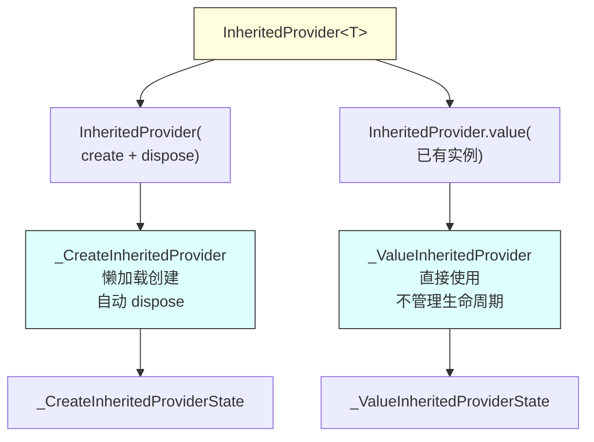
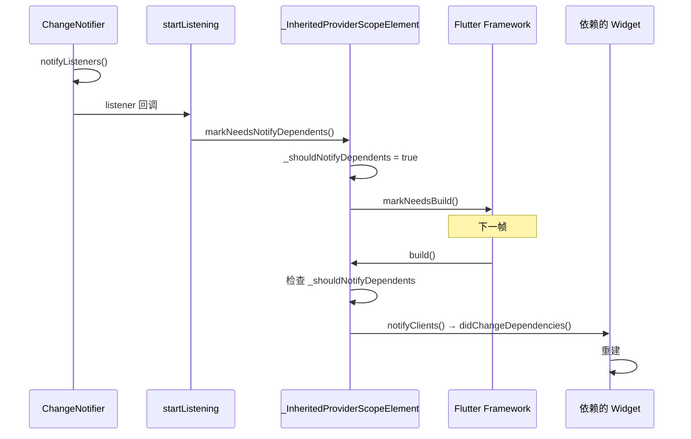
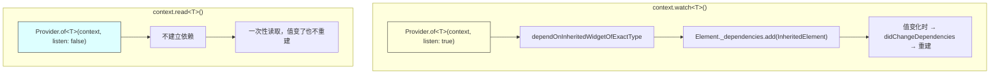
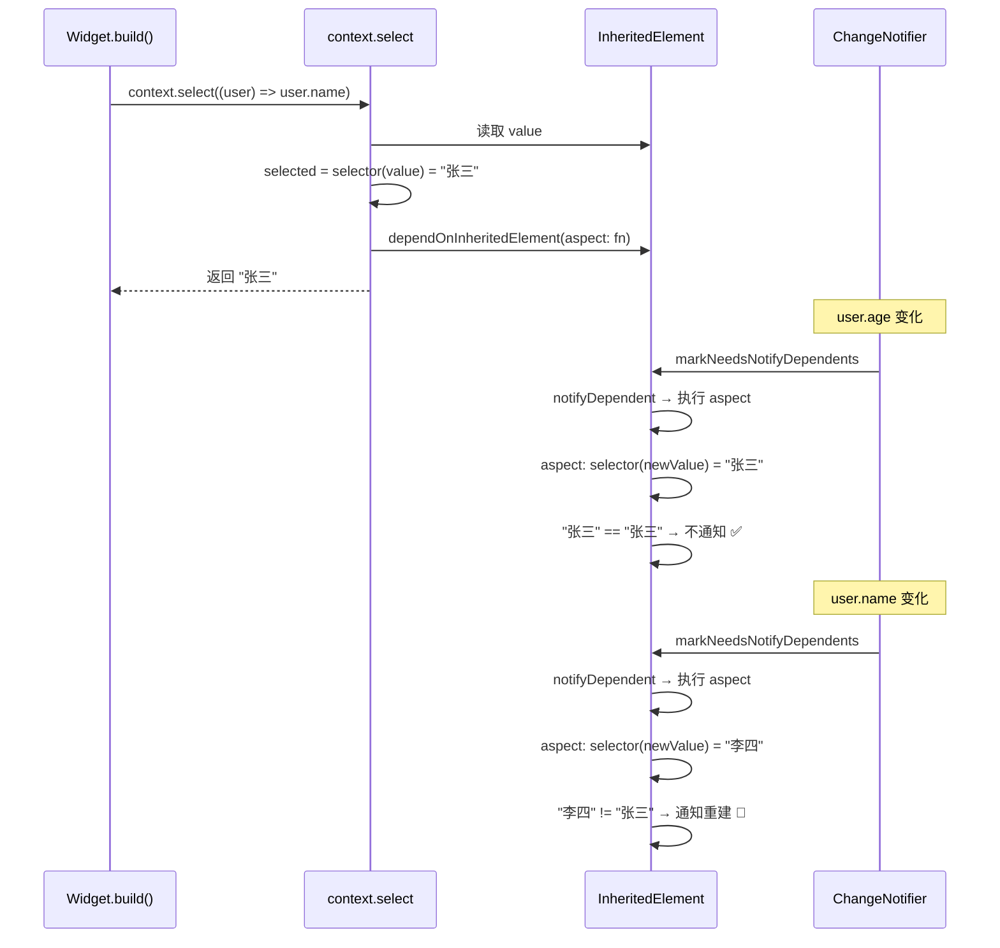
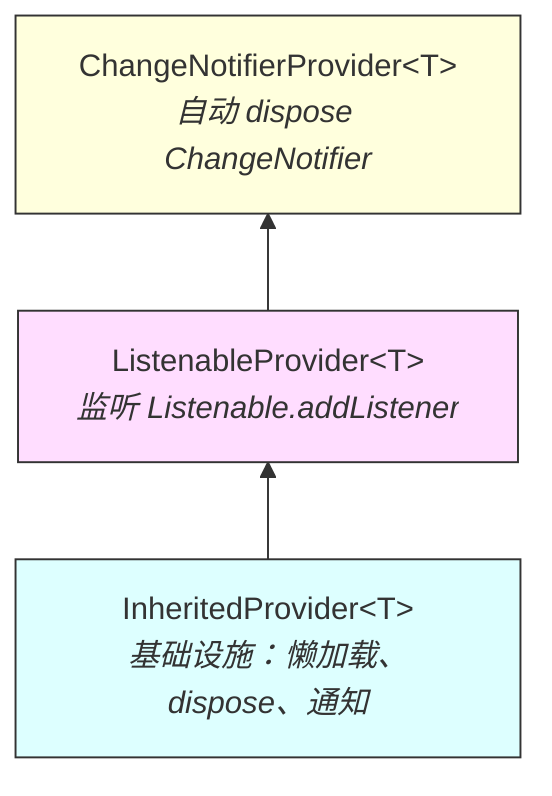
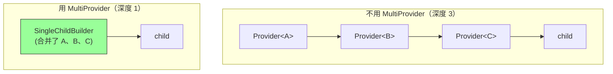
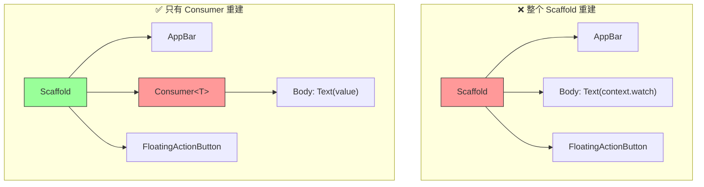
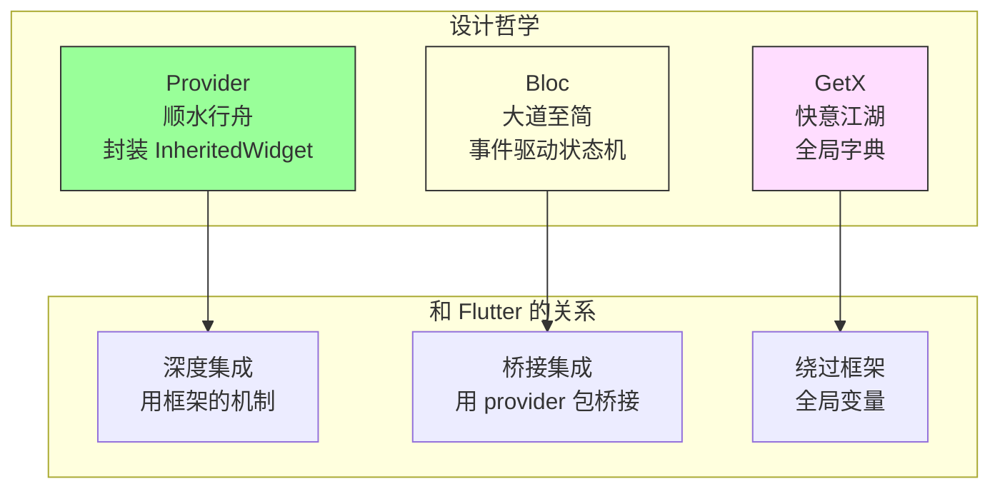

### 顺水行舟 - Provider 源码全面评析 | 状态管理源码评析③

##### 引言：

你家楼下有个快递驿站。你网购了东西，快递员送到驿站，你拿着取件码去取。驿站不生产任何商品，它只做一件事：帮你把东西从卖家那里"中转"到你手上。

Flutter 框架里也有这么一个"驿站"，叫 `InheritedWidget`。`Theme.of(context)` 能拿到主题、`MediaQuery.of(context)` 能拿到屏幕信息、`Navigator.of(context)` 能拿到导航器——靠的全是这个驿站机制。数据挂在 Widget 树上，子孙节点拿着"取件码"（context）去取。

但 `InheritedWidget` 用起来太麻烦了。你得自己写一个 `InheritedWidget` 子类、覆写 `updateShouldNotify`、处理 `createElement`、管理生命周期……写过一次你就不想写第二次。

Provider 做的事情，就是帮你把这个驿站装修好了。门面整洁、取件方便、还自带垃圾回收。你只管 `context.watch<T>()` 取件就行，背后的脏活累活 Provider 全包了。

这篇文章从源码层面拆解 Provider 的核心实现。看完之后你会发现，Provider 不是什么黑魔法——它就是 `InheritedWidget` 的一层精巧封装，但这层封装的设计密度非常高。

---

#### 一、InheritedProvider：一切的基石

Provider 包的所有 Provider 类型——`Provider`、`ChangeNotifierProvider`、`ListenableProvider`、`ProxyProvider`——都继承自同一个基类：`InheritedProvider`。就像一个家族企业，不管是卖水果的分店还是卖蔬菜的分店，背后都是同一个供应链系统。

理解了 `InheritedProvider`，就理解了整个 Provider 包。

---

##### 1. 两种创建模式

`InheritedProvider` 有两个构造函数，对应两种使用模式：

```dart
---->[packages/provider/lib/src/inherited_provider.dart#InheritedProvider]----
class InheritedProvider<T> extends SingleChildStatelessWidget {
  // 模式一：create + dispose（创建并管理生命周期）
  InheritedProvider({
    Create<T>? create,
    T Function(BuildContext context, T? value)? update,
    UpdateShouldNotify<T>? updateShouldNotify,
    StartListening<T>? startListening,
    Dispose<T>? dispose,
    bool? lazy,
    // ...
  }) : _delegate = _CreateInheritedProvider(/* ... */);

  // 模式二：value（暴露已有实例，不管理生命周期）
  InheritedProvider.value({
    required T value,
    UpdateShouldNotify<T>? updateShouldNotify,
    StartListening<T>? startListening,
    // ...
  }) : _delegate = _ValueInheritedProvider(/* ... */);
}
```



这两种模式的区别很重要，打个比方：

- `create` 模式：你开了一家店，店里的设备是你买的，关店时你负责处理。就像 `ChangeNotifierProvider(create: (_) => MyModel())`——Provider 创建了 MyModel，Widget 销毁时自动 `dispose`。
- `value` 模式：你租了一间店面，设备是房东的，你退租时不能把设备扔了。就像 `ChangeNotifierProvider.value(value: existingModel)`——Provider 只是传递一个已有的实例，不负责销毁。

社区里有人踩过这个坑：用 `ChangeNotifierProvider.value` 在 `build` 方法里创建新实例，结果每次 build 都创建一个新的 ChangeNotifier，旧的没人 dispose，内存泄漏。这就像每次开门都买一套新设备，旧的堆在角落没人管。正确做法是用 `create` 构造函数，让 Provider 管理生命周期。

新手朋友如果现在对这两种模式的区别还不太清楚，不用急。先记住一条规则：**新建对象用 `create`，传递已有对象用 `.value`**。后面踩坑的时候你会想起来的。

---

##### 2. _Delegate 模式：状态与 Widget 分离

`InheritedProvider` 内部用了一个 `_Delegate` + `_DelegateState` 的模式来管理状态。

停下来想想，这个设计是不是很眼熟？

```dart
---->[packages/provider/lib/src/inherited_provider.dart#_Delegate]----
abstract class _Delegate<T> {
  _DelegateState<T, _Delegate<T>> createState();
}

abstract class _DelegateState<T, D extends _Delegate<T>> {
  _InheritedProviderScopeElement<T?>? element;

  T get value;
  bool get hasValue;
  bool willUpdateDelegate(D newDelegate) => false;
  void dispose() {}
  void build({required bool isBuildFromExternalSources}) {}
}
```

没错，这就是 Flutter 的 `StatefulWidget` + `State` 模式的翻版！`_Delegate` 是不可变的配置（类似 Widget），`_DelegateState` 是可变的状态（类似 State）。Widget 重建时 `_Delegate` 可能换新的，但 `_DelegateState` 保持不变，通过 `willUpdateDelegate` 决定是否需要更新。

就像你搬家了（Widget 重建），但你的银行账户（State）还是那个，不会因为换了住址就清零。Provider 用这个模式保证了 Widget 重建时状态不丢失。

---

##### 3. _InheritedProviderScope：真正的 InheritedWidget

`InheritedProvider` 的 `buildWithChild` 方法返回的是一个 `_InheritedProviderScope`：

```dart
---->[packages/provider/lib/src/inherited_provider.dart#InheritedProvider#buildWithChild]----
Widget buildWithChild(BuildContext context, Widget? child) =>
    _buildWithChild(child);

Widget _buildWithChild(Widget? child, {Key? key}) {
  return _InheritedProviderScope<T?>(
    owner: this,
    child: builder != null
        ? Builder(builder: (context) => builder!(context, child))
        : child!,
  );
}
```

`_InheritedProviderScope` 才是真正的 `InheritedWidget`：

```dart
---->[packages/provider/lib/src/inherited_provider.dart#_InheritedProviderScope]----
class _InheritedProviderScope<T> extends InheritedWidget {
  final InheritedProvider<T> owner;

  @override
  bool updateShouldNotify(InheritedWidget oldWidget) {
    return false;  // tag1: 永远返回 false！
  }
}
```

`tag1` 处是一个关键设计：`updateShouldNotify` 永远返回 `false`。

给你三秒钟，想想为什么。

如果你的第一反应是"这不对吧，返回 false 不就永远不通知了吗"——恭喜你，说明你对 `InheritedWidget` 有基本认知。但 Provider 确实这么干了。

答案：Provider 不依赖 `InheritedWidget` 的默认通知机制来触发重建。它有自己的通知机制——通过 `markNeedsNotifyDependents` 手动触发。就像你不用等邮局送信（默认机制），你自己打电话通知（手动触发），更快更精确。这样 Provider 可以更精确地控制"什么时候通知"和"通知谁"。

---

##### 4. _InheritedProviderScopeElement：核心引擎

`_InheritedProviderScopeElement` 是整个 Provider 包最复杂的类，也是核心引擎。它继承自 `InheritedElement`，重写了依赖追踪和通知的关键方法：

```dart
---->[packages/provider/lib/src/inherited_provider.dart#_InheritedProviderScopeElement]----
class _InheritedProviderScopeElement<T> extends InheritedElement
    implements InheritedContext<T> {

  late final _DelegateState<T, _Delegate<T>> _delegateState =
      widget.owner._delegate.createState()..element = this;

  bool _shouldNotifyDependents = false;

  @override
  T get value => _delegateState.value;  // tag2: 懒加载

  @override
  void markNeedsNotifyDependents() {
    markNeedsBuild();                    // tag3: 标记需要重建
    _shouldNotifyDependents = true;      // tag4: 标记需要通知
  }
}
```

`tag2` 处的 `value` getter 是懒加载的——第一次访问时才创建值。这就是为什么 Provider 默认是 `lazy: true`。就像你点了外卖，不是下单就开始做，而是骑手到了餐厅才开始做——按需生产，不浪费。

`tag3` 和 `tag4` 处是通知机制的核心：`markNeedsNotifyDependents` 先调用 `markNeedsBuild` 让 Element 在下一帧重建，然后设置 `_shouldNotifyDependents` 标志。在 `build` 方法中检查这个标志，如果为 true 就调用 `notifyClients` 通知所有依赖者。

带着这个理解，看完整的通知链路：



---

##### 5. 懒加载的实现

```dart
---->[packages/provider/lib/src/inherited_provider.dart#_CreateInheritedProviderState]----
class _CreateInheritedProviderState<T>
    extends _DelegateState<T, _CreateInheritedProvider<T>> {
  bool _didInitValue = false;  // tag5: 是否已初始化
  T? _value;

  @override
  T get value {
    if (!_didInitValue) {
      _didInitValue = true;
      if (delegate.create != null) {
        _value = delegate.create!(element!);  // tag6: 第一次访问时创建
      }
      if (delegate.update != null) {
        _value = delegate.update!(element!, _value);  // tag7: update 可以基于旧值更新
      }
    }

    _removeListener ??= delegate.startListening?.call(element!, _value as T); // tag8: 开始监听
    return _value as T;
  }
}
```

`tag5` 和 `tag6` 实现了懒加载：`_didInitValue` 标志确保 `create` 只被调用一次，而且是在第一次读取 `value` 时才调用。

`tag7` 处的 `update` 回调是 `ProxyProvider` 的基础——它允许基于其他 Provider 的值来更新当前值。

`tag8` 处的 `startListening` 是 `ChangeNotifierProvider` 和 `ListenableProvider` 的基础——它在值第一次被读取时开始监听变化。

这三个回调（`create`、`update`、`startListening`）的组合，覆盖了 Provider 包所有变体的需求。就像乐高积木——零件就那么几种，但组合方式千变万化。

如果你现在觉得这些回调的关系有点绕，不要着急。后面看 `ChangeNotifierProvider` 和 `ProxyProvider` 的时候，你会看到它们是怎么组合这些回调的，到时候就清晰了。

---

#### 二、Provider.of 和 context 扩展：读取的三种姿势

Provider 提供了三种读取方式：`context.read`、`context.watch`、`context.select`。它们的底层都是 `Provider.of`，但行为完全不同。

就像去驿站取件：`read` 是"取完就走，以后有新快递别通知我"；`watch` 是"取完留个电话，以后有新快递通知我"；`select` 是"取完留个电话，但只有我要的那种快递到了才通知我"。

---

##### 1. Provider.of：一切读取的基础

```dart
---->[packages/provider/lib/src/provider.dart#Provider#of]----
static T of<T>(BuildContext context, {bool listen = true}) {
  final inheritedElement = _inheritedElementOf<T>(context);

  if (listen) {
    // tag1: listen=true 时建立依赖
    context.dependOnInheritedWidgetOfExactType<_InheritedProviderScope<T?>>();
  }

  final value = inheritedElement?.value;
  return value as T;
}
```

`tag1` 处是关键：当 `listen: true` 时，调用 `dependOnInheritedWidgetOfExactType`，这是 Flutter 框架的原生 API，它会在当前 Element 和 InheritedElement 之间建立依赖关系。之后 InheritedElement 变化时，当前 Element 会被通知重建。

`listen: false` 时不建立依赖，只是一次性读取。



---

##### 2. context.read 和 context.watch

```dart
---->[packages/provider/lib/src/provider.dart#ReadContext]----
extension ReadContext on BuildContext {
  T read<T>() {
    return Provider.of<T>(this, listen: false);
  }
}

extension WatchContext on BuildContext {
  T watch<T>() {
    return Provider.of<T>(this);  // listen 默认 true
  }
}
```

就这么简单。`read` = `Provider.of(listen: false)`，`watch` = `Provider.of(listen: true)`。一行代码的事。

但 `read` 有一个重要的使用限制：**不能在 `build` 方法中使用**。源码中有 assert 检查：

```dart
assert(
  context.owner!.debugBuilding || listen == false || debugIsInInheritedProviderUpdate,
  'Tried to listen to a value exposed with provider, from outside of the widget tree...',
);
```

为什么？因为在 `build` 方法中用 `read` 意味着"我读了这个值但不关心它的变化"。如果值变了，UI 不会更新，用户看到的是过期数据。这几乎总是一个 bug。Provider 在 debug 模式下帮你拦住了。

很多人说"Provider 限制太多"——这不是限制，是护栏。悬崖边上的护栏不是限制你的自由，是防止你掉下去。

---

##### 3. context.select：精准重建

`context.select` 是 Provider 包中设计最精巧的 API：

```dart
---->[packages/provider/lib/src/inherited_provider.dart#SelectContext#select]----
R select<T, R>(R Function(T value) selector) {
  final inheritedElement = Provider._inheritedElementOf<T>(this);

  final value = inheritedElement?.value;
  final selected = selector(value);  // tag2: 执行 selector

  if (inheritedElement != null) {
    dependOnInheritedElement(
      inheritedElement,
      aspect: (T? newValue) {  // tag3: 注册 aspect
        return !const DeepCollectionEquality()
            .equals(selector(newValue), selected);  // tag4: 比较
      },
    );
  }
  return selected;
}
```

`tag2` 处执行 selector 函数，提取出关心的部分。`tag3` 处把一个 `aspect` 函数注册到 InheritedElement 上。`tag4` 处在值变化时，用 `DeepCollectionEquality` 比较 selector 的新旧结果。

这里用了 Flutter 框架的 `aspect` 机制——和 `InheritedModel` 是同一个底层 API。`dependOnInheritedElement` 的 `aspect` 参数允许你注册一个"切面"，只有当切面判断"需要更新"时才通知依赖者。



注意 `tag4` 处用的是 `DeepCollectionEquality` 而不是 `==`。这意味着即使 selector 返回的是一个新的 List 或 Map 实例，只要内容相同就不会触发重建。

打个比方：你订了一份报纸，你只看体育版。报社每天都印新报纸（新的 List 实例），但如果体育版内容没变，你就不需要重新阅读。`DeepCollectionEquality` 做的就是"翻开报纸看看内容变没变"，而不是"看看是不是同一份报纸"。

这比 Riverpod 的 `select`（用 `==`）更宽容，但也有性能开销——深度比较在大集合上可能很慢。大多数场景下不是问题，但如果你的 selector 返回一个包含几千个元素的 List，就要注意了。

---

##### 4. notifyDependent：精准通知的实现

```dart
---->[packages/provider/lib/src/inherited_provider.dart#_InheritedProviderScopeElement#notifyDependent]----
void notifyDependent(InheritedWidget oldWidget, Element dependent) {
  final dependencies = getDependencies(dependent);

  var shouldNotify = false;
  if (dependencies != null) {
    if (dependencies is _Dependency<T>) {
      if (dependent.dirty) return;  // tag5: 已经 dirty 了就不用再通知

      for (final updateShouldNotify in dependencies.selectors) {
        shouldNotify = updateShouldNotify(value);  // tag6: 逐个检查 selector
        if (shouldNotify) break;
      }
    } else {
      shouldNotify = true;  // tag7: 没有 selector，全量通知
    }
  }

  if (shouldNotify) {
    dependent.didChangeDependencies();  // tag8: 触发重建
  }
}
```

`tag5` 处有一个优化：如果 dependent 已经被标记为 dirty（比如因为其他原因需要重建），就跳过 selector 检查。反正都要重建了，没必要再执行 selector。

`tag6` 处遍历所有注册的 selector，只要有一个返回 true 就通知重建。

`tag7` 处：如果 Widget 用的是 `context.watch`（没有 selector），dependencies 不是 `_Dependency` 类型，直接全量通知。

这就是 `context.watch` 和 `context.select` 的底层区别：`watch` 注册的是"全量依赖"，任何变化都通知；`select` 注册的是"切面依赖"，只有 selector 结果变了才通知。

---

#### 三、ChangeNotifierProvider：最常用的变体

`ChangeNotifierProvider` 是 Provider 包中使用频率最高的类型。如果你用过 Provider，十有八九用的就是它。它的继承链很清晰：



---

##### 1. ListenableProvider：监听的桥梁

```dart
---->[packages/provider/lib/src/listenable_provider.dart#ListenableProvider]----
class ListenableProvider<T extends Listenable?> extends InheritedProvider<T> {
  ListenableProvider({
    required Create<T> create,
    Dispose<T>? dispose,
    // ...
  }) : super(
          startListening: _startListening,  // tag1: 注入监听逻辑
          create: create,
          dispose: dispose,
        );

  static VoidCallback _startListening(
    InheritedContext<Listenable?> e,
    Listenable? value,
  ) {
    value?.addListener(e.markNeedsNotifyDependents);  // tag2: 监听变化
    return () => value?.removeListener(e.markNeedsNotifyDependents);  // tag3: 返回取消函数
  }
}
```

`tag1` 处把 `_startListening` 注入到 `InheritedProvider` 中。回看上面 `_CreateInheritedProviderState.value` 的 `tag8`，`startListening` 在值第一次被读取时调用。

`tag2` 处是核心：把 `markNeedsNotifyDependents` 作为 listener 注册到 `Listenable` 上。当 `ChangeNotifier.notifyListeners()` 被调用时，`markNeedsNotifyDependents` 被触发，进而通知所有依赖的 Widget 重建。

`tag3` 处返回一个取消函数，在 Provider 销毁或值变化时调用，防止内存泄漏。

就这三行代码，把 `ChangeNotifier` 的变化通知和 `InheritedWidget` 的依赖追踪连接起来了。就像一根电话线，一头接在 ChangeNotifier 上（"我变了！"），另一头接在 InheritedElement 上（"收到，通知大家！"）。

如果你之前觉得 Provider 是什么复杂的黑魔法，看到这里应该释然了——核心机制就是 `addListener` + `markNeedsNotifyDependents`，没有之一。

---

##### 2. ChangeNotifierProvider：自动 dispose

```dart
---->[packages/provider/lib/src/change_notifier_provider.dart#ChangeNotifierProvider]----
class ChangeNotifierProvider<T extends ChangeNotifier?>
    extends ListenableProvider<T> {
  ChangeNotifierProvider({
    required Create<T> create,
    // ...
  }) : super(
          create: create,
          dispose: _dispose,  // tag4: 自动 dispose
        );

  static void _dispose(BuildContext context, ChangeNotifier? notifier) {
    notifier?.dispose();  // tag5: 调用 ChangeNotifier.dispose()
  }
}
```

`ChangeNotifierProvider` 在 `ListenableProvider` 的基础上只加了一件事：`tag4` 和 `tag5` 处自动调用 `ChangeNotifier.dispose()`。

整个继承链的分工：
- `InheritedProvider`：懒加载、生命周期管理、通知基础设施
- `ListenableProvider`：把 `Listenable.addListener` 接入通知系统
- `ChangeNotifierProvider`：自动 `dispose`

每一层只做一件事，职责清晰。这就是好的继承设计——不是把所有功能塞在一个类里，而是每一层加一个能力，像叠积木一样往上搭。

---

#### 四、ProxyProvider：依赖其他 Provider 的 Provider

`ProxyProvider` 解决的问题是：一个 Provider 的值依赖另一个 Provider 的值。就像做菜——你的红烧肉（ProxyProvider）需要酱油（Provider A）和糖（Provider B），酱油或糖换了牌子，红烧肉的味道也得跟着变。

---

##### 1. 核心机制：update 回调

```dart
---->[packages/provider/lib/src/proxy_provider.dart#ProxyProvider]----
class ProxyProvider<T, R> extends ProxyProvider0<R> {
  ProxyProvider({
    Create<R>? create,
    required ProxyProviderBuilder<T, R> update,
    // ...
  }) : super(
          create: create,
          update: (context, value) => update(
            context,
            Provider.of(context),  // tag1: 读取依赖的 Provider
            value,                 // tag2: 传入旧值
          ),
        );
}
```

`tag1` 处通过 `Provider.of(context)` 读取依赖的 Provider。因为这里 `listen` 默认为 `true`，所以当依赖的 Provider 变化时，`ProxyProvider` 会被通知重建，`update` 会被重新调用。

`tag2` 处传入旧值，让 `update` 可以基于旧值做增量更新，而不是每次都从头创建。

```mermaid
graph TD
    subgraph "ProxyProvider 的工作流"
        A["Provider&lt;A&gt; 值变化"] --> B["ProxyProvider 收到通知"]
        B --> C["调用 update(context, a, previous)"]
        C --> D["返回新的 R"]
        D --> E["通知依赖 R 的 Widget 重建"]
    end

    subgraph "ProxyProvider2 的工作流"
        A2["Provider&lt;A&gt; 或 Provider&lt;B&gt; 值变化"]
        A2 --> B2["ProxyProvider2 收到通知"]
        B2 --> C2["调用 update(context, a, b, previous)"]
        C2 --> D2["返回新的 R"]
        D2 --> E2["通知依赖 R 的 Widget 重建"]
    end

    style A fill:#f99,stroke:#333
    style A2 fill:#f99,stroke:#333
```



---

##### 2. 为什么有 ProxyProvider2、ProxyProvider3……

Provider 包提供了 `ProxyProvider` 到 `ProxyProvider6`，分别支持依赖 1 到 6 个其他 Provider。这是因为 Dart 没有可变参数（variadic parameters），只能用泛型参数的数量来区分。

```dart
// ProxyProvider2 的 update 签名
R Function(BuildContext context, T value, T2 value2, R? previous)

// ProxyProvider3 的 update 签名
R Function(BuildContext context, T value, T2 value2, T3 value3, R? previous)
```

这是 Provider 包最被诟病的地方之一——泛型参数爆炸。`ChangeNotifierProxyProvider6<T, T2, T3, T4, T5, T6, R>` 这种类型签名，光看着就头疼。Riverpod 用 `ref.watch` 解决了这个问题，不需要在类型签名中声明依赖——这也是 Remi Rousselet（两个包的作者是同一个人）创建 Riverpod 的重要原因之一。

如果你的 Provider 依赖超过 2-3 个其他 Provider，建议停下来想想架构——可能需要引入一个中间层来聚合依赖，而不是继续加泛型参数。

---

#### 五、Selector Widget：Widget 层的精准重建

除了 `context.select` 扩展方法，Provider 还提供了 `Selector` Widget：

```dart
---->[packages/provider/lib/src/selector.dart#_Selector0State]----
class _Selector0State<T> extends SingleChildState<Selector0<T>> {
  T? value;
  Widget? cache;  // tag1: 缓存上一次的 Widget

  @override
  Widget buildWithChild(BuildContext context, Widget? child) {
    final selected = widget.selector(context);

    final shouldInvalidateCache = oldWidget != widget ||
        (widget._shouldRebuild != null &&
            widget._shouldRebuild!(value as T, selected)) ||
        (widget._shouldRebuild == null &&
            !const DeepCollectionEquality().equals(value, selected));  // tag2

    if (shouldInvalidateCache) {
      value = selected;
      cache = Builder(
        builder: (context) => widget.builder(context, selected, child),
      );  // tag3: 重建 Widget
    }
    return cache!;  // tag4: 返回缓存的 Widget
  }
}
```

`tag1` 到 `tag4` 实现了一个 Widget 级别的缓存机制：如果 selector 的结果没变（`tag2`），直接返回上次缓存的 Widget（`tag4`），不执行 builder。只有结果变了才重新执行 builder（`tag3`）。

这和 `context.select` 的区别是：`context.select` 在 Element 层做过滤（阻止 `didChangeDependencies`），`Selector` Widget 在 Widget 层做过滤（缓存 Widget 实例）。两者可以配合使用，但大多数场景下 `context.select` 就够了。

---

#### 六、MultiProvider：语法糖的优化

```dart
---->[packages/provider/lib/src/provider.dart#MultiProvider]----
class MultiProvider extends Nested {
  MultiProvider({
    required List<SingleChildWidget> providers,
    Widget? child,
  }) : super(children: _collapseProviders(providers), child: child);
}
```

`MultiProvider` 不只是把多个 Provider 嵌套起来的语法糖——它还做了一个优化：`_collapseProviders` 会把连续的 `InheritedProvider` 合并成一个 `SingleChildBuilder`，减少 Widget 树的深度。



这个优化在有大量 Provider 的应用中对性能有帮助——Widget 树越浅，build 和 layout 的开销越小。

---

#### 七、Consumer：避免不必要的重建

```dart
---->[packages/provider/lib/src/consumer.dart#Consumer]----
class Consumer<T> extends SingleChildStatelessWidget {
  final Widget Function(BuildContext context, T value, Widget? child) builder;

  @override
  Widget buildWithChild(BuildContext context, Widget? child) {
    return builder(context, Provider.of<T>(context), child);
  }
}
```

`Consumer` 的实现极其简单——就是在一个新的 Widget 中调用 `Provider.of`。但它解决了一个重要问题：**缩小重建范围**。

这就像装修房子：你只想换个灯泡，不需要把整面墙拆了重砌。`Consumer` 就是那个"只换灯泡"的工具。



如果你在 `Scaffold` 的 `build` 方法中直接用 `context.watch`，整个 `Scaffold`（包括 AppBar、FAB）都会重建。用 `Consumer` 包裹需要更新的部分，只有 `Consumer` 内部会重建。

`Consumer` 的 `child` 参数也是一个优化：传入的 `child` 不会在 Provider 变化时重建，因为它是在 `Consumer` 外部创建的。

---

#### 八、源码中值得学习的设计模式

看完源码，聊几个值得带走的东西。

---

##### 1. 顺势而为，不另起炉灶

Provider 没有发明新的状态管理机制，它直接用 Flutter 框架的 `InheritedWidget` + `InheritedElement`。这意味着：

- Widget Inspector 能看到 Provider——调试的时候你能在树上找到它
- `context` 的所有能力都能用——框架给你的工具，Provider 一个没浪费
- 框架的生命周期管理自动生效——mount、unmount、didChangeDependencies，全是框架帮你调的

这是 Provider 和 GetX/Riverpod 最大的区别。GetX 在 Flutter 旁边搭了个棚子（全局 Map），Riverpod 在 Flutter 旁边盖了栋楼（容器树），Provider 直接住在 Flutter 家里（InheritedWidget）。住在家里的好处是什么都现成的，坏处是受家里的规矩约束（必须有 context）。

---

##### 2. Delegate 模式分离配置和状态

`_Delegate` + `_DelegateState` 的设计让 Widget 重建时状态不丢失。这个模式在你自己的 StatefulWidget 设计中也能用——当你需要"配置可变但状态持久"的场景时，不妨借鉴一下。

---

##### 3. startListening 的注入

`ListenableProvider` 通过 `startListening` 回调把"如何监听"注入到 `InheritedProvider` 中。`InheritedProvider` 不需要知道 `Listenable` 的存在，保持了通用性。这是依赖倒置原则的一个漂亮实践——高层模块不依赖低层模块的具体实现，而是依赖一个回调接口。

---

##### 4. 错误信息的质量

Provider 的错误信息写得非常好，没有之一。`ProviderNotFoundException` 不仅告诉你"找不到 Provider"，还列出了三种常见原因、对应的解决方案、甚至给出了正确和错误的代码示例。读一遍错误信息就能修好 bug，不需要去 Stack Overflow 搜。

在你自己的项目中，每个异常都应该回答：出了什么错？为什么？怎么修？做到这三点，你的同事会感谢你的。

---

#### 九、Provider 的天花板

公道地说，Provider 也有它的边界。

---

##### 1. 泛型参数爆炸

`ProxyProvider6<T, T2, T3, T4, T5, T6, R>` 这种类型签名是 Provider 最大的痛点。Riverpod 用 `ref.watch` 彻底解决了这个问题。这也是为什么 Provider 的作者自己又写了 Riverpod——不是 Provider 不好，是 Dart 的类型系统在这个场景下确实力不从心。

---

##### 2. 没有内置的异步支持

Provider 没有 Riverpod 的 `AsyncValue`。处理异步状态需要自己定义 loading/success/error 状态，或者用 `FutureProvider`/`StreamProvider`——但它们的能力有限，不支持刷新、不保留旧数据。自己定义状态类也不是什么难事，就是重复劳动多了点。

---

##### 3. 依赖 context

Provider 的所有操作都需要 `BuildContext`。在纯 Dart 的业务逻辑层中无法使用 Provider。这个限制在实际开发中的影响比你想象的小——大多数状态操作本来就发生在 Widget 层。但如果你想在 Service 层直接读取 Provider，就做不到了。

---

##### 4. 没有 autoDispose

Provider 的生命周期和 Widget 树绑定——Widget 在，Provider 就在；Widget 没了，Provider 就没了。没有 Riverpod 那种"没人用了就自动销毁"的精细控制。对于大多数场景这不是问题，但在需要精细控制内存的场景下是一个限制。

---

#### 十、Provider vs GetX vs Bloc：三方对比

前两篇我们拆解了 GetX 和 Bloc，现在加上 Provider，三方对比：



| 维度 | Provider | Bloc | GetX |
|------|----------|------|------|
| 底层机制 | InheritedWidget | Stream + provider 包 | 全局 Map |
| 依赖 context | ✅ 必须 | ✅ 通过 provider | ❌ 全局访问 |
| 作用域 | Widget 树天然支持 | Widget 树天然支持 | 无 |
| 精准重建 | context.select | BlocSelector | 无 |
| 生命周期 | 和 Widget 绑定 | 和 Widget 绑定 | SmartManagement |
| 可追溯性 | 无 | Transition 记录事件+状态 | 无 |
| 并发控制 | 无 | EventTransformer | 无 |
| 学习曲线 | 低 | 中 | 低 |
| DevTools | Widget Inspector 可见 | Widget Inspector 可见 | 不可见 |

有意思的是，Bloc 的 `flutter_bloc` 包底层就是用 Provider 包的 `InheritedProvider` 实现的。所以 Bloc 和 Provider 不是竞争关系，而是上下层关系——Bloc 管"状态怎么变"，Provider 管"状态怎么传"。

下一篇我们拆解 Riverpod，到时候再做四方的完整对比。Riverpod 走了一条和 Provider 完全不同的路——它的作者就是 Provider 的作者，但他选择了另起炉灶。为什么？看完源码你就知道了。

---

#### 碎碎念

三篇写下来（GetX、Bloc、Provider），一个有意思的发现是：Bloc 的 `flutter_bloc` 底层就是用 Provider 的 `InheritedProvider` 实现的。所以这三个方案不是完全独立的——Provider 是地基，Bloc 在上面盖了一层事件系统，GetX 则完全绕过了这个地基自己搭了个棚子。

Provider 的设计哲学可以用一句话概括：**不另起炉灶，把 Flutter 自己的机制封装好给你用。** 这意味着你学 Provider 的过程就是在学 Flutter 本身——InheritedWidget、Element、BuildContext、依赖追踪——这些是框架的核心概念，不管你以后用什么状态管理方案，这些知识都不会过时。

有人问我"到底该用哪个"。如果你是 Flutter 新手，我的建议是先用 Provider。不是因为它最好，而是因为它最贴近框架。等你对 Flutter 框架有了足够的理解，再去看 Riverpod，你会更清楚它为什么要脱离 Widget 树、为什么要搞容器树、为什么要发明 Ref。

适合的时期，学适合的东西，也是非常重要的。

适合的时期，学适合的东西，也是非常重要的。等你对 Flutter 框架有了足够的理解，再去看 Riverpod 和 Bloc，你会更清楚它们为什么要那样设计，也更清楚自己的项目需要什么。

人云亦云是技术成长最大的敌人。自己去看源码，自己去判断。

---

*我是张风捷特烈，如果你对 Flutter 框架的源码分析感兴趣，欢迎关注。这是「四大状态管理方案源码评析」系列的第三篇，下一篇（也是最后一篇）我们拆解 Riverpod——看看 Provider 的作者为什么要另起炉灶，以及那套独立于 Widget 树的容器系统到底有多精密。*