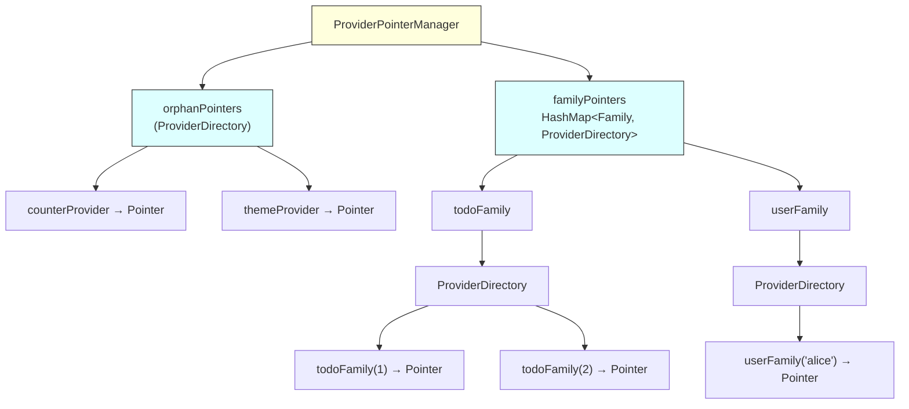
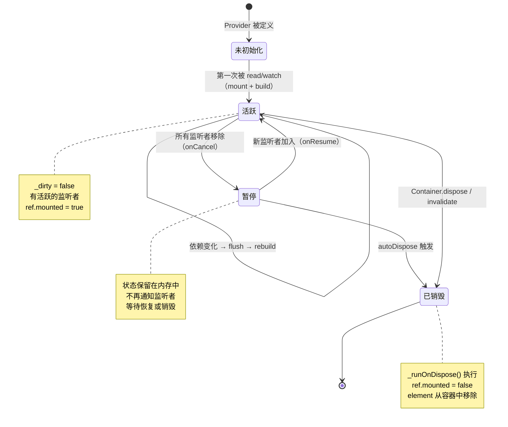
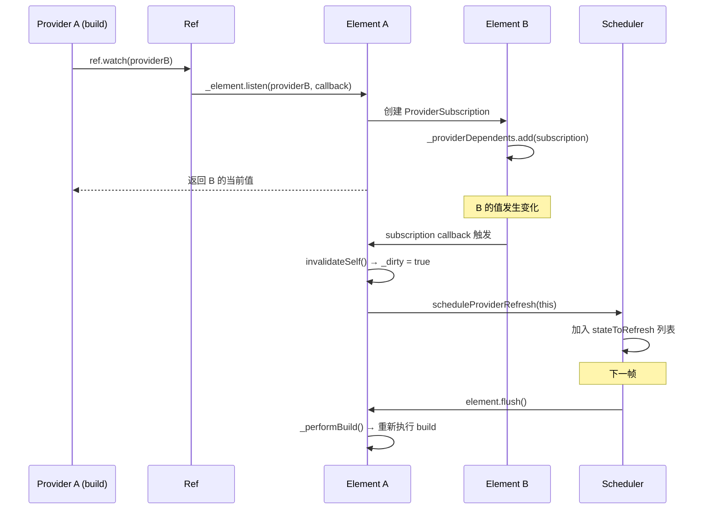

##### 引言：

你有没有想过，一个城市的自来水系统是怎么工作的？

水厂把水净化好，通过主管道送到各个小区。每个小区有自己的水表和阀门，哪家开了水龙头，水就流过去；哪家关了，水就停。水厂不需要知道每家每户在干什么，每家也不需要知道水厂在哪——中间的管道系统把一切串起来了。

Riverpod 的架构和这个自来水系统惊人地相似。`ProviderContainer` 是水厂，`Provider` 是水源，`Ref` 是管道，`ConsumerWidget` 是水龙头。水（状态）从水源出发，经过管道，流到需要它的地方。谁打开了水龙头，水厂就给谁供水；谁关了，就停止供应，甚至在没人用的时候自动关闭水源（autoDispose）。

这篇文章是 Riverpod 源码分析系列的第一篇，我们从最底层的核心架构开始拆解。看完之后你会发现，Riverpod 的设计远比"状态管理"四个字要深得多——它本质上是一套独立于 Widget 树的依赖图管理系统。

---

#### 一、ProviderContainer：水厂的心脏

Flutter 的 `InheritedWidget` 把状态挂在 Widget 树上，查找靠 `context`。Riverpod 做了一个关键的设计决策：**状态不挂在 Widget 树上，而是存在一个独立的容器里。**

这个容器就是 `ProviderContainer`。

---

##### 1. 容器里装了什么

```dart
---->[packages/riverpod/lib/src/core/provider_container.dart#ProviderContainer]----
class ProviderContainer implements Node {
  ProviderContainer({
    ProviderContainer? parent,
    List<Override> overrides = const [],
    List<ProviderObserver>? observers,
    Retry? retry,
  }) : _parent = parent,
       _root = parent?._root ?? parent {
    _pointerManager = ProviderPointerManager(
      overrides,
      container: this,
      orphanPointers: /* ... */,
    );
  }

  final ProviderContainer? _parent;  // tag1: 父容器
  final ProviderContainer? _root;    // tag2: 根容器
  late final ProviderPointerManager _pointerManager; // tag3: 指针管理器
  late final ProviderScheduler scheduler; // tag4: 调度器
}
```

停下来想想 `tag1` 和 `tag2`。`ProviderContainer` 有 `_parent` 和 `_root`——这意味着容器本身是可以嵌套的，形成一棵容器树。

这和 GetX 的全局 Map 是本质区别。GetX 只有一本字典，所有东西都往里塞；Riverpod 有一棵容器树，子容器可以覆盖父容器的 Provider，就像子目录可以覆盖父目录的同名文件。

---

##### 2. ProviderPointerManager：O(1) 的查找系统

`tag3` 处的 `ProviderPointerManager` 是容器的核心数据结构。它维护了两个 HashMap：

```dart
---->[packages/riverpod/lib/src/core/provider_container.dart#ProviderPointerManager]----
class ProviderPointerManager {
  final ProviderContainer container;
  final ProviderDirectory orphanPointers;  // tag5: 非 family 的 Provider
  final HashMap<Family, ProviderDirectory> familyPointers; // tag6: family Provider
}
```

`tag5` 处的 `orphanPointers` 存储所有不属于 family 的 Provider。`tag6` 处的 `familyPointers` 按 Family 分组存储。每个 `ProviderDirectory` 内部又是一个 `HashMap<ProviderBase, $ProviderPointer>`。

这是一个两级索引结构：先按 Family 分组，再按具体 Provider 查找。查找复杂度是 O(1)。



---

##### 3. $ProviderPointer：指针的设计

每个 Provider 在容器中对应一个 `$ProviderPointer`：

```dart
---->[packages/riverpod/lib/src/core/provider_container.dart#$ProviderPointer]----
class $ProviderPointer implements _PointerBase {
  final ProviderBase<Object?> origin;       // tag7: 原始 Provider
  _ProviderOverride? providerOverride;      // tag8: 覆盖信息
  ProviderElement? element;                 // tag9: 运行时元素
  final ProviderContainer targetContainer;  // tag10: 目标容器
}
```

`tag9` 处的 `element` 是关键——它是 Provider 的运行时实例，只有在第一次被读取时才会创建。这就是 Riverpod 的懒加载机制：你定义了 100 个 Provider，但只有被用到的才会真正初始化。

`tag8` 处的 `providerOverride` 记录了这个 Provider 是否被覆盖。如果子容器覆盖了某个 Provider，指针会指向覆盖后的实现，而不是原始的。

这个设计就像文件系统的挂载点：你可以在子目录下"挂载"一个新的文件系统，覆盖父目录的内容，但父目录本身不受影响。

---

##### 4. mount：懒加载的初始化

当你第一次读取一个 Provider 时，`ProviderDirectory.mount` 被调用：

```dart
---->[packages/riverpod/lib/src/core/provider_container.dart#ProviderDirectory#mount]----
$ProviderPointer mount(
  ProviderBase<Object?> origin, {
  required ProviderContainer currentContainer,
}) {
  final pointer = upsertPointer(origin, currentContainer: currentContainer);

  if (pointer.element == null) {  // tag11: 还没初始化
    ProviderElement? element;

    switch ((pointer.providerOverride, familyOverride)) {
      case (final override?, _):
        element = override.providerOverride.$createElement(pointer); // tag12: 用覆盖的实现
      case (null, final $FamilyOverride override):
        element = override.createElement(pointer);
      case (null, _FamilyOverride() || null):
        element = origin.$createElement(pointer); // tag13: 用原始实现
    }

    pointer.element = element; // tag14: 赋值，防止递归初始化
  }

  return pointer;
}
```

`tag11` 处检查 element 是否为 null——如果是，说明这个 Provider 还没被初始化过。`tag12` 和 `tag13` 处根据是否有覆盖，选择不同的实现来创建 element。

`tag14` 处有一个细节值得注意：element 在调用 mount 之前就被赋值了。这是为了防止递归初始化——如果 Provider A 依赖 Provider B，B 又依赖 A，赋值操作保证不会无限递归。

如果你现在对 `ProviderElement` 还不太清楚，不用急。下一节会详细讲。先知道它是 Provider 的"运行时实例"就够了，就像 Widget 和 Element 的关系一样。

---

#### 二、ProviderElement：每个水源的管理员

如果说 `ProviderContainer` 是水厂，那 `ProviderElement` 就是每个水源的管理员。它负责：创建状态、追踪依赖、通知监听者、管理生命周期。

---

##### 1. Element 的核心字段

Riverpod 的 `ProviderElement` 和 Flutter 的 `Element` 在概念上非常相似——都是"配置"（Provider/Widget）的运行时实例。但 Riverpod 的 Element 不挂在 Widget 树上，而是挂在 `ProviderContainer` 里。

```dart
---->[packages/riverpod/lib/src/core/element.dart#ProviderElement]----
abstract class ProviderElement<StateT, ValueT> implements Node {
  Ref? _ref;                    // tag1: 当前的 Ref 实例
  bool _disposed = false;       // tag2: 是否已销毁
  bool _dirty = true;           // tag3: 是否需要重建
  bool _didBuild = false;       // tag4: 是否已完成首次构建
  bool _dependencyMayHaveChanged = false; // tag5: 依赖是否可能变化

  // 监听者管理
  final _providerDependents = <ProviderSubscriptionImpl>[];  // tag6: Provider 间的订阅
  final _externalDependents = <ExternalProviderSubscription>[]; // tag7: 外部订阅（Widget）
  final weakDependents = <ProviderSubscriptionImpl>[];  // tag8: 弱订阅
}
```

给你三秒钟，想想 `tag6`、`tag7`、`tag8` 三种订阅的区别。

答案：`_providerDependents` 是 Provider 之间的依赖（A watch B，A 就是 B 的 providerDependent）。`_externalDependents` 是 Widget 对 Provider 的监听（`ref.watch` in ConsumerWidget）。`weakDependents` 是弱订阅——不会阻止 Provider 被 autoDispose。

这三种订阅的区分非常重要。autoDispose 的判断逻辑是：只有当 `_providerDependents` 和 `_externalDependents` 都为空时，Provider 才会被回收。`weakDependents` 不算。这就像图书馆的借阅系统：正式借阅（强订阅）会阻止图书下架，浏览记录（弱订阅）不会。

---

##### 2. flush：延迟重建的核心

当一个 Provider 的依赖发生变化时，它不会立即重建，而是被标记为 dirty，等到下次被读取时才真正重建。这个机制的核心是 `flush` 方法：

```dart
---->[packages/riverpod/lib/src/core/element.dart#ProviderElement#flush]----
void flush() {
  if (_dependencyMayHaveChanged) {  // tag9: 依赖可能变了
    _dependencyMayHaveChanged = false;
    visitChildren((child) => child.flush()); // tag10: 先刷新子依赖
  }

  if (_dirty) {  // tag11: 自己需要重建
    _dirty = false;
    _performBuild();
  }
}
```

`tag9` 到 `tag11` 的顺序很讲究：先检查依赖是否变了（`tag9`），如果变了就先刷新子依赖（`tag10`），最后才重建自己（`tag11`）。

为什么要先刷新子依赖？想象一下：Provider A 依赖 Provider B，B 依赖 Provider C。C 变了，B 和 A 都被标记为 dirty。如果 A 先重建，它会读取 B 的值——但 B 还是旧的！所以必须先刷新 B，再刷新 A。

这和 Flutter 的 `BuildOwner` 按深度排序重建是同一个思路，只不过 Riverpod 用的是递归 flush 而不是排序。

---

##### 3. _performBuild：重建的完整流程

```dart
---->[packages/riverpod/lib/src/core/element.dart#ProviderElement#_performBuild]----
void _performBuild() {
  final ref = _ref = $Ref(this, isFirstBuild: !_didBuild, isReload: _isReload);

  // tag12: 清理旧的订阅和回调
  _runOnDispose();

  final previousStateResult = _stateResult;

  try {
    buildState(ref);  // tag13: 执行 Provider 的 build 函数
  } catch (err, stack) {
    handleError(ref, err, stack);
  } finally {
    _didBuild = true;
  }

  // tag14: 通知监听者
  if (previousStateResult != null) {
    _notifyListeners(previousStateResult, _stateResult!);
  }
}
```

`tag12` 处的 `_runOnDispose` 是一个精妙的设计：每次重建之前，先清理上一次 build 注册的所有 `onDispose` 回调和订阅。这意味着 `ref.watch` 建立的依赖关系是每次 build 重新建立的，不是累积的。

打个比方：你每天早上去菜市场买菜（build），买之前先把昨天的购物清单撕掉（_runOnDispose），然后重新列一份今天要买的（ref.watch）。这样你永远只依赖当前需要的东西，不会有"僵尸依赖"。

`tag13` 处调用 `buildState`，这是一个抽象方法，不同类型的 Provider 有不同的实现。`tag14` 处在 build 完成后通知所有监听者。

---

##### 4. 生命周期：从创建到销毁



这里有一个 GetX 没有的状态：`暂停`。当一个 Provider 的所有监听者都被移除时（比如 Widget 不可见了），Provider 不会立即销毁，而是进入暂停状态。状态保留在内存中，等待恢复。只有在 autoDispose 模式下，暂停一段时间后才会真正销毁。

这个设计对性能很友好。用户在 Tab 之间切换时，不可见 Tab 的 Provider 会暂停而不是销毁，切回来时直接恢复，不需要重新请求数据。

---

#### 三、Ref：管道系统

`Ref` 是 Provider 与外界交互的唯一通道。它的设计哲学是：Provider 不直接访问其他 Provider，而是通过 `Ref` 这个中间人。

---

##### 1. Ref 的真实身份

```dart
---->[packages/riverpod/lib/src/core/ref.dart#Ref]----
sealed class Ref implements MutationTarget {
  Ref._({required this.isFirstBuild, required this.isReload});

  ProviderElement<Object?, Object?> get _element;
  List<KeepAliveLink>? _keepAliveLinks;
  List<void Function()>? _onDisposeListeners;
  List<void Function()>? _onResumeListeners;
  List<void Function()>? _onCancelListeners;

  final bool isFirstBuild;  // tag1: 是否首次构建
  final bool isReload;       // tag2: 是否因依赖变化而重建
}
```

`Ref` 是一个 sealed class，只能在 Riverpod 内部实例化。每次 Provider 重建时，都会创建一个新的 `Ref` 实例（回看上面 `_performBuild` 的 `tag12`）。旧的 `Ref` 的 `mounted` 会变成 false，所有通过旧 Ref 的操作都会抛异常。

这个设计防止了一个常见的 bug：异步操作完成后，Provider 已经重建了，但旧的回调还在用旧的 Ref 操作状态。Riverpod 通过"每次重建换一个新 Ref"来彻底杜绝这个问题。

```dart
---->[packages/riverpod/lib/src/core/ref.dart#Ref#mounted]----
bool get mounted => !_element._disposed && identical(_element.ref, this);
```

`mounted` 的判断很精确：不仅要求 element 没被销毁，还要求当前 Ref 就是 element 持有的那个 Ref（`identical` 比较引用）。如果 Provider 重建了，旧 Ref 的 `mounted` 自动变成 false。

---

##### 2. watch：依赖追踪的核心

`ref.watch` 是 Riverpod 最核心的 API。它做了两件事：读取值 + 建立依赖。

```dart
---->[packages/riverpod/lib/src/core/ref.dart#Ref#watch]----
StateT watch<StateT>(ProviderListenable<StateT> listenable) {
  _throwIfInvalidUsage();
  late ProviderSubscription<StateT> sub;
  sub = _element.listen<StateT>(
    listenable,
    (prev, value) => invalidateSelf(asReload: true),  // tag3: 依赖变化时，标记自己为 dirty
    onError: (err, stack) => invalidateSelf(asReload: true),
    onDependencyMayHaveChanged: _element._markDependencyMayHaveChanged,
  );

  return sub.readSafe().valueOrProviderException;  // tag4: 返回当前值
}
```

`tag3` 处是关键：当被 watch 的 Provider 发生变化时，回调函数调用 `invalidateSelf`，把当前 Provider 标记为 dirty。注意它不是立即重建，而是标记——实际重建会在下一次 flush 时发生。

`tag4` 处读取当前值并返回。如果被 watch 的 Provider 还没初始化，这一步会触发它的 mount 和 build。

整个依赖追踪的链路：



这里有一个和 GetX 的本质区别：GetX 的 `.obs` + `Obx` 是通过全局 proxy 在 build 期间隐式收集依赖；Riverpod 的 `ref.watch` 是显式声明依赖。显式的好处是可读性强——看一眼 build 函数就知道这个 Provider 依赖了谁。隐式的好处是写起来简洁。各有取舍。

---

##### 3. read vs watch vs listen

这三个方法的区别是 Riverpod 使用中最容易搞混的地方：

| 方法 | 建立依赖？ | 触发重建？ | 适用场景 |
|------|-----------|-----------|---------|
| `ref.watch` | ✅ | ✅ 值变化时重建当前 Provider | build 函数中声明依赖 |
| `ref.read` | ❌ | ❌ | 事件处理、一次性读取 |
| `ref.listen` | ✅ | ❌ 只触发回调，不重建 | 副作用（弹对话框、导航） |

从源码层面看，`watch` = `listen` + `invalidateSelf`：

```dart
// watch 的本质
StateT watch<StateT>(ProviderListenable<StateT> listenable) {
  final sub = _element.listen(listenable, (prev, value) {
    invalidateSelf(asReload: true);  // listen + 自动标记 dirty
  });
  return sub.read();
}
```

`read` 更简单，它直接读取值，不建立任何订阅关系：

```dart
---->[packages/riverpod/lib/src/core/ref.dart#Ref#read]----
StateT read<StateT>(ProviderListenable<StateT> listenable) {
  _throwIfInvalidUsage();
  final result = container.read(listenable);
  return result;
}
```

如果你在 build 函数中用了 `read` 而不是 `watch`，Provider 的值变了你的 UI 不会更新。这不是 bug，是你告诉框架"我不关心这个值的变化"。

---

##### 4. onDispose / onCancel / onResume：生命周期钩子

Riverpod 的生命周期钩子设计得很细致：

```dart
---->[packages/riverpod/lib/src/core/ref.dart#Ref]----
// 销毁时清理资源
RemoveListener onDispose(void Function() listener);

// 所有监听者移除时（暂停前）
RemoveListener onCancel(void Function() cb);

// 重新被监听时（恢复后）
RemoveListener onResume(void Function() cb);
```

`onCancel` + `onResume` 这对组合特别实用。比如你有一个 WebSocket 连接的 Provider：

```dart
---->[示例代码]----
final wsProvider = Provider.autoDispose((ref) {
  final ws = WebSocket.connect('wss://example.com');

  ref.onCancel(() {
    ws.pause();  // 没人用了，暂停连接
  });

  ref.onResume(() {
    ws.resume();  // 又有人用了，恢复连接
  });

  ref.onDispose(() {
    ws.close();  // 彻底销毁，关闭连接
  });

  return ws;
});
```

Widget 不可见时连接暂停，可见时恢复，销毁时关闭。整个生命周期管理不需要你自己写一行状态判断代码。

---

##### 5. keepAlive：手动续命

autoDispose 的 Provider 在没有监听者时会被销毁。但有时候你想在某些条件下阻止销毁：

```dart
---->[packages/riverpod/lib/src/core/ref.dart#Ref#keepAlive]----
KeepAliveLink keepAlive() {
  _throwIfInvalidUsage();

  final links = _keepAliveLinks ??= [];

  late KeepAliveLink link;
  link = KeepAliveLink._(() {
    if (links.remove(link)) {
      if (links.isEmpty) _element.mayNeedDispose(); // tag5: 所有 link 都关闭后才允许销毁
    }
  });
  links.add(link);

  return link;
}
```

`keepAlive` 返回一个 `KeepAliveLink`，只要这个 link 没被 close，Provider 就不会被 autoDispose。多次调用 `keepAlive` 会创建多个 link，所有 link 都 close 之后才允许销毁（`tag5`）。

这个设计在缓存场景中很有用：数据加载完成后调用 `keepAlive`，保证数据不会因为用户切换页面而丢失。用户手动刷新时 close link，允许重新加载。

---

#### 四、ProviderScheduler：调度中心

Provider 的重建不是立即发生的，而是由 `ProviderScheduler` 统一调度。这个设计避免了一个经典问题：连锁更新导致的重复重建。

---

##### 1. 调度器的核心逻辑

```dart
---->[packages/riverpod/lib/src/core/scheduler.dart#ProviderScheduler]----
class ProviderScheduler {
  final flutterVsyncs = <Vsync>{};  // tag1: Flutter 帧同步回调
  final _stateToDispose = <ProviderElement>[];  // tag2: 待销毁列表
  final stateToRefresh = <ProviderElement>[];   // tag3: 待刷新列表

  void scheduleProviderRefresh(ProviderElement element) {
    stateToRefresh.add(element);
    _scheduleTask();  // tag4: 安排一个任务
  }

  void _scheduleTask() {
    if (_pendingTaskCompleter != null || _disposed) return; // tag5: 防止重复调度
    _pendingTaskCompleter = Completer<void>();
    _cancel = vsync(Task(this));
  }
}
```

`tag4` 和 `tag5` 处的逻辑很关键：当一个 Provider 需要刷新时，它被加入 `stateToRefresh` 列表，然后调度一个任务。如果已经有任务在等待执行（`_pendingTaskCompleter != null`），就不会重复调度。

这意味着：即使在同一帧内有 10 个 Provider 被标记为 dirty，调度器也只会执行一次刷新任务。所有 dirty 的 Provider 在同一个任务中批量处理。

---

##### 2. vsync：和 Flutter 帧同步

```dart
---->[packages/riverpod/lib/src/core/scheduler.dart#ProviderScheduler#vsync]----
void Function()? Function(Task) get vsync {
  if (flutterVsyncs.isNotEmpty) {
    return (task) {
      for (final flutterVsync in flutterVsyncs) {
        flutterVsync(task);  // tag6: 通知所有 ProviderScope
      }
      return;
    };
  }
  return _defaultVsync;  // tag7: 非 Flutter 环境用 Timer
}
```

`tag6` 处是 Riverpod 和 Flutter 帧同步的关键。每个 `ProviderScope`（通过 `_UncontrolledProviderScopeState`）会把自己的 vsync 回调注册到调度器中。当有 Provider 需要刷新时，调度器通知所有 ProviderScope，ProviderScope 调用 `setState` 触发 Widget 树重建，在重建过程中 Consumer 会读取最新的 Provider 值。

`tag7` 处是非 Flutter 环境（纯 Dart）的降级方案：用 `Timer(Duration.zero, ...)` 在下一个事件循环中执行。

这个设计让 Riverpod 可以同时在 Flutter 和纯 Dart 环境中工作——Flutter 环境下和帧同步，纯 Dart 环境下用 Timer。

---

##### 3. 刷新和销毁的执行顺序

```dart
---->[packages/riverpod/lib/src/core/scheduler.dart#ProviderScheduler#_task]----
void _task() {
  _cancel = null;
  final pendingTaskCompleter = _pendingTaskCompleter;
  if (pendingTaskCompleter == null) return;
  pendingTaskCompleter.complete();

  _performRefresh();   // tag8: 先刷新
  _performDispose();   // tag9: 再销毁
  stateToRefresh.clear();
  _stateToDispose.clear();
  _pendingTaskCompleter = null;
}
```

`tag8` 和 `tag9` 的顺序不能反：先刷新，再销毁。如果先销毁，可能会把正在被依赖的 Provider 销毁掉，导致刷新时找不到依赖。

`_performRefresh` 的实现也值得看：

```dart
---->[packages/riverpod/lib/src/core/scheduler.dart#_performRefresh]----
void _performRefresh() {
  for (var i = 0; i < stateToRefresh.length; i++) {
    final element = stateToRefresh[i];
    if (element.isActive) element.flush();  // tag10: 只刷新活跃的
  }
}
```

注意 `tag10` 处的 `isActive` 检查：如果一个 Provider 在等待刷新的过程中被销毁了（比如 autoDispose 触发了），就跳过它。这种防御性编程在异步调度系统中是必须的。

另外，`_performRefresh` 不需要按深度排序（不像 Flutter 的 `BuildOwner`），因为 `flush` 方法内部会递归地先刷新子依赖。即使列表中的顺序是乱的，递归 flush 也能保证正确的刷新顺序。

---

#### 五、循环依赖检测：防患于未然

Riverpod 在 debug 模式下会检测循环依赖，这是一个值得学习的防御性设计。

---

```dart
---->[packages/riverpod/lib/src/core/ref.dart#Ref#_debugAssertCanDependOn]----
void _debugAssertCanDependOn(ProviderListenableOrFamily listenable) {
  // ...
  final queue = Queue<ProviderElement>();
  _element.visitChildren(queue.add);

  while (queue.isNotEmpty) {
    final current = queue.removeFirst();
    current.visitChildren(queue.add);

    if (current.origin == dependency) {
      final dependencyLoop = _buildDependencyLoop(current, current.origin);
      throw CircularDependencyError._(dependencyLoop);  // tag1: 抛出循环依赖错误
    }
  }
}
```

这是一个 BFS（广度优先搜索）：从当前 Provider 出发，遍历所有子依赖，如果发现目标 Provider 出现在子依赖中，说明形成了环，直接抛异常。

`tag1` 处抛出的 `CircularDependencyError` 会包含完整的依赖链路，告诉你 A → B → C → A 这样的环是怎么形成的。这比运行时的栈溢出错误友好得多。

GetX 没有这个检测。如果你在 GetX 中不小心创建了循环依赖，得到的是一个莫名其妙的栈溢出，排查起来很痛苦。

---

#### 六、源码中值得学习的设计模式

看完核心架构，总结几个 Riverpod 源码中值得学习的设计模式。

---

##### 1. 指针间接层

Riverpod 没有直接用 `Map<Provider, Element>` 存储状态，而是引入了 `$ProviderPointer` 作为中间层。这个间接层让 override 机制成为可能——子容器和父容器可以共享同一个 Pointer，但 Pointer 指向不同的 Element。

这是经典的"多加一层间接"设计原则。遇到"两个东西需要共享引用但行为不同"的场景，加一层指针就能解决。

---

##### 2. 每次重建换 Ref

每次 Provider 重建时创建新的 `Ref`，旧 Ref 的 `mounted` 自动失效。这比"在旧对象上设置一个 disposed 标志"更安全，因为 `identical` 比较是不可伪造的。

这个模式适用于所有"异步操作可能在对象销毁后完成"的场景。

---

##### 3. 懒加载 + 按需初始化

Provider 定义时不创建任何运行时对象，第一次被读取时才 mount。这让你可以放心地定义大量 Provider 而不担心启动性能。

---

##### 4. 暂停/恢复 而不是 销毁/重建

`onCancel` / `onResume` 的设计比简单的 `dispose` / `create` 更精细。暂停时保留状态，恢复时直接使用，避免了不必要的重新计算和网络请求。

---

##### 5. 批量调度

调度器把同一帧内的所有更新合并成一次任务，避免了连锁更新导致的重复重建。这是所有响应式系统都应该有的优化，但不是所有框架都做到了。

---

#### 碎碎念

写到这里，Riverpod 的核心架构已经拆解完了。回头看，它的设计哲学可以用一句话概括：**用一棵独立于 Widget 树的容器树来管理状态的依赖图。**

这和 GetX 的"全局字典"、Flutter 原生的"挂在 Widget 树上"都不同。Riverpod 走了第三条路：状态有自己的树，但这棵树可以和 Widget 树同步。

说实话，第一次读 Riverpod 源码的时候，我被它的复杂度吓了一跳。`ProviderPointerManager`、`ProviderDirectory`、`$ProviderPointer`、`ProviderElement`——光是存储层就有四层抽象。但读完之后你会发现，每一层都有它存在的理由：Pointer 是为了 override，Directory 是为了 family 分组，Element 是为了生命周期管理，Manager 是为了把它们串起来。

认识事物是一个过程。如果你现在觉得这些抽象层太多了，不用急。先把 `ProviderContainer` → `ProviderElement` → `Ref` 这条主线记住就够了。其他的细节，在实际使用中遇到问题时再回来看，会清晰很多。

下一篇我们聊 Provider 的类型系统、Family 机制、Select 精准重建和 AsyncValue 的设计——这些是 Riverpod 在日常使用中最常接触的部分。

---

*我是张风捷特烈，如果你对 Flutter 框架的源码分析感兴趣，欢迎关注。这是「四状态管理大乱斗」系列的第四篇，下一篇继续拆解 Riverpod 的类型系统、Select 精准重建和 AsyncValue 的设计。*