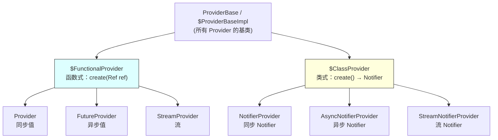
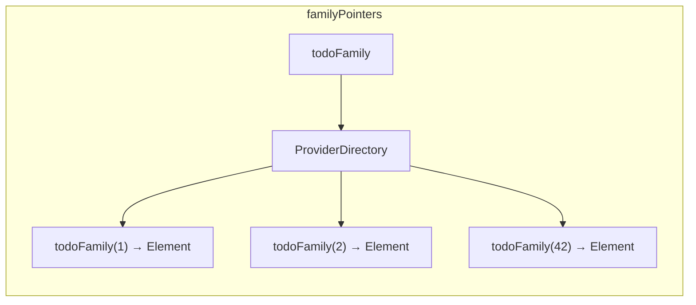
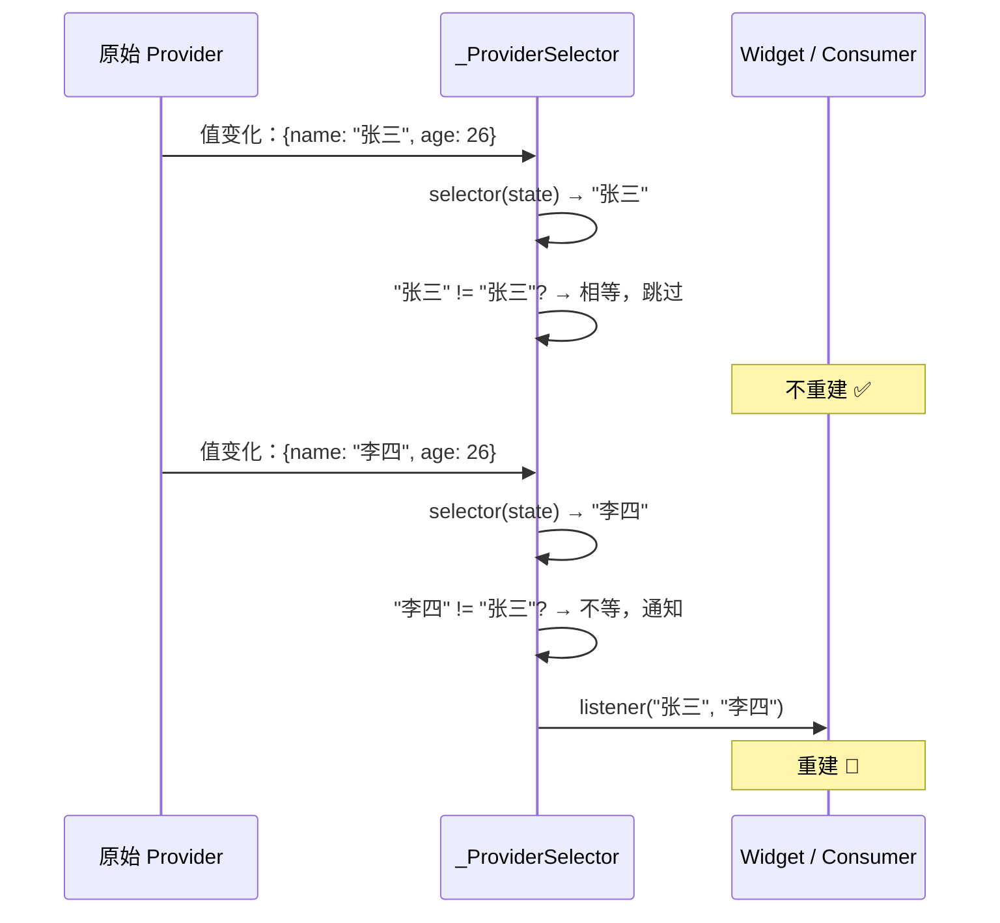
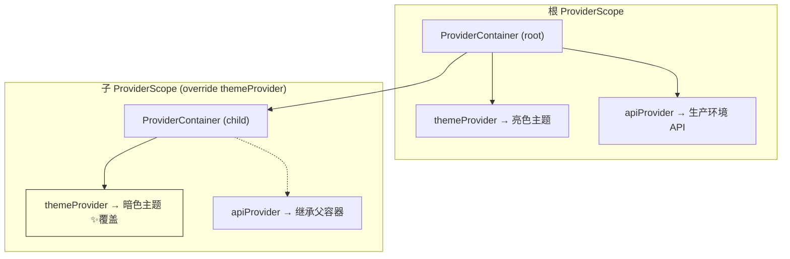
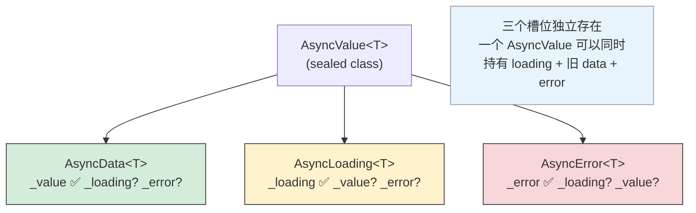
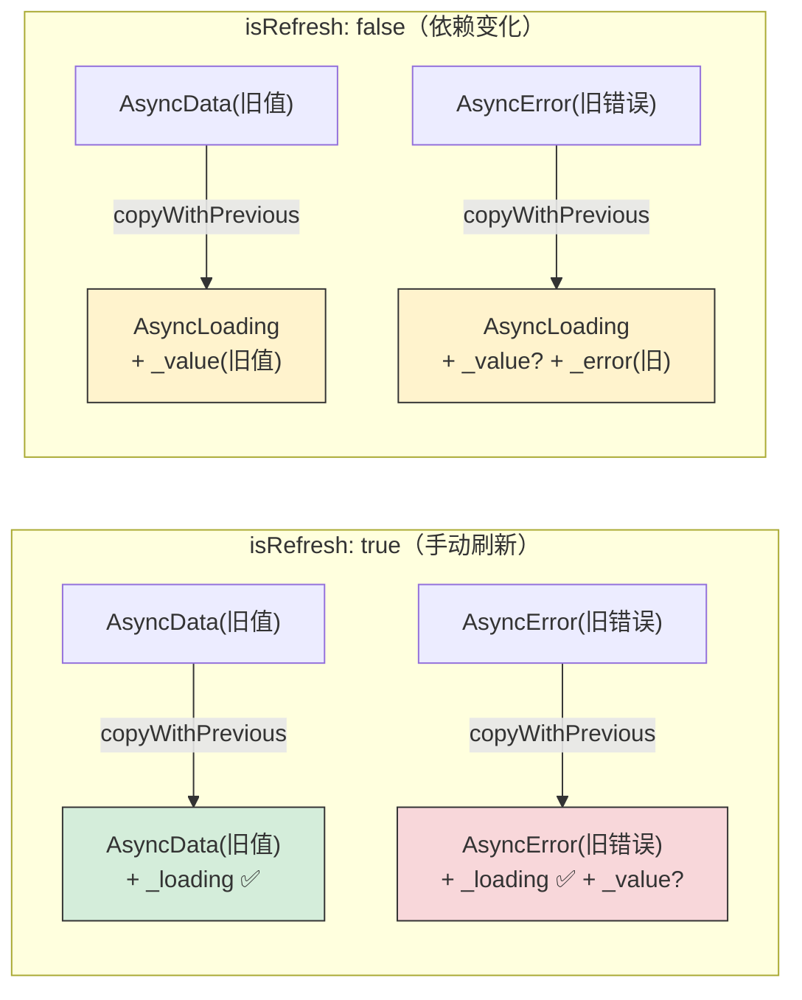
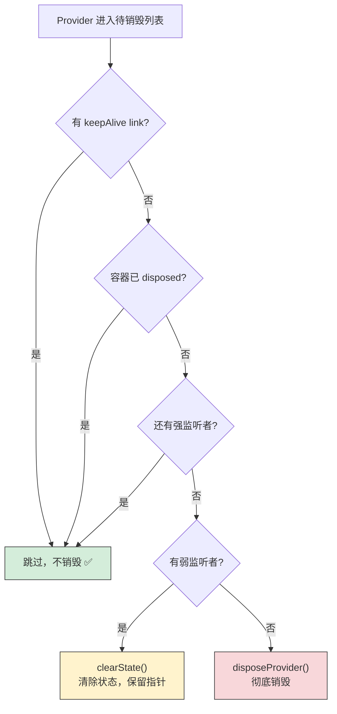

#### 引言：

你去过自助餐厅吗？

餐台上摆着几十道菜：凉菜、热菜、甜点、饮料。你不需要全部吃一遍，只挑自己想吃的就行。但你得知道每道菜在哪个区域——凉菜区找不到红烧肉，甜点区也没有酸辣汤。

Riverpod 的 Provider 类型系统就像这个自助餐台。`Provider`、`NotifierProvider`、`FutureProvider`、`StreamProvider`……初学者容易被搞晕，觉得"怎么这么多种"。但每种 Provider 都有自己的"区域"，解决的是不同场景的问题。上一篇我们拆解了 Riverpod 的地基——ProviderContainer、ProviderElement、Ref、Scheduler。这一篇往上盖楼：Provider 的类型体系、Family 机制、Select 精准重建、Override 覆盖、AsyncValue 的设计。

这些是你在日常开发中最常接触的部分。看完源码之后，很多"为什么要这样写"的疑惑会自然消解。

***

#### 一、Provider 的类型体系：龙生九子，各有不同

Riverpod 有好几种 Provider 类型，但从源码层面看，它们的继承关系很清晰——所有 Provider 分为两大流派：**函数式**和**类式**。

***

##### 1. 两大流派的基类

先看源码中的继承链。所有 Provider 的最终基类是 `ProviderBase`：



```dart
---->[core/provider/provider.dart#ProviderBase]----
sealed class ProviderBase<StateT> extends ProviderOrFamily
    implements
        ProviderListenable<StateT>,
        Refreshable<StateT>,
        _ProviderOverride {
  ProviderBase({
    required super.name,
    required this.from,       // tag1: 所属 Family
    required this.argument,   // tag2: Family 参数
    required super.dependencies,
    required super.$allTransitiveDependencies,
    required super.isAutoDispose,
    required super.retry,
  });

  final Family? from;      // tag3: 如果是 family 创建的，指向 family
  final Object? argument;   // tag4: family 的参数
}
```

`tag1` 到 `tag4` 告诉我们一个重要信息：**每个 Provider 天生就知道自己是不是从 Family 创建的**。`from` 指向所属的 Family，`argument` 是创建时的参数。这为后面的 Family 机制埋下了伏笔。

在 `ProviderBase` 之下，分出两条路：

```dart
---->[core/provider/functional_provider.dart#$FunctionalProvider]----
abstract base class $FunctionalProvider<StateT, ValueT, CreatedT>
    extends $ProviderBaseImpl<StateT> {
  // tag5: 函数式 Provider 的基类
  CreatedT create(Ref ref);  // 接收一个函数，调用得到值
}
```

```dart
---->[core/provider/notifier_provider.dart#$ClassProvider]----
abstract base class $ClassProvider<NotifierT extends AnyNotifier<StateT, ValueT>, StateT, ValueT, CreatedT>
    extends $ProviderBaseImpl<StateT> {
  // tag6: 类式 Provider 的基类
  NotifierT create();  // 创建一个 Notifier 实例
}
```

`tag5` 和 `tag6` 的区别一目了然：函数式接收 `Ref`，返回值就是状态；类式创建一个 `Notifier` 实例，Notifier 内部管理状态。

用做菜来类比：

*   函数式是"给我原料（Ref），我直接出成品"——纯函数，进去什么出来什么；
*   类式是"给我一个厨房（Notifier），我在里面做各种操作"——有状态的对象，可以炒、可以炖、可以加调料。

***

##### 2. 函数式 Provider 的源码

以最基础的 `Provider` 为例：

```dart
---->[providers/provider.dart#Provider]----
final class Provider<ValueT> extends $FunctionalProvider<ValueT, ValueT, ValueT>
    with $Provider<ValueT>, LegacyProviderMixin<ValueT> {
  Provider(
    this._create, {
    super.name,
    super.dependencies,
    super.isAutoDispose = false,  // tag1: 默认不自动销毁
    super.retry,
  });

  final Create<ValueT> _create;  // tag2: 一个函数

  @override
  ValueT create(Ref ref) => _create(ref);  // tag3: 调用函数得到值
}
```

`tag2` 处的 `Create<ValueT>` 是什么？往上翻源码：

```dart
---->[core/provider/provider.dart]----
typedef Create<CreatedT> = CreatedT Function(Ref ref);
```

就是一个接收 `Ref`、返回 `CreatedT` 的函数。简单直白。

***

##### 3. 类式 Provider 的源码

类式 Provider 的核心是 `Notifier`。看 `$Notifier` 的基类：

```dart
---->[providers/notifier.dart#$Notifier]----
abstract class $Notifier<StateT> extends $SyncNotifierBase<StateT> {
  StateT? get stateOrNull {
    final element = requireElement();
    element.flush();  // tag4: 读取前先刷新
    return element.stateResult()?.value;
  }
}
```

`tag4` 处有个细节值得停下来想想：读取 `stateOrNull` 时会先调用 `flush()`。还记得上一篇讲的 `flush` 吗？它会检查依赖是否变化，如果变了就先重建。这保证了你读到的永远是最新的值，即使有依赖在你读取之前刚刚变化了。

再看 Notifier 的 `state` getter 和 setter：

```dart
---->[core/provider/notifier_provider.dart#AnyNotifier]----
abstract class AnyNotifier<StateT, ValueT> {
  StateT get state {
    final ref = $ref;
    ref._throwIfInvalidUsage();
    return ref._element.readSelf().valueOrRawException;  // tag5: 读取当前状态
  }

  set state(StateT newState) {
    final ref = $ref;
    ref._throwIfInvalidUsage();
    ref._element.setValueFromState(newState);  // tag6: 设置新状态，触发通知
  }
}
```

`tag5` 和 `tag6` 揭示了 Notifier 修改状态的本质：setter 调用 `setValueFromState`，最终会触发 `_notifyListeners`，通知所有监听者。这就是为什么你在 Notifier 里写 `state = newValue` 就能让 UI 更新——不是魔法，是 setter 里藏了通知逻辑。

***

##### 4. 函数式 vs 类式：怎么选

| 维度   | 函数式 (Provider)               | 类式 (NotifierProvider) |
| ---- | ---------------------------- | --------------------- |
| 定义方式 | 一个函数                         | 一个类 + build 方法        |
| 修改状态 | 只能通过 `ref.invalidateSelf` 重建 | 可以通过方法直接修改 `state`    |
| 适用场景 | 派生状态、计算值、依赖组合                | 有业务逻辑的可变状态            |
| 测试   | 简单，mock 依赖即可                 | 需要实例化 Notifier        |

简单理解：如果你的状态是"从其他状态计算出来的"，用函数式；如果你的状态"需要被用户操作修改"，用类式。

如果你现在还不确定该用哪种，不用纠结。先用函数式，等发现需要在多个地方修改状态时，再换成类式。Riverpod 的类型系统设计得足够灵活，切换成本不高。

***

#### 二、Family：一个模具生产一批零件

`Provider.family` 是 Riverpod 中使用频率很高的功能。它允许你用参数创建同一类型但不同实例的 Provider。比如 `todoFamily(42)` 和 `todoFamily(99)` 是两个完全独立的 Provider，各有各的状态、各有各的生命周期。

***

##### 1. Family 的本质：模具，不是零件

```dart
---->[core/family.dart#Family]----
final class Family extends ProviderOrFamily implements _FamilyOverride {
  Family({
    required super.name,
    required super.dependencies,
    required super.$allTransitiveDependencies,
    required super.isAutoDispose,
    required super.retry,
  });

  @override
  Family get from => this;  // tag1: Family 的 from 指向自己
}
```

`Family` 本身不是 Provider，它是一个"模具"。`tag1` 处 `from` 指向自己——这和具体 Provider 的 `from` 指向所属 Family 形成对照。

真正的魔法在 `FunctionalFamily.call` 方法里：

```dart
---->[core/family.dart#FunctionalFamily]----
base class FunctionalFamily<StateT, ValueT, ArgT, CreatedT,
    ProviderT extends $FunctionalProvider<StateT, ValueT, CreatedT>>
    extends Family {

  final FunctionalProviderFactory<ProviderT, CreatedT, ArgT> _providerFactory;
  final CreatedT Function(Ref ref, ArgT arg) _createFn;

  ProviderT call(ArgT argument) {
    return _providerFactory(
      (ref) => _createFn(ref, argument),  // tag2: 把参数"烤"进闭包
      name: name,
      isAutoDispose: isAutoDispose,
      from: this,          // tag3: 标记来源是这个 Family
      argument: argument,  // tag4: 记录参数
      dependencies: null,
      $allTransitiveDependencies: null,
      retry: retry,
    );
  }
}
```

给你三秒钟，看看 `tag2` 到 `tag4` 做了什么。

答案：每次调用 `todoFamily(42)` 时，`call` 方法创建一个全新的 `Provider` 实例。`tag2` 把参数 `42` 通过闭包"烤"进了 create 函数里；`tag3` 标记这个 Provider 来自哪个 Family；`tag4` 记录参数值。

回看上一篇的 `ProviderPointerManager`，Family 的 Provider 存储在 `familyPointers` 中，按 Family 分组：



每个参数对应一个独立的 Provider 实例，有自己的 Element、自己的状态、自己的生命周期。`todoFamily(1)` 和 `todoFamily(2)` 互不影响，就像同一条生产线上的不同产品——模具一样，但产品各自独立。

***

##### 2. 类式 Family 的区别

类式 Family 的 `call` 方法略有不同：

```dart
---->[core/family.dart#ClassFamily]----
base class ClassFamily<NotifierT extends AnyNotifier<StateT, ValueT>,
    StateT, ValueT, ArgT, CreatedT,
    ProviderT extends $ClassProvider<NotifierT, StateT, ValueT, CreatedT>>
    extends Family {

  final NotifierT Function(ArgT arg) _createFn;

  ProviderT call(ArgT argument) {
    return _providerFactory(
      () => _createFn(argument),  // tag5: 参数传给 Notifier 的工厂函数
      name: name,
      isAutoDispose: isAutoDispose,
      from: this,
      argument: argument,
      // ...
    );
  }
}
```

`tag5` 处的区别：函数式 Family 把参数传给 `(ref, arg) => ...`，类式 Family 把参数传给 `(arg) => Notifier()`。本质一样，都是把参数"烤"进去，只是入口不同。

***

##### 3. 参数的相等性：一个容易踩的坑

Family 用参数来区分不同的 Provider 实例。看 `LegacyProviderMixin` 的 `==` 实现：

```dart
---->[core/provider/provider.dart#LegacyProviderMixin]----
base mixin LegacyProviderMixin<StateT> on $ProviderBaseImpl<StateT> {
  @override
  int get hashCode {
    if (from == null) return super.hashCode;
    return from.hashCode ^ argument.hashCode;  // tag6: 用 from + argument 算 hash
  }

  @override
  bool operator ==(Object other) {
    if (from == null) return identical(other, this);
    return other.runtimeType == runtimeType &&
        other is $ProviderBaseImpl<StateT> &&
        other.from == from &&
        other.argument == argument;  // tag7: 用 from + argument 判等
  }
}
```

`tag6` 和 `tag7` 揭示了一个关键事实：**Family 创建的 Provider 的相等性完全取决于 `argument` 的 `==` 和 `hashCode`**。

这意味着什么？如果你用一个没有正确实现 `==` 的对象作为参数，每次调用 `family(param)` 都会创建一个新的 Provider 实例，之前的实例变成孤儿——这是内存泄漏。

社区里有人踩过这个坑：用 `List` 或 `Map` 作为 family 参数，结果每次 build 都创建新实例。Dart 的 `List` 默认用引用比较，`[1, 2]` 和 `[1, 2]` 不相等。解决方案是用 Record 或者自定义的值对象。

如果你现在对这个问题还没有直观感受，不用急。先记住一条规则：**family 的参数必须是不可变的值类型**。后面踩坑的时候你会想起来的。

***

#### 三、Select：看我想看

`ref.watch(provider.select((state) => state.name))` 是 Riverpod 实现精准重建的核心机制。

打个比方：你每天看天气预报（原始 Provider），但你只关心温度（selector）。天气预报每小时都在更新——湿度变了、风向变了、紫外线指数变了——但只要温度没变，你就不需要重新决定穿什么衣服。

***

##### 1. \_ProviderSelector 的实现

```dart
---->[core/modifiers/select.dart#_ProviderSelector]----
final class _ProviderSelector<InputT, OutputT>
    implements ProviderListenable<OutputT> {

  _ProviderSelector({required this.provider, required this.selector});

  final ProviderListenable<InputT> provider;   // tag1: 原始 Provider
  final OutputT Function(InputT) selector;      // tag2: 选择器函数

  $Result<OutputT> _select($Result<InputT> value) {
    try {
      return switch (value) {
        $ResultData(:final value) => $Result.data(selector(value)),  // tag3: 应用选择器
        $ResultError(:final error, :final stackTrace) =>
            $Result.error(error, stackTrace),
      };
    } catch (err, stack) {
      return $Result.error(err, stack);
    }
  }
}
```

`_ProviderSelector` 是一个包装器。它持有原始 Provider（`tag1`）和一个选择器函数（`tag2`）。当原始 Provider 的值变化时，它先通过选择器提取出关心的部分（`tag3`）。

但光提取还不够，关键是**比较**。看 `_selectOnChange` 方法：

```dart
---->[core/modifiers/select.dart#_ProviderSelector#_selectOnChange]----
void _selectOnChange({
  required InputT newState,
  required $Result<OutputT>? lastSelectedValue,
  required void Function(Object error, StackTrace stackTrace) onError,
  required void Function(OutputT? prev, OutputT next) listener,
  required void Function($Result<OutputT> newState) onChange,
}) {
  final newSelectedValue = _select($Result.data(newState));
  if (lastSelectedValue == null ||
      !lastSelectedValue.hasData ||
      !newSelectedValue.hasData ||
      lastSelectedValue.value != newSelectedValue.value) {  // tag4: 用 != 比较新旧值
    onChange(newSelectedValue);
    switch (newSelectedValue) {
      case $ResultData(:final value):
        listener(lastSelectedValue?.value, value);  // tag5: 只有不同才通知
      case $ResultError(:final error, :final stackTrace):
        onError(error, stackTrace);
    }
  }
}
```

`tag4` 处是精准重建的核心：用 `!=` 比较新旧选择结果。只有当提取出的值**确实不同**时，才执行 `tag5` 处的通知。

这意味着你的 selector 返回值必须正确实现 `==`。如果返回的是一个每次都新建的对象（比如 `List`），即使内容相同也会被认为"变了"，select 就失去了意义。这也是为什么 Riverpod 官方推荐 selector 返回基本类型（`int`、`String`、`bool`）或者不可变的值对象。

***

##### 2. 订阅的建立过程

`_addListener` 方法展示了 select 如何嵌入到订阅链中：

```dart
---->[core/modifiers/select.dart#_ProviderSelector#_addListener]----
ProviderSubscriptionImpl<OutputT> _addListener(
  Node node,
  void Function(OutputT? previous, OutputT next) listener, {
  required void Function(Object error, StackTrace stackTrace) onError,
  required void Function()? onDependencyMayHaveChanged,
  required bool weak,
}) {
  $Result<OutputT>? lastSelectedValue;
  final sub = provider._addListener(
    node,
    (prev, input) {
      _selectOnChange(                    // tag6: 原始值变化时，走 select 过滤
        newState: input,
        lastSelectedValue: lastSelectedValue,
        listener: providerSub._notifyData,
        onError: providerSub._notifyError,
        onChange: (newState) => lastSelectedValue = newState,
      );
    },
    weak: weak,
    onDependencyMayHaveChanged: onDependencyMayHaveChanged,
    onError: onError,
  );

  if (!weak) {
    lastSelectedValue = _select(sub.readSafe());  // tag7: 初始化时记录当前选择值
  }
  // ...
}
```

`tag6` 处是关键：`_addListener` 先订阅原始 Provider，但在回调里不是直接通知监听者，而是先走 `_selectOnChange` 过滤。只有选择结果变了，才真正通知。`tag7` 处在订阅建立时就记录了当前的选择值，作为后续比较的基准。

整个 select 的过滤链路可以用一张图概括：



***

##### 3. select 的链式调用

`select` 可以链式调用：

```dart
ref.watch(
  userProvider
    .select((user) => user.address)
    .select((address) => address.city)
);
```

每一层 `select` 都会创建一个新的 `_ProviderSelector`，形成一个链。只有最内层的值变化时才会触发重建。这在处理深层嵌套的状态对象时非常有用。

***

##### 4. 和 InheritedModel 的对比

Flutter 的 `InheritedModel` 也能做切面级精准通知（上一篇 GetX 文章中提到的 `MediaQuery.sizeOf`）。两者的对比：

| 维度   | Riverpod select      | InheritedModel aspect  |
| ---- | -------------------- | ---------------------- |
| 粒度   | 任意函数，可以做计算           | 预定义的枚举切面               |
| 灵活性  | 极高，selector 可以是任意表达式 | 受限于预定义的 aspect         |
| 性能   | 每次变化都要执行 selector 函数 | 只比较 aspect 枚举          |
| 使用场景 | 通用                   | 框架内部（MediaQuery、Theme） |

Riverpod 的 select 更灵活，但代价是每次 Provider 变化都要执行 selector 函数。如果 selector 函数本身很重（比如遍历一个大列表），反而可能成为性能瓶颈。大多数情况下这不是问题，但值得知道。

***

#### 四、Override：子目录覆盖父目录

Override 是 Riverpod 最强大的特性之一，也是它和 GetX 的核心差异。它让你可以在不同的 `ProviderScope` 中替换 Provider 的实现——就像文件系统里子目录可以覆盖父目录的同名文件，但父目录本身不受影响。

***

##### 1. Override 的类型体系

```dart
---->[core/override.dart]----
sealed class Override {
  @visibleForTesting
  Override get origin;  // tag1: 被覆盖的对象
}

sealed class _ProviderOverride implements Override {
  ProviderBase<Object?> get origin;  // tag2: 被覆盖的 Provider
}

class $ProviderOverride implements _ProviderOverride {
  $ProviderOverride({required this.origin, required this.providerOverride});

  final ProviderBase<Object?> origin;           // tag3: 谁被覆盖
  final ProviderBase<Object?> providerOverride; // tag4: 覆盖成什么
}
```

`tag3` 是"谁被覆盖"，`tag4` 是"覆盖成什么"。当容器查找一个 Provider 时，如果发现有 override，就用 `tag4` 的实现代替 `tag3`。

注意 `Override` 是 `sealed class`——只有 Riverpod 内部能创建 Override 的子类。你不能自己 `implements Override`，只能通过 `provider.overrideWith(...)` 或 `provider.overrideWithValue(...)` 来创建。这是一种防御性设计，防止用户搞出奇怪的 Override 实现。

***

##### 2. Family 的 Override

Family 有自己的 Override 类型：

```dart
---->[core/override.dart#$FamilyOverride]----
abstract class $FamilyOverride implements _FamilyOverride {
  factory $FamilyOverride({
    required ProviderElement Function($ProviderPointer pointer) createElement,
    required Family from,
  }) = _FamilyOverrideImpl;

  Family get from;  // tag5: 被覆盖的 Family
  ProviderElement createElement($ProviderPointer pointer);  // tag6: 新的创建逻辑
}
```

`tag5` 和 `tag6` 的设计很巧妙：Family Override 不是替换某个具体的 Provider，而是替换整个 Family 的**创建逻辑**。这意味着 `todoFamily(1)`、`todoFamily(2)`、`todoFamily(42)` 全部被覆盖，不需要一个一个替换。

再看 `FunctionalFamily` 的 `overrideWith` 方法，就能理解这个机制是怎么串起来的：

```dart
---->[core/family.dart#$FunctionalFamilyOverride]----
base mixin $FunctionalFamilyOverride<CreatedT, ArgT> on Family {
  Override overrideWith(CreatedT Function(Ref ref, ArgT arg) create) {
    return $FamilyOverride(
      from: this,
      createElement: (pointer) {
        final provider =
            pointer.origin as $FunctionalProvider<Object?, Object?, CreatedT>;
        return provider
            .$view(create: (ref) => create(ref, provider.argument as ArgT))
            .$createElement(pointer);  // tag7: 用新的 create 函数创建 Element
      },
    );
  }
}
```

`tag7` 处的逻辑：拿到原始 Provider 的 `argument`（就是 family 的参数），传给新的 `create` 函数，然后用新函数创建 Element。这样无论你调用 `todoFamily(1)` 还是 `todoFamily(999)`，都会走覆盖后的逻辑。

***

##### 3. 覆盖的作用域

```dart
---->[flutter_riverpod/provider_scope.dart#ProviderScopeState]----
final class ProviderScopeState extends State<ProviderScope> {
  late final ProviderContainer container;

  @override
  void initState() {
    super.initState();
    final parent = _getParent();

    container = ProviderContainer(
      parent: parent,                    // tag8: 父容器
      overrides: widget.overrides,       // tag9: 覆盖列表
      observers: widget.observers,
      retry: widget.retry,
    );
  }
}
```

`tag8` 和 `tag9` 是关键：子 `ProviderScope` 创建一个新的 `ProviderContainer`，以父容器为 parent，并应用自己的 overrides。子容器中的 Provider 会被覆盖，但父容器不受影响。



这就是 Riverpod 的"作用域"能力。不同子树可以有不同的 Provider 实现，互不干扰。GetX 的全局 Map 做不到这一点——所有地方拿到的都是同一个实例。

***

##### 4. 测试中的 Override

Override 在测试中极其有用：

```dart
---->[示例代码]----
testWidgets('显示用户名', (tester) async {
  await tester.pumpWidget(
    ProviderScope(
      overrides: [
        userRepositoryProvider.overrideWithValue(FakeUserRepository()),
        // 所有依赖 userRepositoryProvider 的 Provider 自动使用 Fake 实现
      ],
      child: MyApp(),
    ),
  );

  expect(find.text('张三'), findsOneWidget);
});
```

你不需要修改任何业务代码，只需要在测试的 `ProviderScope` 中覆盖依赖。所有依赖链上的 Provider 自动使用覆盖后的实现。这比 GetX 的 `Get.put` 手动替换要优雅得多，也更安全——覆盖的作用域是明确的，不会影响其他测试。

***

#### 五、AsyncValue：异步状态的三体问题

处理异步状态是前端开发中最头疼的事情之一。一个网络请求有三种状态：加载中、成功、失败。再加上"刷新中但有旧数据"、"重试中"、"从缓存加载"……状态组合爆炸。

Riverpod 的 `AsyncValue` 就是为了解决这个问题。

***

##### 1. 三种基本状态

```dart
---->[core/async_value.dart#AsyncValue]----
sealed class AsyncValue<ValueT> {
  const AsyncValue._();

  const factory AsyncValue.data(ValueT value) = AsyncData<ValueT>;
  const factory AsyncValue.loading({num progress}) = AsyncLoading<ValueT>;
  const factory AsyncValue.error(Object error, StackTrace stackTrace) = AsyncError<ValueT>;

  // tag1: 三个内部状态槽
  _LoadingRecord? get _loading;
  _DataRecord<ValueT>? get _value;
  _ErrorRecord? get _error;
}
```

停下来看 `tag1`。`AsyncValue` 内部有三个独立的状态槽：`_loading`、`_value`、`_error`。它们不是互斥的——一个 `AsyncValue` 可以**同时**持有 loading 状态和旧数据。这是 `AsyncValue` 最精妙的设计。



`AsyncValue` 是一个 `sealed class`，只有三种子类型。用 Dart 3 的模式匹配可以穷举处理：

```dart
---->[示例代码]----
switch (ref.watch(userProvider)) {
  AsyncData(:final value) => Text(value.name),
  AsyncError(:final error) => Text('错误: $error'),
  AsyncLoading() => CircularProgressIndicator(),
}
```

编译器会强制你处理所有三种情况。漏了一种？编译不过。这比手动用 `isLoading` / `hasError` 标志位安全得多。

***

##### 2. 复合状态：加载中但有旧数据

`AsyncValue` 的精妙之处在于它支持复合状态。看源码中这几个 getter：

```dart
---->[core/async_value.dart#AsyncValueExtensions]----
extension AsyncValueExtensions<ValueT> on AsyncValue<ValueT> {
  bool get isLoading => _loading != null;  // tag2: 有 loading 记录就是加载中

  bool get _hasState => hasValue || hasError;

  bool get isRefreshing => _hasState && isLoading && this is! AsyncLoading;
  // tag3: 有旧状态 + 加载中 + 不是纯 AsyncLoading = 刷新中

  bool get isReloading => _hasState && isLoading && this is AsyncLoading;
  // tag4: 有旧状态 + 加载中 + 是 AsyncLoading = 重载中

  bool get hasValue => _value != null;   // tag5: 有值
  bool get hasError => _error != null;   // tag6: 有错误

  num? get progress => _loading?.progress;  // tag7: 加载进度
}
```

`tag3` 和 `tag4` 的区别值得细品。

`isRefreshing`：Provider 被 `ref.refresh` / `ref.invalidate` 手动触发重建，但保留旧数据。运行时类型不是 `AsyncLoading`（可能是 `AsyncData` 或 `AsyncError`），但 `_loading` 槽有值。用户看到的是旧数据 + 一个加载指示器。

`isReloading`：Provider 因为依赖变化而重建（`ref.watch` 的依赖变了），运行时类型是 `AsyncLoading`，但 `_value` 槽保留了旧数据。

两者的区别在于触发原因和运行时类型，但用户体验是一样的：旧数据还在，新数据在加载。这比"一刷新就白屏"的体验好太多了。

还有个 `tag7` 处的 `progress`——`AsyncLoading` 支持加载进度，你可以在 Notifier 里手动设置进度值，UI 层就能显示进度条。这个功能很多人不知道。

***

##### 3. copyWithPrevious：状态过渡的秘密

这是 `AsyncValue` 最核心的方法。当 Provider 重建时，新的 `AsyncLoading` 怎么"带上"旧数据？

```dart
---->[core/async_value.dart#AsyncLoading#copyWithPrevious]----
// AsyncLoading 的 copyWithPrevious
AsyncValue<ValueT> copyWithPrevious(
  AsyncValue<ValueT> previous, {
  bool isRefresh = true,
}) {
  final previousValue =
      isRefresh
          ? previous._value
          : previous._value?.copyWith(source: (DataSource.reload,));

  if (isRefresh) {
    return previous.map(
      data: (previous) => AsyncData._(
        previousValue!,
        error: previous._error,
        loading: _loading,       // tag1: 把 loading 状态"注入"到旧的 AsyncData 里
      ),
      error: (previous) => AsyncError._(
        previous._error,
        loading: _loading,       // tag2: 把 loading 状态"注入"到旧的 AsyncError 里
        value: previousValue,
      ),
      loading: (_) => AsyncLoading._(
        _loading,
        value: previousValue,    // tag3: 纯 loading，但带上旧值
        error: previous._error,
      ),
    );
  } else {
    return AsyncLoading._(
      _loading,
      value: previousValue,
      error: previous._error,
    );
  }
}
```

给你三秒钟，看看 `isRefresh: true` 和 `isRefresh: false` 的区别。

答案在 `tag1` 和 `tag3`：

*   `isRefresh: true`（手动刷新）：如果之前是 `AsyncData`，返回的还是 `AsyncData`，但 `_loading` 槽被填上了。运行时类型不变，所以 `this is! AsyncLoading` 为 true，`isRefreshing` 为 true。UI 层用 `when(skipLoadingOnRefresh: true)` 可以跳过 loading 状态，直接显示旧数据。
*   `isRefresh: false`（依赖变化导致的重载）：无论之前是什么状态，都返回 `AsyncLoading`，但 `_value` 槽保留旧值。运行时类型是 `AsyncLoading`，所以 `isReloading` 为 true。

这个设计让"下拉刷新"和"切换筛选条件"有不同的 UI 表现，而你不需要写任何额外的状态管理代码。框架帮你把这些细节处理好了。

用一张图总结 `copyWithPrevious` 的状态过渡：



再看 `AsyncError` 的 `copyWithPrevious`，更简单：

```dart
---->[core/async_value.dart#AsyncError#copyWithPrevious]----
AsyncError<ValueT> copyWithPrevious(
  AsyncValue<ValueT> previous, {
  bool isRefresh = true,
}) {
  return AsyncError._(_error, loading: _loading, value: previous._value);
  // tag4: 出错了，但保留旧值
}
```

`tag4` 处：即使出错了，旧的 `_value` 也会被保留。这样 UI 可以同时显示错误信息和旧数据——"加载失败，显示的是上次的数据"。

而 `AsyncData` 的 `copyWithPrevious` 最简单——直接返回自己：

```dart
---->[core/async_value.dart#AsyncData#copyWithPrevious]----
AsyncData<ValueT> copyWithPrevious(
  AsyncValue<ValueT> previous, {
  bool isRefresh = true,
}) {
  return this;  // tag5: 有新数据了，不需要旧的
}
```

`tag5` 处：数据已经到了，不需要保留旧状态。干净利落。

***

##### 4. asyncTransition：框架内部的调用入口

`copyWithPrevious` 不是你直接调用的，它在 `ProviderElement` 的 `asyncTransition` 中被使用：

```dart
---->[core/element.dart#ElementWithFuture#asyncTransition]----
void asyncTransition(AsyncValue<ValueT> newState, {required bool seamless}) {
  final previous = value;

  if (newState._isMultiState) {
    super.value = newState;  // tag6: 已经是复合状态，直接用
    return;
  }

  super.value = newState.cast<ValueT>().copyWithPrevious(
    previous,
    isRefresh: seamless,  // tag7: seamless = true → refresh，false → reload
  );
}
```

`tag7` 处的 `seamless` 参数就是控制 `isRefresh` 的开关。`seamless: true` 意味着"无缝过渡"——保留旧数据，跳过 loading；`seamless: false` 意味着"有感过渡"——保留旧数据，但优先显示 loading。

***

##### 5. 错误重试

Riverpod 内置了错误重试机制。看 `ProviderOrFamily` 中的 `retry` 字段：

```dart
---->[core/foundation.dart#ProviderOrFamily]----
sealed class ProviderOrFamily {
  /// 默认重试策略：
  /// - 最多 10 次
  /// - 起始延迟 200ms
  /// - 每次翻倍，最大 6.4s
  /// - 忽略 ProviderException（其他 Provider 抛出的错误）
  /// - 忽略 Error 类型（通常是编程错误）
  final Retry? retry;
}
```

再看 `ProviderElement` 中 `triggerRetry` 的实现：

```dart
---->[core/element.dart#ProviderElement#triggerRetry]----
AsyncValue<ValueT> triggerRetry(Object error, StackTrace stackTrace) {
  var retrying = false;

  if (!_disposed) {
    final retry =
        origin.retry ?? container.retry ?? ProviderContainer.defaultRetry;

    container.runGuarded(() {
      final duration = retry(_retryCount, error);  // tag8: 计算延迟
      if (duration == null) return;                 // tag9: 返回 null 表示停止重试

      retrying = true;
      _pendingRetryTimer = Timer(duration, () {
        _pendingRetryTimer = null;
        _retryCount++;
        invalidateSelf(asReload: false);  // tag10: 定时器到期后重新构建
      });
    });
  }

  if (retrying) {
    return AsyncLoading._(                // tag11: 重试中，保留旧值和错误信息
      value._loading ?? (progress: 0),
      value: value._value,
      error: (err: error, stack: stackTrace, retrying: true),
    );
  }

  return AsyncError(error, stackTrace, retrying: false);
}
```

`tag8` 到 `tag11` 展示了完整的重试流程：调用 retry 函数计算延迟（`tag8`），如果返回 null 就停止（`tag9`），否则设置定时器，到期后 `invalidateSelf` 触发重建（`tag10`）。重试期间返回的 `AsyncValue` 同时携带 loading 状态、旧值和错误信息（`tag11`），UI 可以显示"加载失败，正在重试..."。

注意 `tag11` 处 `error` 记录里有个 `retrying: true` 标志。对应到 `AsyncValueExtensions` 中：

```dart
bool get retrying => _errorFilled?.retrying ?? false;
```

这样 UI 层可以区分"出错了，等待用户操作"和"出错了，正在自动重试"。

这个功能在网络不稳定的场景下非常实用。以前你得自己写重试逻辑，现在框架帮你做了。

***

#### 六、autoDispose：用完即走

autoDispose 是 Riverpod 的自动内存管理机制。当一个 Provider 没有任何监听者时，它的状态会被自动销毁。

***

##### 1. 销毁的判断逻辑

```dart
---->[core/scheduler.dart#ProviderScheduler#_performDispose]----
void _performDispose() {
  for (var i = 0; i < _stateToDispose.length; i++) {
    final element = _stateToDispose[i];
    final links = element.ref?._keepAliveLinks;

    if ((links != null && links.isNotEmpty) ||  // tag1: 有 keepAlive link
        element.container._disposed ||           // tag2: 容器已销毁
        element.hasNonWeakListeners) {           // tag3: 还有强监听者
      continue;  // 跳过，不销毁
    }

    if (element.weakDependents.isEmpty) {
      element.container._disposeProvider(element.origin);  // tag4: 彻底销毁
    } else {
      element.clearState();  // tag5: 清除状态但保留指针
    }
  }
}
```

`tag1` 到 `tag3` 是三道"保护锁"：有 keepAlive link、容器已销毁、还有强监听者——任何一个条件满足，都不会销毁。



`tag4` 和 `tag5` 的区别也值得注意：如果没有弱监听者，彻底销毁（连指针都删）；如果还有弱监听者，只清除状态但保留指针。这样弱监听者下次读取时会触发重新初始化，而不是拿到一个空指针。

打个比方：图书馆的书，如果没人借也没人浏览，直接下架（`tag4`）；如果没人借但有人在浏览记录里标记了"想看"，就先把书放回仓库（`tag5`），下次有人来找的时候再摆出来。

***

##### 2. 销毁的时序：先刷新，再销毁

回看调度器的 `_task` 方法：

```dart
---->[core/scheduler.dart#ProviderScheduler#_task]----
void _task() {
  _cancel = null;
  final pendingTaskCompleter = _pendingTaskCompleter;
  if (pendingTaskCompleter == null) return;
  pendingTaskCompleter.complete();

  _performRefresh();   // tag6: 先刷新
  _performDispose();   // tag7: 再销毁
  stateToRefresh.clear();
  _stateToDispose.clear();
  _pendingTaskCompleter = null;
}
```

`tag6` 和 `tag7` 的顺序不能反：先刷新，再销毁。如果先销毁，可能会把正在被依赖的 Provider 销毁掉，导致刷新时找不到依赖。这个顺序保证在上一篇中也提到过，这里再强调一次——因为它真的很重要。

***

##### 3. 和 GetX SmartManagement 的对比

| 维度    | Riverpod autoDispose | GetX SmartManagement |
| ----- | -------------------- | -------------------- |
| 触发条件  | 没有监听者                | 路由退出                 |
| 粒度    | 每个 Provider 独立       | 按路由批量                |
| 跨页面共享 | 自然支持（有监听者就不销毁）       | 需要 permanent 标记      |
| 手动控制  | keepAlive link       | permanent / tag      |
| 时序问题  | 无（基于监听者计数）           | 有（依赖路由生命周期）          |

Riverpod 的 autoDispose 基于"有没有人在用"，GetX 的 SmartManagement 基于"路由有没有退出"。前者更精确，后者更简单但有边界条件。

***

#### 七、源码中值得学习的模式

***

##### 1. sealed class 穷举

`AsyncValue` 用 sealed class 强制穷举所有状态，`Override` 也是 sealed class。这是 Dart 3 的杀手级特性，Riverpod 用得很到位。在你自己的项目中，任何"有限状态集合"的场景都可以用这个模式。

***

##### 2. 三槽复合状态

`AsyncValue` 的 `_loading`、`_value`、`_error` 三个独立槽位，允许一个值同时处于多种状态。这比传统的"互斥枚举"灵活得多。如果你的业务中也有"加载中但有缓存数据"这类需求，可以参考这个设计。

***

##### 3. 分层的 Provider 类型

函数式和类式的分离不是为了炫技，而是为了让不同场景有最合适的工具。派生状态用函数式（简洁），可变状态用类式（灵活）。这种"按场景分工"的设计思路值得借鉴。

***

##### 4. Family 的相等性设计

Family 创建的 Provider 通过 `from + argument` 来判等，而不是用 `identical`。这让同一个参数在不同地方调用 `family(42)` 能拿到同一个 Provider 实例。但代价是参数必须正确实现 `==`。这种"用值相等代替引用相等"的设计，在缓存和去重场景中很常见。

***

##### 5. Override 的作用域隔离

Override 只影响当前 ProviderScope 及其子树，不影响父级。这种"向下传播、不向上污染"的设计，和 Flutter 的 InheritedWidget 是同一个思路。在你自己的架构设计中，任何"配置覆盖"的场景都可以参考这个模式。

***

#### 碎碎念

写完这篇，Riverpod 的类型系统和核心机制基本讲清楚了。回头看，Riverpod 的设计有一个很明显的特点：**它不怕复杂，但它把复杂度封装在框架内部，暴露给用户的 API 是简洁的。**

`AsyncValue` 内部有三个状态槽、`copyWithPrevious` 的分支逻辑、`isRefreshing` 和 `isReloading` 的微妙区别——这些你不需要知道。你只需要写 `switch (asyncValue)` 然后处理三种情况就行了。但知道了之后，遇到"为什么刷新时旧数据还在"、"为什么重试时 UI 没变化"这类问题时，你能更快地定位原因。

有人说 Riverpod 学习曲线陡。这话对了一半。API 层面的学习曲线其实不陡——`ref.watch`、`ref.read`、`ref.listen`，三个方法覆盖 90% 的场景。陡的是概念层面：Provider 的类型选择、autoDispose 的时机、Family 的参数设计、Override 的作用域。这些概念需要时间消化，但一旦理解了，你会发现它们是一套自洽的体系。

认识事物是一个过程。如果你现在觉得 `AsyncValue` 的三槽设计太绕了，不用急。先用起来，遇到问题再回来看源码，会清晰很多。

下一篇是最后一篇，我们聊 Riverpod 和 Flutter Widget 树的集成机制——ProviderScope、ConsumerWidget、WidgetRef 的源码实现，以及四大方案的终极对比。

***

*我是张风捷特烈，如果你对 Flutter 框架的源码分析感兴趣，欢迎关注。这是「状态管理大乱斗」系列的第5 篇（中），下一篇聊聊 Riverpod 和 Flutter Widget 树的集成机制，以及四大方案的终极对比。*
