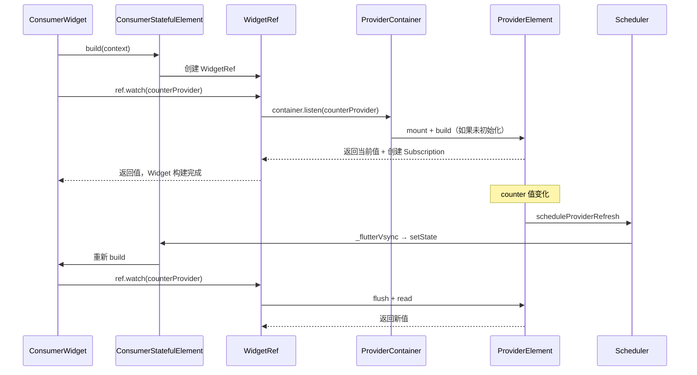
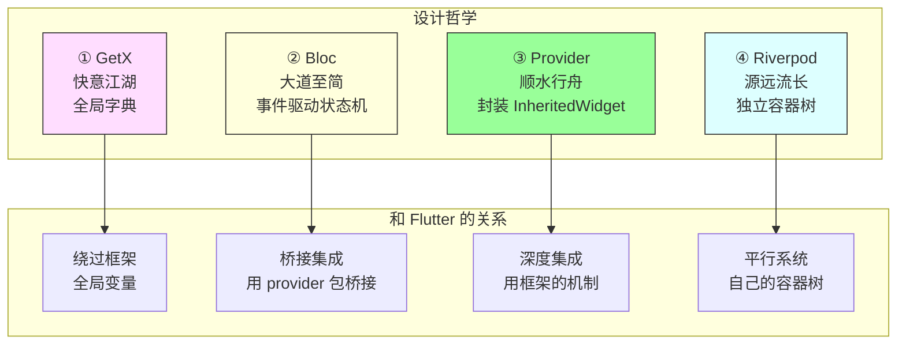

### 源远流长 - Riverpod 源码全面评析（下）：Flutter 集成与实战心法 | 状态管理源码评析⑥

##### 引言：

前两篇我们拆解了 Riverpod 的核心架构和类型系统。那些是"内功"。这一篇聊"外功"——Riverpod 怎么和 Flutter 的 Widget 树连接起来，以及在实战中有哪些值得掌握的技巧。

Riverpod 的状态管理系统是独立于 Widget 树的，但最终状态要驱动 UI 更新。这个"桥梁"怎么搭的？搭得好不好？看完源码你就知道了。

---

#### 一、ProviderScope：桥梁的桥墩

`ProviderScope` 是 Riverpod 和 Flutter 之间的桥梁。每个 Flutter 应用的根部都要包一个 `ProviderScope`，它的作用是把 `ProviderContainer` 注入到 Widget 树中。

---

##### 1. ProviderScope 的本质

```dart
---->[packages/flutter_riverpod/lib/src/core/provider_scope.dart#ProviderScope]----
final class ProviderScope extends StatefulWidget {
  const ProviderScope({
    super.key,
    this.overrides = const [],
    this.observers,
    this.retry,
    required this.child,
  });

  final List<Override> overrides;
  final List<ProviderObserver>? observers;
  final Widget child;
}
```

`ProviderScope` 本身是一个 `StatefulWidget`。它在 `initState` 中创建 `ProviderContainer`，在 `dispose` 中销毁它：

```dart
---->[packages/flutter_riverpod/lib/src/core/provider_scope.dart#ProviderScopeState]----
class ProviderScopeState extends State<ProviderScope> {
  late final ProviderContainer container;

  @override
  void initState() {
    super.initState();
    final parent = _getParent();  // tag1: 查找父 ProviderScope

    container = ProviderContainer(
      parent: parent,              // tag2: 建立容器树
      overrides: widget.overrides,
      observers: widget.observers,
    );
  }

  @override
  void dispose() {
    container.dispose();  // tag3: Widget 销毁时，容器也销毁
    super.dispose();
  }
}
```

`tag1` 处通过 `context.getElementForInheritedWidgetOfExactType` 查找父级的 `ProviderScope`。如果找到了，新容器以它为 parent（`tag2`）。`tag3` 处 Widget 销毁时容器也销毁——生命周期和 Widget 树绑定。

---

##### 2. _UncontrolledProviderScope：真正的 InheritedWidget

`ProviderScope` 的 `build` 方法返回的是一个 `UncontrolledProviderScope`，它内部包了一个 `_UncontrolledProviderScope`——这才是真正的 `InheritedWidget`：

```dart
---->[packages/flutter_riverpod/lib/src/core/provider_scope.dart#_UncontrolledProviderScope]----
final class _UncontrolledProviderScope extends InheritedWidget {
  const _UncontrolledProviderScope({
    required this.container,
    required super.child,
  });

  final ProviderContainer container;

  @override
  bool updateShouldNotify(_UncontrolledProviderScope oldWidget) {
    return container != oldWidget.container;  // tag4: 容器变了才通知
  }
}
```

`tag4` 处的 `updateShouldNotify` 只在容器实例变化时返回 true。容器实例在 `ProviderScope` 的生命周期内不会变，所以这个 InheritedWidget 几乎不会触发子树重建。

停下来想想：如果 `updateShouldNotify` 总是返回 false，那 Consumer 是怎么知道 Provider 的值变了的？

答案：Consumer 不是通过 InheritedWidget 的通知机制来感知 Provider 变化的。它是通过 `ProviderSubscription` 直接订阅 Provider，Provider 变化时通过订阅回调触发 `setState`。InheritedWidget 只是用来传递 `ProviderContainer` 的引用，不负责状态变化的通知。

这是一个很聪明的设计：用 InheritedWidget 做"容器的传递"（低频），用 Subscription 做"状态的通知"（高频）。两个机制各司其职。

---

##### 3. vsync 同步：和 Flutter 帧对齐

`_UncontrolledProviderScopeState` 中有一段关键代码：

```dart
---->[packages/flutter_riverpod/lib/src/core/provider_scope.dart#_UncontrolledProviderScopeState]----
@override
void initState() {
  super.initState();
  widget.container.scheduler.flutterVsyncs.add(_flutterVsync); // tag5: 注册帧同步
}

void _flutterVsync(Task task) {
  _task = task;
  _vsyncTimer = Timer(Duration.zero, () {
    if (mounted) setState(() {});  // tag6: 触发 Widget 重建

    _vsyncTimOutTimer = Timer(Duration.zero, () {
      _callTask();  // tag7: 执行调度任务
    });
  });
}

@override
Widget build(BuildContext context) {
  _callTask();  // tag8: build 时执行待处理的任务
  // ...
}
```

`tag5` 处把 `_flutterVsync` 注册到调度器中。当有 Provider 需要刷新时，调度器调用 `_flutterVsync`，它通过 `setState`（`tag6`）触发 Widget 重建。在 `build` 方法中（`tag8`），待处理的任务被执行，Provider 的值被刷新。

这个机制保证了 Provider 的刷新和 Flutter 的帧渲染是同步的——Provider 在 Widget build 之前完成刷新，Widget 读到的永远是最新值。

---

#### 二、ConsumerWidget：水龙头

`ConsumerWidget` 是用户接触最多的 API。它让 Widget 能够读取 Provider 的值，并在值变化时自动重建。

---

##### 1. WidgetRef 的设计

```dart
---->[packages/flutter_riverpod/lib/src/core/widget_ref.dart#WidgetRef]----
sealed class WidgetRef implements MutationTarget {
  BuildContext get context;

  StateT watch<StateT>(ProviderListenable<StateT> provider);
  StateT read<StateT>(ProviderListenable<StateT> provider);
  void listen<StateT>(ProviderListenable<StateT> provider, /* ... */);
  ProviderSubscription<StateT> listenManual<StateT>(/* ... */);
  StateT refresh<StateT>(Refreshable<StateT> provider);
  void invalidate(ProviderOrFamily provider);
}
```

`WidgetRef` 是一个 sealed class，和 `Ref` 类似但面向 Widget 层。它的 API 和 `Ref` 几乎一样：`watch`、`read`、`listen`。区别在于 `WidgetRef` 多了一个 `context` 属性，以及 `listenManual` 方法。

为什么要分 `Ref` 和 `WidgetRef` 两个接口？因为它们的使用场景不同：

- `Ref` 在 Provider 的 build 函数中使用，生命周期和 Provider 绑定
- `WidgetRef` 在 Widget 的 build 方法中使用，生命周期和 Widget 绑定

分开之后，编译器能帮你检查：你不会在 Widget 层误用 `ref.invalidateSelf()`（那是 Provider 层的 API），也不会在 Provider 层误用 `ref.context`（那是 Widget 层的 API）。

---

##### 2. Consumer 的 build 流程

```dart
---->[packages/flutter_riverpod/lib/src/core/consumer.dart#Consumer]----
final class Consumer extends ConsumerWidget {
  const Consumer({super.key, required this.builder, this.child});

  final ConsumerBuilder builder;
  final Widget? child;

  @override
  Widget build(BuildContext context, WidgetRef ref) {
    return builder(context, ref, child);
  }
}
```

`Consumer` 本身很简单，就是把 `builder` 函数包装成一个 `ConsumerWidget`。真正的魔法在 `ConsumerStatefulElement` 中——它在 build 时创建 `WidgetRef`，通过 `WidgetRef.watch` 建立订阅，Provider 变化时通过订阅回调触发 `setState`。

整个链路：



---

##### 3. TickerMode 暂停优化

Riverpod 有一个很贴心的优化：当 Widget 不可见时（`TickerMode.of(context)` 为 false），自动暂停所有订阅。

这意味着：如果你有一个 Tab 页面，切到其他 Tab 时，当前 Tab 的 Provider 订阅会被暂停。Provider 不会被销毁（状态保留），但也不会触发不必要的重建。切回来时自动恢复。

这个优化对性能的影响在复杂应用中是很明显的。你不需要写任何代码，框架自动帮你做了。

---

#### 三、实战心法：从源码中提炼的使用技巧

看完源码，很多"最佳实践"就不再是死记硬背的规则，而是有源码支撑的理解。

---

##### 1. watch 放在 build 的最顶层

```dart
---->[✅ 正确做法]----
@override
Widget build(BuildContext context, WidgetRef ref) {
  final count = ref.watch(counterProvider);  // 顶层 watch
  final user = ref.watch(userProvider);      // 顶层 watch

  return Column(
    children: [
      Text('$count'),
      Text(user.name),
    ],
  );
}
```

为什么？因为 `ref.watch` 建立的订阅在每次 build 时会被重新创建（旧订阅被清理）。如果你把 `watch` 放在条件分支里，某些 build 可能不会执行到那个 `watch`，导致订阅丢失，下次值变化时不会触发重建。

从源码层面看，这和 Provider 的 `_performBuild` 中 `_runOnDispose` 清理旧订阅是同一个机制。

---

##### 2. 事件处理用 read，不用 watch

```dart
---->[✅ 正确做法]----
ElevatedButton(
  onPressed: () {
    ref.read(counterProvider.notifier).increment();  // 事件中用 read
  },
  child: Text('加一'),
)
```

`read` 不建立订阅，只是一次性读取。在事件处理中你不需要"监听变化"，你只需要"拿到当前值然后操作"。用 `watch` 反而会建立不必要的订阅。

---

##### 3. 副作用用 listen，不用 watch

```dart
---->[✅ 正确做法]----
@override
Widget build(BuildContext context, WidgetRef ref) {
  ref.listen(authProvider, (prev, next) {
    if (!next.isAuthenticated) {
      Navigator.of(context).pushReplacementNamed('/login');
    }
  });

  return /* ... */;
}
```

`listen` 只触发回调，不触发 Widget 重建。弹对话框、导航、显示 SnackBar 这些副作用，用 `listen` 比 `watch` 更合适。`watch` 会导致整个 Widget 重建，但你只是想执行一个副作用，不需要重建 UI。

---

##### 4. select 优化重建粒度

```dart
---->[✅ 优化前]----
// 用户的任何字段变化都会触发重建
final user = ref.watch(userProvider);
return Text(user.name);

---->[✅ 优化后]----
// 只有 name 变化才触发重建
final name = ref.watch(userProvider.select((u) => u.name));
return Text(name);
```

从源码层面看，`select` 创建了一个 `_ProviderSelector`，它在原始 Provider 变化时先执行 selector 函数，然后用 `==` 比较新旧结果。只有结果不同才通知 Widget。

在列表页面中，这个优化的效果很明显。如果你 watch 了一个包含 100 个 todo 的列表，任何一个 todo 的变化都会导致整个列表重建。用 `select` 可以让每个 todo item 只在自己的数据变化时重建。

---

##### 5. autoDispose + keepAlive 的组合拳

```dart
---->[示例代码]----
final searchResultProvider = FutureProvider.autoDispose
    .family<List<Item>, String>((ref, query) async {
  // 数据加载完成后，保持缓存
  final link = ref.keepAlive();

  // 30 秒后允许销毁
  final timer = Timer(Duration(seconds: 30), link.close);
  ref.onDispose(timer.cancel);

  return api.search(query);
});
```

这个模式实现了"带过期时间的缓存"：数据加载完成后通过 `keepAlive` 阻止销毁，30 秒后释放 link 允许销毁。如果 30 秒内用户再次访问，直接使用缓存；超过 30 秒，下次访问时重新加载。

从源码层面看，`keepAlive` 往 `_keepAliveLinks` 列表里加了一个 link，`_performDispose` 检查这个列表是否为空来决定是否销毁。`link.close` 从列表中移除 link，如果列表空了就调用 `mayNeedDispose`。

---

##### 6. Override 做依赖注入

```dart
---->[示例代码]----
// 定义抽象接口
final httpClientProvider = Provider<HttpClient>((ref) {
  return DioHttpClient();  // 默认实现
});

// 测试中替换
ProviderScope(
  overrides: [
    httpClientProvider.overrideWithValue(MockHttpClient()),
  ],
  child: MyApp(),
)
```

这比 GetX 的 `Get.put` 更安全：override 的作用域是明确的（只影响当前 ProviderScope 及其子树），不会污染全局状态。测试之间互不影响。

---

##### 7. 用 Provider 做派生状态

```dart
---->[示例代码]----
final todosProvider = NotifierProvider<TodoList, List<Todo>>(TodoList.new);

final completedTodosProvider = Provider<List<Todo>>((ref) {
  final todos = ref.watch(todosProvider);
  return todos.where((t) => t.isCompleted).toList();
});

final incompleteTodosProvider = Provider<List<Todo>>((ref) {
  final todos = ref.watch(todosProvider);
  return todos.where((t) => !t.isCompleted).toList();
});
```

`completedTodosProvider` 和 `incompleteTodosProvider` 是从 `todosProvider` 派生出来的。`todosProvider` 变化时，两个派生 Provider 自动重新计算。如果计算结果没变（比如你修改了一个已完成的 todo 的标题），依赖它们的 Widget 不会重建。

这是函数式 Provider 最典型的用法：把"计算逻辑"从 Widget 层提取到 Provider 层，让框架帮你管理缓存和更新。

---

#### 四、终极对比：四大方案的源码级总结

四篇文章写下来，是时候做一个完整的对比了。这不是"哪个最好"的排名，而是从源码层面看它们各自的设计选择和代价。

---



| 维度 | GetX | Bloc | Provider | Riverpod |
|------|------|------|----------|----------|
| 底层机制 | 全局静态 Map | Stream + provider 包 | InheritedWidget | 独立容器树 |
| 状态存储 | 全局字典 | Bloc 实例（Widget 树上） | Widget 树上 | ProviderContainer |
| 依赖追踪 | 隐式 proxy，运行时收集 | 无内置（手动监听 Stream） | 显式 `of(context)` | 显式 `ref.watch` |
| 作用域 | 无，全局唯一 | Widget 树天然支持 | Widget 树天然支持 | ProviderScope 嵌套覆盖 |
| 精准重建 | 无（Obx 整体重建） | BlocSelector / buildWhen | context.select | ref.watch + select |
| 生命周期 | SmartManagement（路由绑定） | 和 Widget 绑定 | 和 Widget 绑定 | autoDispose + keepAlive + pause/resume |
| 可追溯性 | 无 | Transition 记录事件+状态 | 无 | 无内置 |
| 并发控制 | 无 | EventTransformer 四种策略 | 无 | 无内置 |
| 异步支持 | 无内置 | 自定义状态类 | FutureProvider（有限） | AsyncValue（完整） |
| 测试 | 手动 Get.put | bloc_test 包 | 需要 Widget 环境 | Override 替换，纯 Dart |
| 依赖 context | ❌ 全局访问 | ✅ 通过 provider | ✅ 必须 | ❌ Ref 独立 |
| 脱离 Flutter | ❌ | ✅ bloc 核心包纯 Dart | ❌ | ✅ 纯 Dart 可用 |
| DevTools | 不可见 | Widget Inspector 可见 | Widget Inspector 可见 | 专用 DevTools |
| 源码量 | ~数千行 | ~500 行 | ~1000 行 | ~数千行 |
| 学习曲线 | 低 | 中 | 低 | 中-高 |

---

##### 四条路，四种哲学

**GetX** 像路边摊——什么都能做，灵活但没规矩。全局字典一把梭，快是快，但项目大了容易失控。

**Bloc** 像标准化连锁店——流程固定、品控稳定、可复制性强。事件驱动的状态机让每一次状态变更都有迹可循，但样板代码是实实在在的成本。

**Provider** 像自家厨房——用的是家里现成的锅碗瓢盆（InheritedWidget），不用额外添置设备。学了 Provider 就是在学 Flutter 本身，但厨房的大小受限于房子（context）。

**Riverpod** 像米其林餐厅——食材供应链精密复杂，出品质量高，但运营成本也高。独立容器树、autoDispose、AsyncValue、Override——能力边界最广，但学习曲线也最陡。

##### 怎么选

- **刚入门 Flutter，项目不大** → Provider 或 Cubit。贴近框架，学习成本低。
- **中等规模，需要可追溯性和并发控制** → Bloc。事件系统和 BlocObserver 在团队协作中很有价值。
- **大型项目，需要复杂的依赖管理和测试** → Riverpod。容器树、autoDispose、Override 在复杂场景下优势明显。
- **快速原型，不在乎架构** → GetX 或 Cubit。但要做好后期迁移的心理准备。

没有最好的方案，只有最适合当前阶段的方案。

---

#### 五、Riverpod 的天花板在哪

公道地说，Riverpod 也不是完美的。

---

##### 1. 概念负担

Provider、NotifierProvider、FutureProvider、StreamProvider、Family、autoDispose、select、Override、ProviderScope、Ref、WidgetRef……概念确实多。对于一个只想"把数据从 A 传到 B"的新手来说，这个学习成本是实实在在的。

---

##### 2. 代码生成的依赖

Riverpod 2.0+ 推荐使用 `@riverpod` 注解 + 代码生成。这简化了 Provider 的定义，但也引入了对 `build_runner` 的依赖。代码生成在大型项目中的编译速度是一个痛点。

---

##### 3. 调试的间接性

状态不在 Widget 树上，Widget Inspector 看不到。虽然有 Riverpod DevTools，但它是一个独立的工具，不如 Widget Inspector 那样和 IDE 深度集成。

---

##### 4. 过度设计的风险

Riverpod 的能力很强，但也容易过度设计。一个简单的计数器应用，用 `setState` 三行代码搞定的事，用 Riverpod 可能要定义 Provider、Notifier、ProviderScope……杀鸡用牛刀。

适合的时期，学适合的东西，也是非常重要的。如果你的项目还在原型阶段，不需要作用域隔离、不需要精准重建、不需要复杂的测试，那 Riverpod 的很多能力你用不上。等项目长大了再引入也不迟。

---

#### 碎碎念

四篇文章（GetX → Bloc → Provider → Riverpod）写下来，最大的感受是：**它们解决的是同一个问题，但走的是完全不同的路。**

GetX 用一本全局字典解决一切，简单粗暴，快意江湖。Bloc 用事件驱动的状态机，严谨可控，大道至简。Provider 顺着 Flutter 的水流走，用框架自己的 InheritedWidget，顺水行舟。Riverpod 在 Flutter 旁边挖了一条新河，独立容器树，源远流长。

四条路都能到达目的地。选哪条，取决于你的项目有多大、团队有多少人、你愿意付出多少学习成本。

从源码质量来看，四个方案都有值得学习的地方：GetX 的 proxy + save/restore 自动依赖收集确实精巧；Bloc 的接口隔离和 EventTransformer 策略模式是教科书级设计；Provider 的 Delegate 模式和 aspect 精准通知把 InheritedWidget 的能力发挥到了极致；Riverpod 的容器树、调度器、生命周期管理（pause/resume/dispose）是工程质量最高的实现。

但我也理解为什么有人觉得"选择太多了"。不是每个项目都需要容器树、事件追溯、精准重建。就像不是每个人都需要一辆越野车——如果你只在城市里开，一辆轿车就够了。但如果你要去越野，轿车就不行了。关键是知道自己要去哪里。

说到底，技术选型是一个权衡。了解了源码之后，这个权衡你自己就能做了。不需要听别人说"XX 好"或者"XX 不好"——自己去看源码，自己去验证，自己去判断。

人云亦云是技术成长最大的敌人。

---

*我是张风捷特烈，如果你对 Flutter 框架的源码分析感兴趣，欢迎关注。「状态管理大乱斗」系列到这里来到第六篇，后续还会有其他状态管理分析，敬请期待。GetX 的全局字典、Bloc 的事件状态机、Provider 的 InheritedWidget 封装、Riverpod 的独立容器树——四条路，四种哲学，希望对你有帮助。*