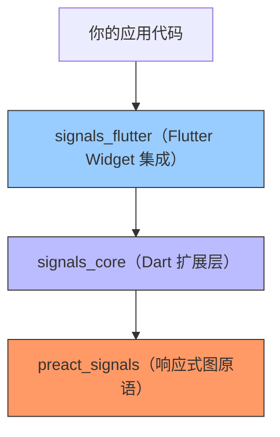
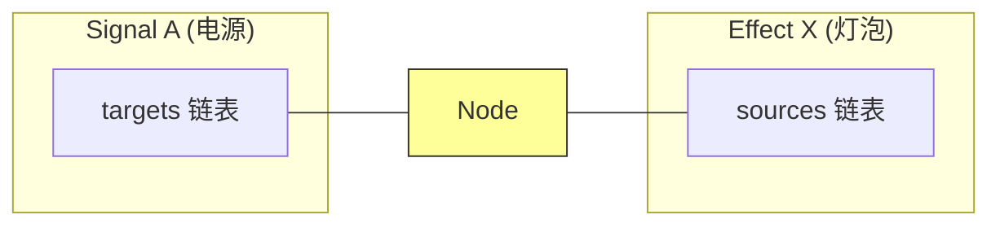
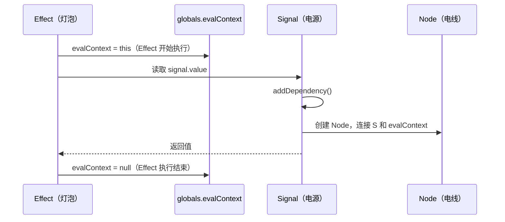
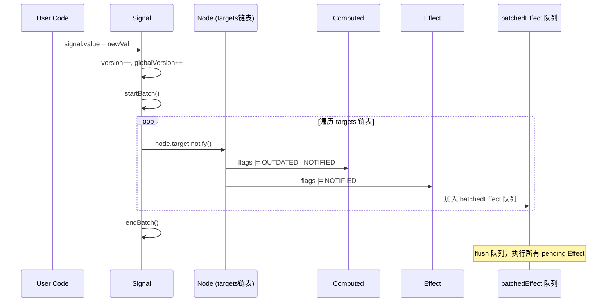
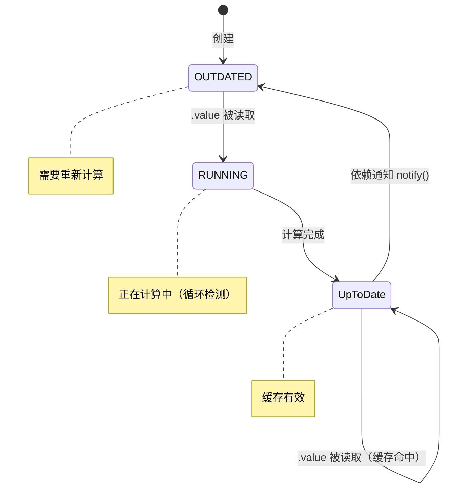
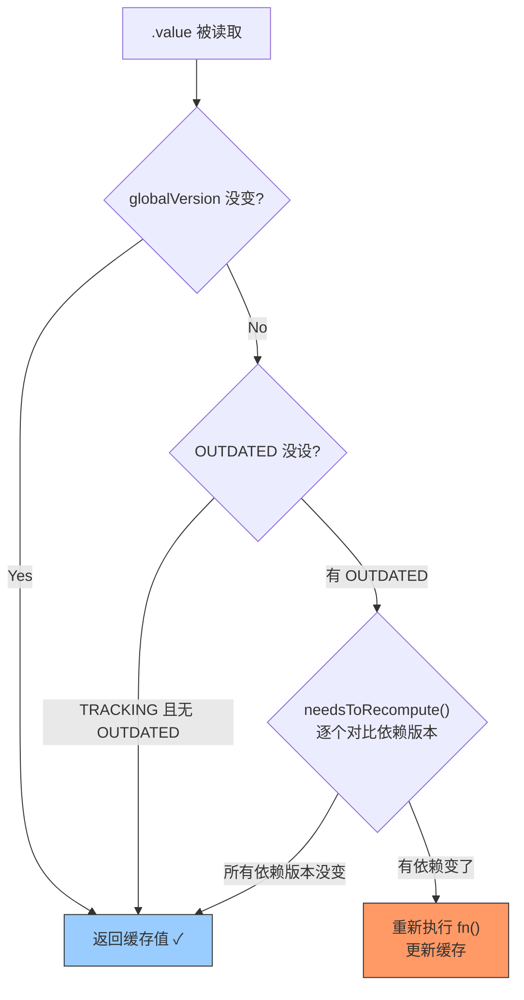
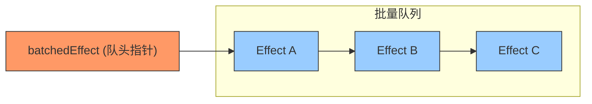
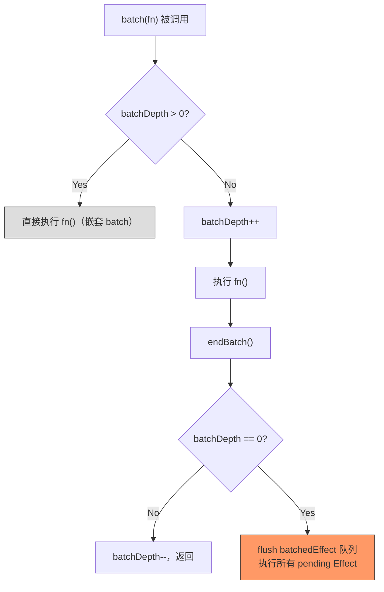
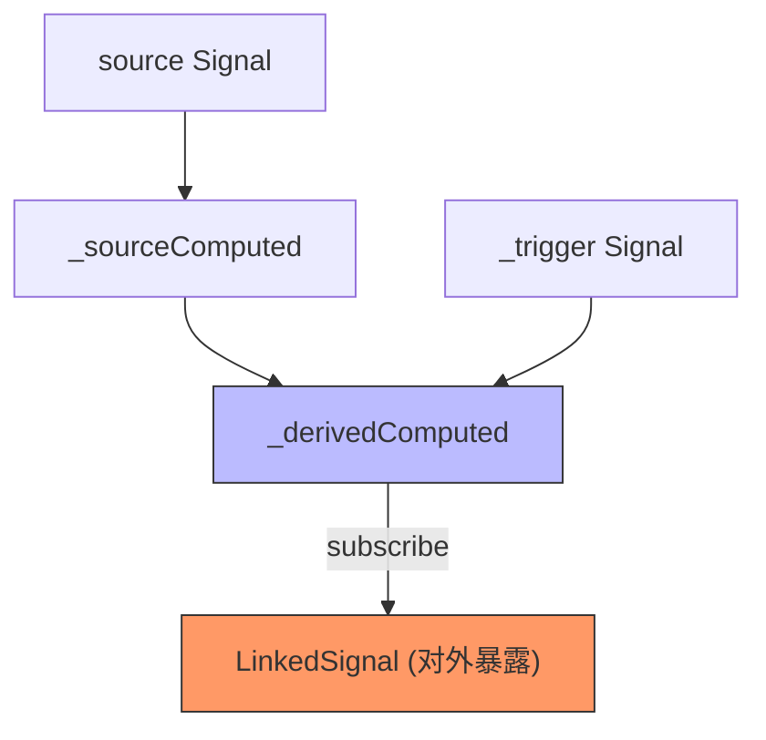
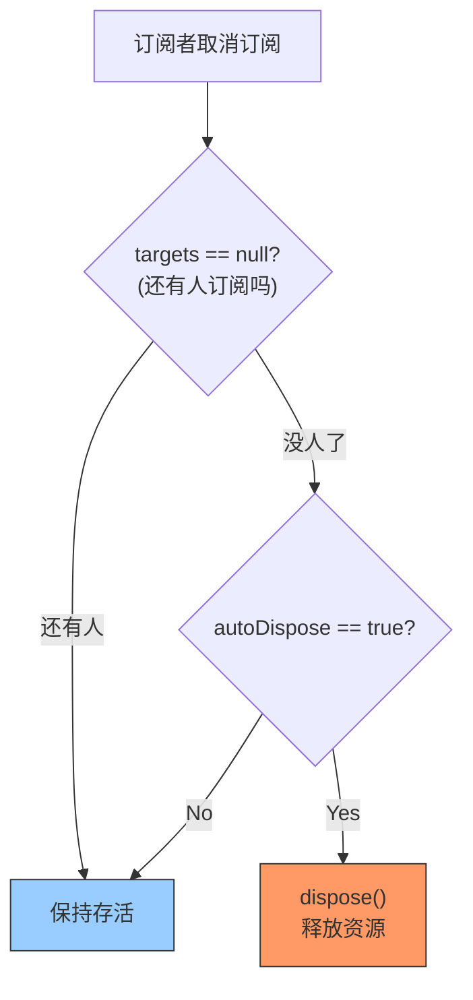

#### 引言：

有一种神奇的电路叫"自动追踪电路"。你往电路板上接一个灯泡（Effect），灯泡亮的时候，电路板自动记录下它用了哪些电源（Signal）。以后只要这些电源的电压变了，电路板就自动让灯泡重新亮一次。你不需要手动接线，不需要手动断线，不需要关心哪个灯泡依赖哪个电源。接上就能用，拔掉就断开。

这就是 Signals 的核心思想：**自动依赖追踪 + 精确通知**。

Signals.dart 7.1 是一个 Dart/Flutter 响应式状态管理库，灵感来自 Preact Signals（JavaScript 社区的细粒度响应式方案）。它的底层用一个双向链表构建的依赖图实现了"读即订阅、写即通知"的响应式模型。

本篇深入 7.1 版本的核心源码，看看它到底是怎么做到"自动追踪"的。

用电路板的类比来对应一下：

| 电路板 | Signals | 说明 |
|--------|---------|------|
| 电源 | `Signal` | 可读写的响应式值 |
| 变压器 | `Computed` | 从电源派生的只读值，懒计算+缓存 |
| 灯泡 | `Effect` | 消费响应式值的副作用 |
| 电线 | `Node`（链表节点） | 连接电源和灯泡的依赖关系 |
| 电路板 | `evalContext` + `flags` | 全局追踪上下文，知道当前谁在"亮" |
| 总开关 | `batch` | 批量更新，多次写入只触发一次通知 |
| 联动开关 | `LinkedSignal` | 可写的 Computed，源变时自动重置 |

---

#### 一、架构总览：两层设计

打开 signals.dart 7.1 的 `packages` 目录，你会发现一个关键的分层：



**底层 `preact_signals`** 提供响应式图的核心原语：`Signal`（可变值）、`Computed`（派生值）、`Effect`（副作用）、`Node`（依赖边）、`batch`（批量更新）。这一层直接从 Preact Signals 的算法移植而来，纯计算逻辑，不依赖任何 Flutter/Dart 特殊能力。

**中间层 `signals_core`** 在 `preact_signals` 基础上扩展 Dart 特性：`autoDispose`（自动销毁）、`SignalsObserver`（DevTools 调试）、`LinkedSignal`（可写 Computed）、`SignalContainer`（参数化工厂）、`Options` 体系。

**上层 `signals_flutter`** 负责和 Flutter Widget 树集成：`SignalWidget`、`Watch`、`onSignalRead` 钩子等。

这篇文章聚焦底层和中间层。看看"自动追踪"到底怎么实现的。

---

#### 二、Node：依赖图的"电线"

整个 Signals 系统的核心数据结构不是 Signal 本身，而是 `Node`。它是连接"电源"（Signal）和"灯泡"（Effect/Computed）的那根"电线"。



`Node` 是一个双向链表节点，它同时出现在两条链表中：

```dart
---->[preact_signals/src/node.dart#Node]----
class Node {
  late ReadonlySignal source;    // 这条线连的是哪个电源
  Node? prevSource;              // 同一灯泡的上一条线
  Node? nextSource;              // 同一灯泡的下一条线

  late Listenable target;        // 这条线连的是哪个灯泡
  Node? prevTarget;              // 同一电源的上一条线
  Node? nextTarget;              // 同一电源的下一条线

  late int version;              // 上次看到的电源版本号
  Node? rollbackNode;            // 上下文切换时的回滚指针
}
```

一个 `Node` 同时在两条链表里：
- **Signal 的 `targets` 链表**：记录"谁在监听我"（通过 `prevTarget`/`nextTarget` 遍历）
- **Effect/Computed 的 `sources` 链表**：记录"我依赖了谁"（通过 `prevSource`/`nextSource` 遍历）

这种"十字链表"结构的好处：订阅和取消订阅都是 O(1) 操作，不需要遍历。

---

##### 1. version：脏检查的利器

`Node` 上的 `version` 字段记录了"上次我看到这个 Signal 是第几版"。Signal 每次被写入，`version` 就 +1。Computed 在求值前，可以通过对比 `node.version` 和 `node.source.version` 来判断"依赖是否真的变了"，避免不必要的重新计算。

这是一种经典的**乐观脏检查**：先假设没变，快速对比版本号；只有版本号不同时，才去真正求值。

---

#### 三、自动追踪：读即订阅

"自动追踪"的秘密藏在 `Signal.value` 的 getter 里。当你在 `effect` 或 `computed` 的回调中读取一个 Signal 的 `.value`，它会偷偷在背后建立一条依赖关系。



关键在 `addDependency()` 方法：

```dart
---->[preact_signals/src/readonly.dart#ReadonlySignal.addDependency]----
Node? addDependency() {
  if (evalContext == null) {          // tag1
    return null;
  }

  var node = signal.node;
  if (node == null || node.target != evalContext) {
    // 新依赖：创建 Node，挂到 evalContext 的 sources 尾部
    node = Node()
      ..version = 0
      ..source = signal
      ..prevSource = evalContext!.sources    // tag2
      ..nextSource = null
      ..target = evalContext!
      ..prevTarget = null
      ..nextTarget = null
      ..rollbackNode = node;

    if (evalContext!.sources != null) {
      evalContext!.sources!.nextSource = node;
    }
    evalContext!.sources = node;             // tag3
    signal.node = node;

    if ((evalContext!.flags & TRACKING) != 0) {
      signal.subscribeToNode(node);          // tag4
    }
    return node;
  } else if (node.version == -1) {
    // 旧依赖复用：标记为仍在使用
    node.version = 0;                        // tag5
    // ... 移到链表尾部
    return node;
  }
  return null;
}
```

`tag1`：没有活跃的执行上下文（不在 effect/computed 中），不追踪。这就是为什么在普通代码中读 `.value` 不会建立订阅。

`tag2/tag3`：把新 Node 追加到 `evalContext.sources` 链表的尾部。

`tag4`：如果当前上下文正在追踪（`TRACKING` 标志），就真正订阅这个 Signal 的通知。

`tag5`：如果这个依赖上次就存在（version 被标为 -1 表示"可能不再需要"），复用它，标回 0。

整个过程对用户完全透明。你只是读了一个 `.value`，背后已经自动建立了订阅关系。

---

#### 四、通知传播：写即触发

Signal 被写入时，通知所有依赖它的下游。流程如下：



核心代码在 `internalSetValue`：

```dart
---->[preact_signals/src/signal.dart#Signal.internalSetValue]----
void internalSetValue(T val) {
  if (batchIteration > 100) {
    throwCycleDetected();              // tag1
  }

  recordBatchSnapshot(this);
  internalValue = val;
  version++;                           // tag2
  globalVersion++;                     // tag3

  startBatch();
  try {
    for (var node = targets; node != null; node = node.nextTarget) {
      node.target.notify();            // tag4
    }
  } finally {
    endBatch();
  }
}
```

`tag1`：循环检测。如果批量迭代超过 100 次，说明有循环依赖（A 写 B，B 写 A），直接抛异常。

`tag2`：Signal 的版本号 +1。这是 Computed 做脏检查的依据。

`tag3`：全局版本号 +1。Computed 用这个做快速路径判断（如果全局版本没变，一定没有任何 Signal 变过）。

`tag4`：遍历 `targets` 链表，通知每一个下游。`notify()` 不是"立即重新计算"，而是"标记为需要重新计算"（设置 `OUTDATED` 和 `NOTIFIED` 标志）。

通知是**标记式**的，不是**立即执行**的。Effect 被标记后，放入 `batchedEffect` 队列，等 `endBatch` 时统一执行。这保证了：
- 同一帧内多次写入，Effect 只执行一次
- 不会出现"中间状态"被观察到（glitch-free）

---

#### 五、Computed：懒求值的变压器

`Computed` 是一个"只读的派生值"。它的回调只有在被读取时才执行（懒），结果会被缓存（memoized），只有依赖变了才重新计算。



Computed 的核心是 `internalRefresh` 方法（也就是 `.value` getter 触发的逻辑）：



三重快速路径：大多数情况在第一步（globalVersion）就返回了。只有真正有变化时才走到最后一步。

```dart
---->[preact_signals/src/computed.dart#Computed.internalRefresh]----
bool internalRefresh() {
  flags &= ~NOTIFIED;

  if ((flags & RUNNING) != 0) {
    return false;                        // tag1：循环检测
  }

  if ((flags & (OUTDATED | TRACKING)) == TRACKING) {
    return true;                         // tag2：有订阅者且没被标脏 → 缓存有效
  }
  flags &= ~OUTDATED;

  if (internalGlobalVersion == globalVersion) {
    return true;                         // tag3：全局版本没变 → 快速返回
  }
  internalGlobalVersion = globalVersion;

  flags |= RUNNING;
  if (version > 0 && !needsToRecompute()) {
    flags &= ~RUNNING;
    return true;                         // tag4：逐个检查依赖版本，都没变 → 跳过
  }

  final prevContext = evalContext;
  try {
    prepareSources();                    // tag5：标记所有旧依赖为"可能不再需要"
    evalContext = this;                  // tag6：设置追踪上下文
    final val = fn();                    // tag7：执行回调，触发 addDependency
    if (!_isInitialized || _internalValue != val || version == 0) {
      internalValue = val;
      version++;
    }
  } catch (err, stack) {
    error = SignalEffectException(err, stack);
    flags |= HAS_ERROR;
    version++;
  }
  evalContext = prevContext;
  cleanupSources();                      // tag8：移除不再需要的旧依赖
  flags &= ~RUNNING;
  return true;
}
```

`tag1`：如果 `RUNNING` 标志已经设置，说明这个 Computed 正在计算自己的值时又被读取了，这是循环依赖。

`tag2`：快速路径。如果有订阅者（`TRACKING`）且没被标脏（无 `OUTDATED`），说明缓存一定有效。

`tag3`：全局快速路径。如果整个系统的 `globalVersion` 没变过，不可能有任何 Signal 被写入过，所有 Computed 都不需要重新计算。

`tag4`：`needsToRecompute` 遍历 sources 链表，逐个对比 `node.version` 和 `node.source.version`。如果所有依赖的版本号都没变，跳过重新计算。

`tag5/tag8`：`prepareSources` 把所有旧依赖的 `version` 标为 -1（"可能不再需要"），执行回调后，`cleanupSources` 移除那些仍然是 -1 的节点（"确实不再需要了"）。这实现了**动态依赖追踪**：如果 Computed 的回调中有条件分支，不同条件下依赖不同的 Signal，每次重新计算时都会自动更新依赖列表。

`tag6/tag7`：设置 `evalContext = this`，然后执行回调。回调中读取的每个 Signal 都会调 `addDependency`，自动注册为这个 Computed 的依赖。

---

##### 1. Computed 的懒订阅

Computed 有一个精巧的优化：**只有在自己有订阅者时，才去订阅上游**。

```dart
---->[preact_signals/src/computed.dart#Computed.subscribeToNode]----
void subscribeToNode(Node node) {
  if (targets == null) {               // tag1：首次有人订阅我
    flags |= OUTDATED | TRACKING;

    for (var node = sources; node != null; node = node.nextSource) {
      node.source.subscribeToNode(node);  // tag2：我才去订阅我的依赖
    }
  }
  internalSubscribe(node);
}
```

`tag1`：只有当 Computed 自己获得第一个订阅者时（比如被 Effect 读取），才设置 `TRACKING` 并订阅上游。

`tag2`：递归地订阅所有 sources。

反过来，当 Computed 失去最后一个订阅者时，它会**取消对上游的订阅**：

```dart
void unsubscribeFromNode(Node node) {
  if (targets != null) {
    signalUnsubscribe(node);

    if (targets == null) {              // 最后一个订阅者走了
      flags &= ~TRACKING;
      for (var node = sources; node != null; node = node.nextSource) {
        node.source.unsubscribeFromNode(node);  // 取消上游订阅
      }
    }
  }
}
```

这意味着：如果没有人在乎一个 Computed 的值，它就不会追踪任何东西，不会消耗任何资源。只有当有人需要它时，它才"醒来"开始工作。这是一种**需求驱动的资源管理**。

---

#### 六、Effect：灯泡的亮与灭

Effect 是响应式图的"终端消费者"。它不返回值（和 Computed 不同），只执行副作用。

```dart
---->[preact_signals/src/effect.dart#Effect.callback]----
void callback() {
  final finish = start();              // tag1
  try {
    if ((flags & DISPOSED) != 0) return;
    if (fn == null) return;
    currentEffect = this;
    final cleanup = fn!();             // tag2
    currentEffect = null;
    if (cleanup is Function) {
      this.cleanup = cleanup;          // tag3
    }
  } finally {
    finish();                          // tag4
  }
}
```

`tag1`：`start()` 做三件事：设置 `RUNNING` 标志、调用 `cleanupEffect`（执行上次的清理函数）、调用 `prepareSources`（标记旧依赖）、设置 `evalContext = this`。

`tag2`：执行用户回调。回调中读取的 Signal 会自动注册为依赖。

`tag3`：如果回调返回了一个函数，保存为 `cleanup`。下次 Effect 重新执行时会先调用它。

`tag4`：`finish()` 调用 `cleanupSources`（移除不再需要的依赖）、恢复 `evalContext`、调 `endBatch`。

---

##### 1. Effect 的批量调度

当一个 Signal 被写入，Effect 不是立即执行，而是被加入一个批量队列：



Effect 通过 `nextBatchedEffect` 字段形成一个单链表。`batchedEffect` 全局变量指向队头：

```dart
---->[preact_signals/src/effect.dart#Effect.notify]----
void notify() {
  if (!((flags & NOTIFIED) != 0)) {
    flags |= NOTIFIED;
    nextBatchedEffect = batchedEffect;   // tag1
    batchedEffect = this;                // tag2
  }
}
```

`tag1/tag2`：Effect 通过 `nextBatchedEffect` 形成一个单链表（"批量队列"）。`batchedEffect` 全局变量指向队头。

真正的执行发生在 `endBatch` 中：

```dart
---->[preact_signals/src/batch.dart#endBatch 简化]----
void endBatch() {
  if (batchDepth > 1) { batchDepth--; return; }  // 嵌套 batch 不 flush

  while (batchedEffect != null) {
    Effect? effect = batchedEffect;
    batchedEffect = null;
    batchIteration++;

    while (effect != null) {
      final next = effect.nextBatchedEffect;
      effect.nextBatchedEffect = null;
      effect.flags &= ~NOTIFIED;

      if (!((effect.flags & DISPOSED) != 0) && effect.needsToRecompute()) {
        effect.callback();               // tag3
      }
      effect = next;
    }
  }
  batchIteration = 0;
  batchDepth--;
}
```

`tag3`：只有当 Effect 确实需要重新计算时（`needsToRecompute` 对比依赖版本号），才执行回调。

---

#### 七、Batch：总开关的秘密

`batch` 让你把多次写入合并为一次通知。它的嵌套安全机制用 `batchDepth` 计数实现：



核心源码：

```dart
---->[preact_signals/src/batch.dart#batch]----
T batch<T>(T Function() fn) {
  if (batchDepth > 0) {
    return fn();                         // tag1：嵌套 batch 直接执行
  }
  currentBatchSnapshotVersion = ++batchSnapshotVersion;
  startBatch();                          // tag2：batchDepth++
  try {
    return fn();
  } finally {
    endBatch();                          // tag3：flush 所有 pending effects
  }
}
```

`tag1`：嵌套的 batch 不会创建新的事务，直接执行。只有最外层 batch 结束时才 flush。

`tag2/tag3`：`startBatch` 增加深度计数，`endBatch` 减少深度计数并在归零时执行所有待处理的 Effect。

一个精妙的细节：Signal 的 `internalSetValue` 内部也调用了 `startBatch/endBatch`。这意味着即使不显式使用 `batch`，单次写入触发的通知传播也是"批量"的：先通知所有下游（标记 NOTIFIED），再统一执行 Effect。不会出现"通知到一半就执行"的情况。

另一个细节：`recordBatchSnapshot` 在 batch 内部记录每个 Signal 被写入前的值。batch 结束时 `reconcileBatchSnapshots` 检查：如果一个 Signal 被写了多次，但最终值和开始时一样，就把 version 回滚。这避免了"写了等于没写"的无效通知。

---

#### 八、LinkedSignal：联动开关

`LinkedSignal` 是 7.1 的新特性。它是一个"可写的 Computed"：默认值从源 Signal 派生，但你可以手动覆盖。当源变化时，手动覆盖被丢弃，自动重置为新的派生值。



实现方式很巧妙：内部用三个信号协作。

```dart
---->[signals_core/src/core/linked_signal.dart#LinkedSignal 简化]----
class LinkedSignal<T, S> extends Signal<T> {
  final S Function() _source;
  final T Function(S, LinkedSignalPreviousState<T, S>?) _computation;
  final bool Function(S a, S b) _sourceEquality;

  bool _hasOverride = false;
  T? _overrideValue;

  late final Signal<int> _trigger;
  late final Computed<T> _derivedComputed;
  late final Computed<S> _sourceComputed;

  LinkedSignal({required S Function() source, ...}) {
    _trigger = signal(0);
    _sourceComputed = computed(_source);

    _derivedComputed = computed(() {
      _trigger.value;                     // tag1：依赖 trigger
      final sourceVal = _sourceComputed.value;

      final sourceChanged = !_hasLastSourceValue ||
          !_sourceEquality(sourceVal, _lastSourceValue as S);

      if (sourceChanged) {                // tag2：源变了 → 重置
        final defaultValue = _computation(sourceVal, prev);
        _hasOverride = false;
        return defaultValue;
      }

      if (_hasOverride) {                 // tag3：有手动覆盖 → 用覆盖值
        return _overrideValue as T;
      }

      return _lastValue as T;
    });

    // 同步到外部 Signal
    _cleanupSubscription = _derivedComputed.subscribe((val) {
      super.set(val, force: true);
    });
  }

  @override
  bool set(T val, {bool force = false}) {
    _overrideValue = val;
    _hasOverride = true;
    _trigger.value++;                     // tag4：触发重新计算
    return true;
  }
}
```

`tag1`：`_derivedComputed` 依赖 `_trigger`。每次手动写入时 `_trigger` 递增（tag4），触发重新计算。

`tag2`：如果源变了，清除覆盖标记，返回派生的默认值。

`tag3`：如果源没变但有手动覆盖，返回覆盖值。

`tag4`：手动写入不直接修改 Signal 的值，而是设置覆盖标记后递增 `_trigger`，让 `_derivedComputed` 重新计算。

这个设计的核心洞察：**用 Computed 的依赖追踪机制来判断"源是否变了"**。不需要手动 diff，不需要额外的监听器，利用现有的响应式基础设施就能实现"源变时自动重置"。

---

#### 九、AutoDispose：灯泡的自动关闭

`SignalsAutoDisposeMixin` 让 Signal/Computed 在最后一个订阅者取消后自动销毁自己：



实现只需一行判断：

```dart
---->[signals_core/src/core/signal.dart#Signal.unsubscribeFromNode]----
@override
void unsubscribeFromNode(Node node) {
  super.unsubscribeFromNode(node);
  if (autoDispose && targets == null) {   // tag1
    dispose();
  }
}
```

`tag1`：每次有订阅者取消时检查：如果开启了 `autoDispose` 且没有任何订阅者了（`targets == null`），自动销毁。

这和 Riverpod 的 `autoDispose` 思路类似，但实现层面更轻量：不需要 ProviderContainer 的引用计数，直接利用链表是否为空来判断。

---

#### 学到了什么

1. **`evalContext` 全局变量是自动追踪的核心。** 读取 `.value` 时检查 `evalContext` 是否非空，非空就建立依赖。这个"隐式上下文"模式让用户代码不需要显式声明依赖。

2. **Node 的双向链表实现了 O(1) 的订阅/取消订阅。** 不需要 HashSet，不需要遍历查找，直接操作指针。代价是每个 Node 占 8 个指针字段的内存。

3. **Computed 的三重快速路径避免了不必要的重新计算。** 先查全局版本，再查 OUTDATED 标志，最后逐个对比依赖版本。大多数情况下在第一步就返回了。

4. **批量更新通过 `batchDepth` 计数实现嵌套安全。** 内层 batch 不 flush，只有最外层结束时才统一执行 Effect。加上 `reconcileBatchSnapshots` 回滚无效写入，保证了 glitch-free。

5. **LinkedSignal 用"Computed + trigger Signal"的组合实现了"可写 Computed"。** 利用现有响应式原语而非引入新的底层机制，是一种优雅的"在框架内组合"的设计。

---

#### 碎碎念

Signals.dart 7.1 的源码读起来像一篇精心写就的函数式编程教材。每个函数都很短，每个字段都有明确的职责，没有多余的抽象层。响应式图的核心就是几百行代码：一个双向链表、一个全局上下文指针、一组位标志。

但这几百行代码背后是几十年的积累。从 MobX 到 SolidJS 到 Preact Signals，细粒度响应式的核心算法经过了无数次迭代。Signals.dart 站在这些巨人的肩膀上，用 Dart 的语法重新表达了这套算法，并加入了 Dart/Flutter 生态需要的 autoDispose、DevTools 集成、LinkedSignal 等实用扩展。

如果让我用一句话总结这套架构的设计哲学：**读即订阅，写即通知，不用不算。** 三个规则，构成了整个响应式世界。
