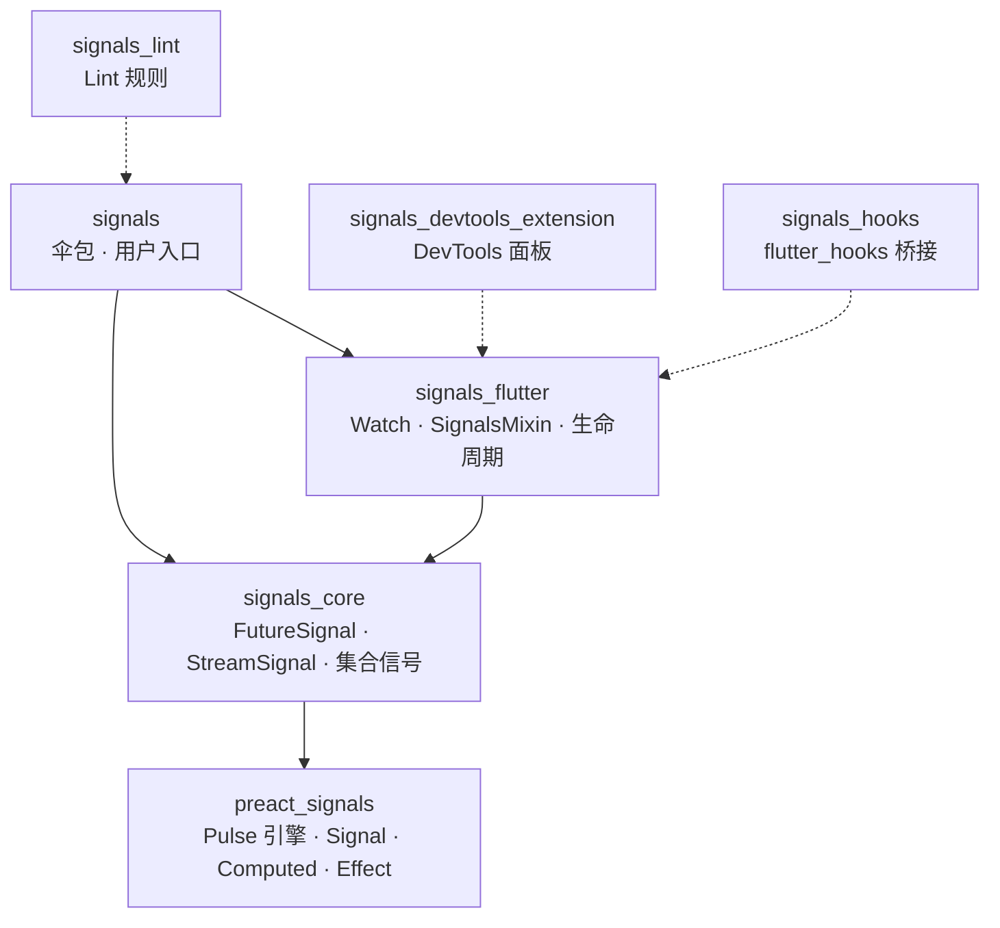
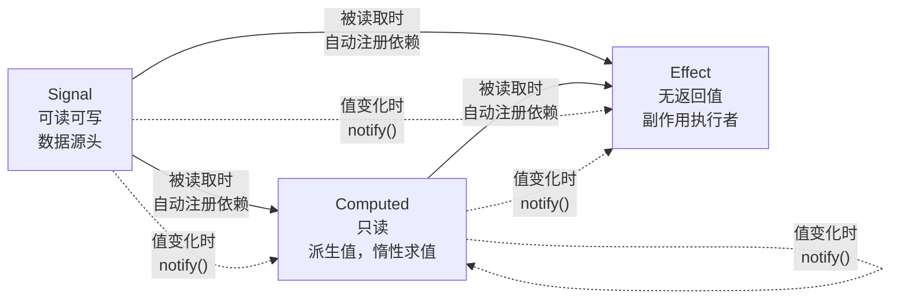
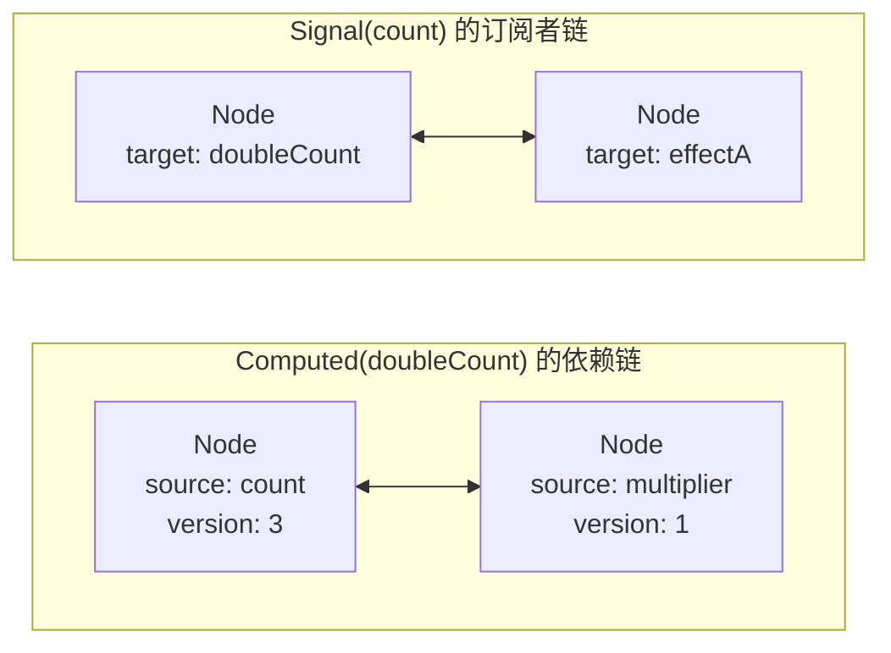
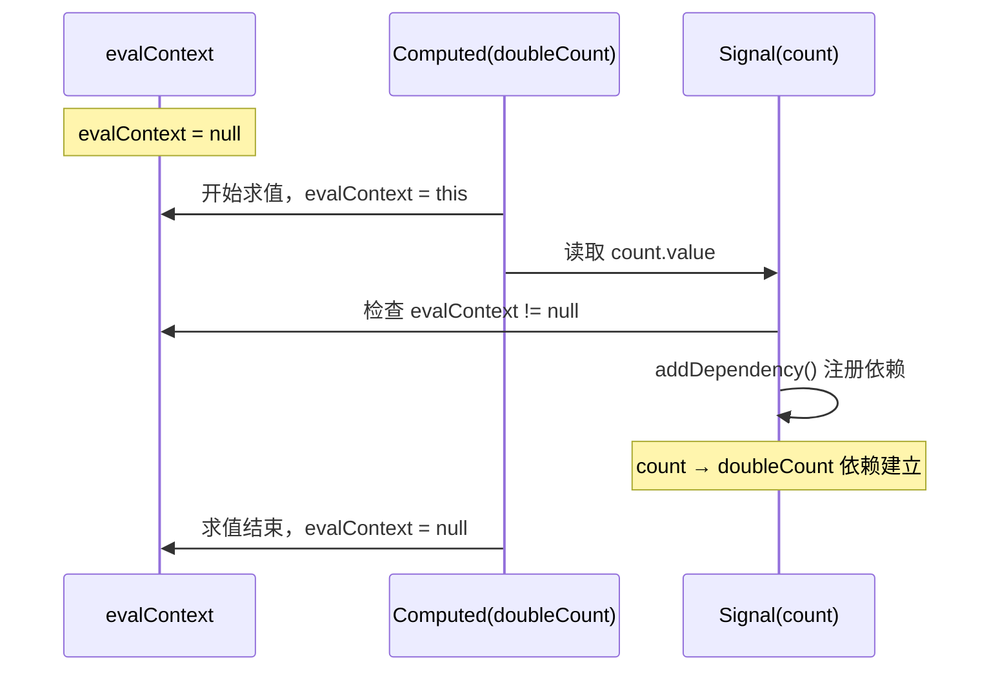
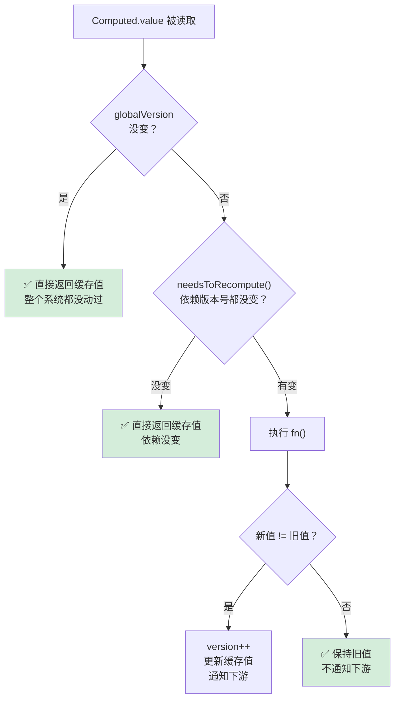
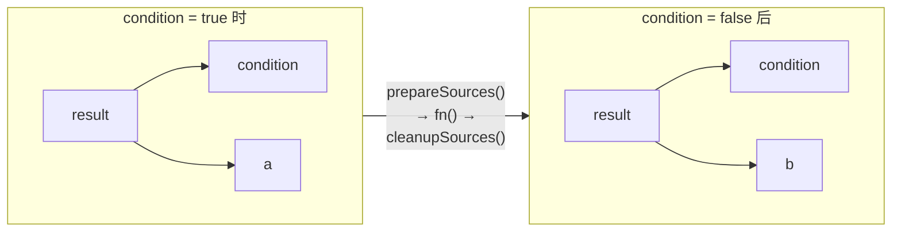
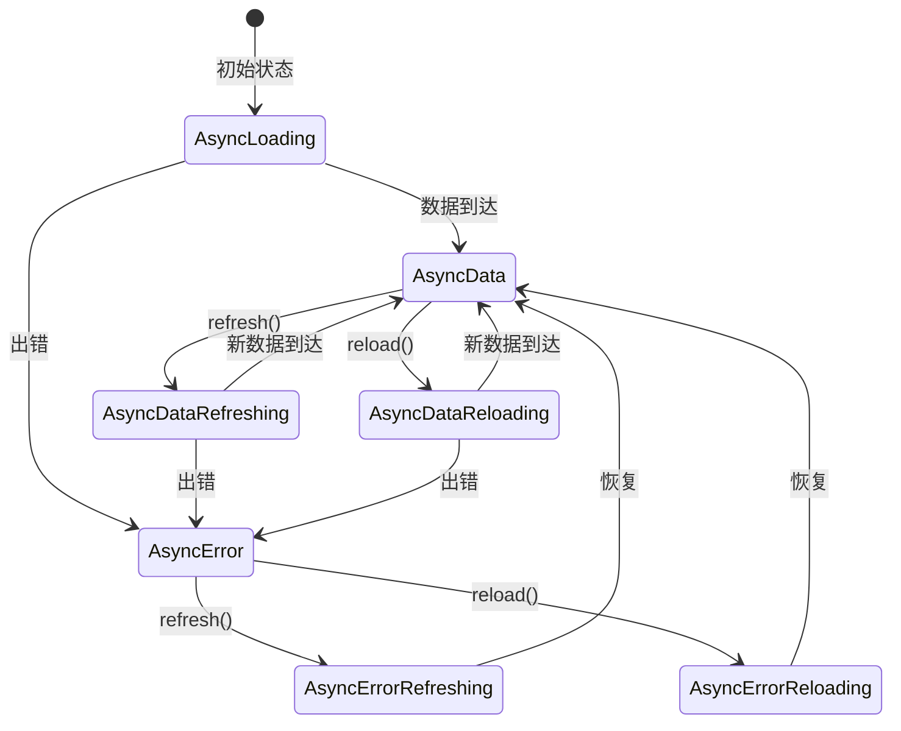
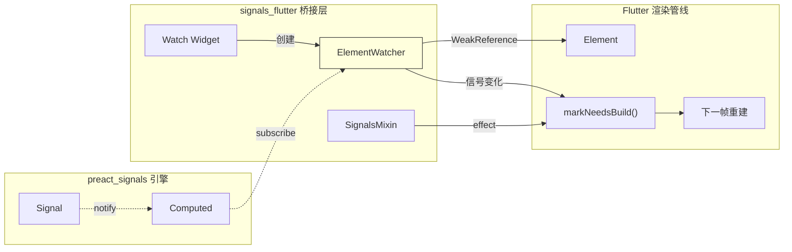
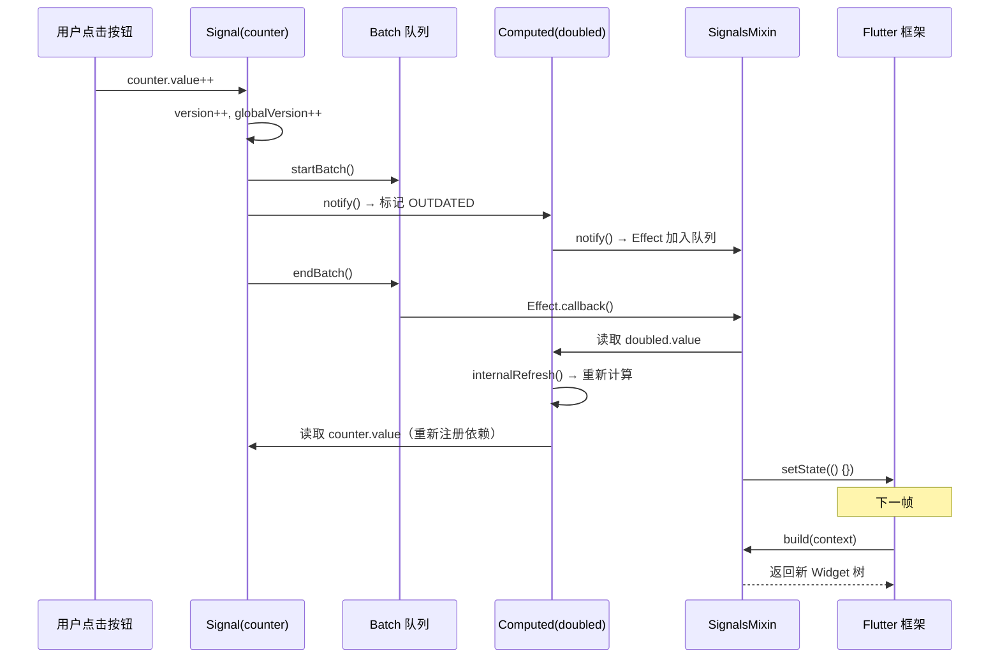

#### 引言：

前六篇我们拆过 GetX 的全局单例、Bloc 的事件流水线、Provider 的 InheritedWidget 驿站、Riverpod 的自来水管道系统。它们有一个共同点：**你得告诉框架"我依赖谁"。**

GetX 要你用 `.obs` 和 `Obx`，Bloc 要你用 `BlocBuilder` 指定泛型，Provider 要你用 `Consumer` 或 `context.watch`，Riverpod 要你用 `ref.watch`。形式不同，本质一样——手动声明依赖关系。

但有一个方案走了完全不同的路。它说：**你读了谁，就自动依赖谁。不需要声明，不需要包裹，不需要任何仪式。**

这就是 [signals.dart](https://github.com/rodydavis/signals.dart)，一个从前端 [Preact Signals](https://preactjs.com/blog/signal-boosting/) 移植过来的细粒度响应式状态管理方案。如果你用过 Vue 的 `ref()` 或 Solid.js 的 `createSignal()`，会觉得非常亲切。核心思想一句话：**读时自动订阅，写时自动通知。**

这篇文章带你钻进源码，看看这套"自动"到底是怎么实现的。

---

#### 一、项目全貌：一台响应式汽车

在拆零件之前，先看看这台车长什么样。signals.dart 是一个 Melos 管理的 monorepo，包含 7 个包，分层清晰：

| 层级 | 包名 | 职责 |
|------|------|------|
| 引擎层 | `preact_signals` | 底层响应式引擎，Pulse 算法的 Dart 移植 |
| 核心层 | `signals_core` | 纯 Dart API，`FutureSignal`、`StreamSignal`、集合信号 |
| Flutter 层 | `signals_flutter` | `Watch` Widget、`SignalsMixin`、生命周期管理 |
| 伞包 | `signals` | 面向用户的统一入口，导出上面三层 |
| 开发体验 | `signals_lint` | 自定义 lint 规则 |
| 开发体验 | `signals_devtools_extension` | DevTools 可视化面板 |
| 集成 | `signals_hooks` | `flutter_hooks` 桥接 |

可以把它想象成一台汽车：`preact_signals` 是发动机，`signals_core` 是变速箱，`signals_flutter` 是方向盘和仪表盘，`signals` 是你拿到手的整车。



整个引擎层 `preact_signals` 只有 8 个文件，加起来不到 600 行有效代码。和 Bloc 的 500 行核心代码量相当，但信息密度更高——因为它要实现的东西更底层：一套完整的依赖追踪和惰性求值系统。

---


##### 1. 三个核心原语

整个响应式系统建立在三个原语之上：Signal、Computed、Effect。它们的角色分工像一条生产线：Signal 是原料仓库，Computed 是加工车间，Effect 是出货口。



Signal 是源头，只产出数据；Effect 是终端，只消费数据；Computed 比较特殊——它既是消费者（依赖上游信号），又是生产者（被下游 Computed 或 Effect 依赖）。这种"双重身份"是后面很多设计复杂度的根源。

---

##### 2. 四条设计原则

在看源码之前，先记住这四条，后面的代码全是围绕它们展开的：

1. **细粒度响应**：只重建真正变化的部分，不是整棵子树
2. **惰性求值**：`computed` 只在被读取时才计算，没人读就不算
3. **隐式依赖追踪**：你读了谁，系统自动知道你依赖谁，不需要手动声明
4. **GC 友好**：没有订阅者的信号自动解除依赖，不会内存泄漏

和前面几个方案对比一下：Bloc 是"显式事件 + 显式状态"，Provider 是"显式依赖 + 显式通知"，Riverpod 是"显式依赖 + 自动通知"。Signals 把"显式"这两个字彻底去掉了——依赖和通知全自动。

---

#### 二、发动机拆解 —— preact_signals 引擎

引擎层是整个方案的灵魂。我们从最底层的数据结构开始，一层层往上看。

---

##### 1. 依赖图的骨架：Node

信号之间的依赖关系需要一种数据结构来表达。如果是你来设计，你会用什么？`List`？`Set`？`Map`？

signals.dart 的选择是：**双向链表**。



每个 `Node` 同时存在于两条链表中：一条是"我依赖谁"（source 链），一条是"谁依赖我"（target 链）。

```dart
---->[preact_signals/lib/src/node.dart#Node]----
class Node {
  late ReadonlySignal source;   // 数据源（Signal 或 Computed）
  Node? prevSource;             // source 链的前驱
  Node? nextSource;             // source 链的后继

  late Listenable target;       // 消费者（Computed 或 Effect）
  Node? prevTarget;             // target 链的前驱
  Node? nextTarget;             // target 链的后继

  late int version;             // 上次看到的源版本号
  Node? rollbackNode;           // 进入新上下文时的回滚点
}
```

为什么用链表而不是 `List` 或 `Set`？因为在响应式系统中，依赖关系的增删是最高频的操作——每次 `computed` 重新求值，都要先清理旧依赖再建立新依赖。链表的增删是 O(1)，改几个指针就完事；`Set` 每次都要 hash 计算和可能的扩容。

`version` 字段是个巧妙的设计：Node 记住了"上次看到源的版本号是多少"。下次检查时，如果源的版本号没变，就不需要重新计算。这比存储源的值要省内存得多——值可能是一个巨大的对象，版本号永远只是一个 `int`。

---

##### 2. 全局监控摄像头：evalContext

自动依赖追踪的秘密藏在两个全局变量里：

```dart
---->[preact_signals/lib/src/globals.dart]----
Listenable? evalContext;  // 当前正在执行的 Computed 或 Effect
int globalVersion = 0;    // 全局版本号，信号每次更新都递增
```

`evalContext` 是整个自动追踪机制的关键。想象一个审讯室里的单面镜——`evalContext` 就是镜子后面的观察者。当一个 `computed` 或 `effect` 正在执行时，`evalContext` 指向它。此时任何被读取的信号都会检查这个全局变量，发现"有人在观察我"，就自动把自己注册为 `evalContext` 的依赖。

给你三秒钟想想：这个设计有什么前提条件？

答案是：**Dart 是单线程的。** 同一时刻只有一个 `computed` 或 `effect` 在执行，所以一个全局变量就够了。如果是多线程环境，这个设计就不成立了——你需要 ThreadLocal 或者其他线程隔离机制。

`globalVersion` 是另一个加速器。每次任何信号更新，这个数字就递增。`computed` 在求值前先检查这个数字——如果和上次看到的一样，说明整个系统都没动过，直接返回缓存值，连依赖都不用逐个检查。

---


##### 3. Signal：最朴素的响应式容器

Signal 是整个系统中最简单的原语——一个带版本号的值容器，读的时候注册依赖，写的时候通知订阅者。

先看读取流程。当你访问 `counter.value` 时，发生了什么？



源码非常简洁：

```dart
---->[preact_signals/lib/src/signal.dart#Signal]----
T get value {
  final node = addDependency();  // tag1
  if (node != null) {
    node.version = version;      // tag2
  }
  return internalValue;
}
```

`tag1`：调用 `addDependency()`，检查 `evalContext` 是否存在。如果有人在"观察"（比如一个 `computed` 正在求值），就把当前信号注册为它的依赖，返回一个 `Node`。如果没人观察（`evalContext == null`），返回 `null`，什么都不做。

`tag2`：把当前信号的版本号记录到 Node 上。下次检查时，对比这个版本号就知道信号有没有变过。

再看写入流程：

```dart
---->[preact_signals/lib/src/signal.dart#Signal]----
bool set(T val, {bool force = false}) {
  if (force || val != internalValue) {
    internalSetValue(val);       // tag1
    return true;
  }
  return false;                  // tag2
}

void internalSetValue(T val) {
  if (batchIteration > 100) {
    throwCycleDetected();        // tag3
  }
  internalValue = val;
  version++;                     // tag4
  globalVersion++;               // tag5

  startBatch();
  try {
    for (var node = targets; node != null; node = node.nextTarget) {
      node.target.notify();      // tag6
    }
  } finally {
    endBatch();
  }
}
```

`tag1` ~ `tag2`：先做相等性检查。值没变就不通知，直接返回 `false`。这和 Bloc 的 `emit` 里检查 `state == newState` 是同一个思路——避免无意义的更新。

`tag3`：循环检测。如果一个 batch 内迭代超过 100 次（A 改了 B，B 改了 C，C 又改了 A……），直接抛异常。

`tag4` ~ `tag5`：递增自身版本号和全局版本号。这两个版本号是后面 `computed` 做快速路径判断的基础。

`tag6`：遍历 targets 链表，逐个调用 `notify()`。注意这里用的是链表遍历，不是 `List.forEach`——没有迭代器对象的创建开销。

`startBatch()` 和 `endBatch()` 的包裹确保在一次 batch 中修改多个信号时，Effect 的执行只在最后统一触发一次。

---

##### 4. addDependency：依赖注册的核心逻辑

`addDependency` 是整个自动追踪机制的心脏。它的逻辑分三种情况，我们逐个看：

```dart
---->[preact_signals/lib/src/readonly.dart#ReadonlySignal.addDependency]----
Node? addDependency() {
  final signal = this;
  if (evalContext == null) {
    return null;                 // tag1：没人在观察，直接返回
  }

  var node = signal.node;
  if (node == null || node.target != evalContext) {
    // tag2：全新的依赖关系
    node = Node()
      ..version = 0
      ..source = signal
      ..prevSource = evalContext!.sources
      ..nextSource = null
      ..target = evalContext!
      ..prevTarget = null
      ..nextTarget = null
      ..rollbackNode = node;

    if (evalContext!.sources != null) {
      evalContext!.sources!.nextSource = node;
    }
    evalContext!.sources = node;
    signal.node = node;

    if ((evalContext!.flags & TRACKING) != 0) {
      signal.subscribeToNode(node);  // tag3
    }
    return node;
  } else if (node.version == -1) {
    // tag4：旧依赖被重新使用
    node.version = 0;
    // 把 node 移到链表尾部（最新使用的位置）
    if (node.nextSource != null) {
      node.nextSource!.prevSource = node.prevSource;
      if (node.prevSource != null) {
        node.prevSource!.nextSource = node.nextSource;
      }
      node.prevSource = evalContext!.sources;
      node.nextSource = null;
      evalContext!.sources!.nextSource = node;
      evalContext!.sources = node;
    }
    return node;
  }
  return null;                   // tag5：依赖已存在且有效
}
```

`tag1`：如果 `evalContext` 是 `null`，说明当前不在任何 `computed` 或 `effect` 的执行上下文中。这时候读信号就是纯读取，不建立依赖。

`tag2`：这个信号是当前上下文的一个全新依赖。创建一个新的 `Node`，插入到 `evalContext` 的 sources 链表尾部。

`tag3`：如果当前上下文正在追踪依赖（`TRACKING` 标志位），就订阅这个信号的变更通知。这个标志位的含义是：这个 `computed` 或 `effect` 有下游订阅者，需要接收上游的变更通知。

`tag4`：这个信号是上一次求值时就存在的依赖（`version == -1` 是 `prepareSources` 标记的"待回收"状态）。重新激活它，把它移到链表尾部。

`tag5`：依赖已经存在且有效，不需要做任何事。

这三种情况覆盖了依赖追踪的所有场景：新增、复用、跳过。

---


##### 5. Computed：惰性求值的精妙设计

`Computed` 是整个系统中最复杂的部分。它既是消费者（依赖其他信号），又是生产者（被其他 `computed` 或 `effect` 依赖）。这种双重身份带来了大量的边界情况。

先看一个问题：如果你有一个 `computed`，它依赖了 10 个信号，其中只有 1 个变了，你需要重新计算吗？

答案是：**不一定。** 你得先检查那个变了的信号是否真的影响了计算结果。signals.dart 用了三层"快速路径"来尽可能避免不必要的计算：



源码展开看：

```dart
---->[preact_signals/lib/src/computed.dart#Computed.internalRefresh]----
bool internalRefresh() {
  flags &= ~NOTIFIED;

  if ((flags & RUNNING) != 0) return false;

  if ((flags & (OUTDATED | TRACKING)) == TRACKING) {  // tag1
    return true;
  }
  flags &= ~OUTDATED;

  if (internalGlobalVersion == globalVersion) {        // tag2
    return true;
  }
  internalGlobalVersion = globalVersion;

  flags |= RUNNING;

  if (version > 0 && !needsToRecompute()) {            // tag3
    flags &= ~RUNNING;
    return true;
  }

  final prevContext = evalContext;
  try {
    prepareSources();                                   // tag4
    evalContext = this;                                  // tag5
    final val = fn();                                   // tag6
    if (!_isInitialized ||
        (flags & HAS_ERROR) != 0 ||
        _internalValue != val ||
        version == 0) {
      internalValue = val;
      flags &= ~HAS_ERROR;
      version++;                                        // tag7
    }
  } catch (err, stack) {
    error = SignalEffectException(err, stack);
    flags |= HAS_ERROR;
    version++;
  }
  evalContext = prevContext;
  cleanupSources();                                     // tag8
  flags &= ~RUNNING;
  return true;
}
```

三层快速路径：

- **第一层**（`tag1`）：如果正在追踪依赖且没有收到变更通知（`OUTDATED` 未设置），直接返回。这意味着没有任何上游信号通知过这个 `computed`。
- **第二层**（`tag2`）：`globalVersion` 没变，说明整个系统都没有任何信号更新过，直接返回。
- **第三层**（`tag3`）：逐个检查依赖的版本号。`needsToRecompute()` 会遍历 sources 链表，对比每个依赖的当前版本号和 Node 上记录的版本号。如果都没变，不用重算。

只有三层都没拦住，才真正执行 `fn()`（`tag6`）。

`tag4` 和 `tag8` 是动态依赖追踪的关键。想象一个 `computed` 里有条件分支：

```dart
---->[示例代码]----
final result = computed(() {
  if (condition.value) {
    return a.value;
  } else {
    return b.value;
  }
});
```

当 `condition` 从 `true` 变成 `false`，`result` 不再依赖 `a`，转而依赖 `b`。这个切换是怎么实现的？



`prepareSources()`（`tag4`）把所有旧依赖的 `version` 标记为 `-1`（"待回收"）。执行 `fn()` 时，被读取的信号会通过 `addDependency` 重新激活（version 从 -1 变回 0）。最后 `cleanupSources()`（`tag8`）把仍然是 `-1` 的节点从链表中移除并取消订阅。

这就是为什么 signals 能做到"隐式依赖追踪"——你不需要声明依赖列表，系统在每次求值时自动发现当前的依赖集合。

---

##### 6. prepareSources 和 cleanupSources：依赖的新陈代谢

这两个方法是动态依赖追踪的具体实现，值得单独拆开看。

`prepareSources` 做三件事：标记旧依赖为可回收、设置回滚点、把 sources 指针移到链表尾部。

```dart
---->[preact_signals/lib/src/listenable.dart#Listenable.prepareSources]----
void prepareSources() {
  final target = this;
  for (var node = target.sources; node != null; node = node.nextSource) {
    final rollbackNode = node.source.node;
    if (rollbackNode != null) {
      node.rollbackNode = rollbackNode;   // tag1：保存回滚点
    }
    node.source.node = node;              // tag2：设置快速查找指针
    node.version = -1;                    // tag3：标记为待回收

    if (node.nextSource == null) {
      target.sources = node;              // tag4：指向尾部
      break;
    }
  }
}
```

`tag1`：`rollbackNode` 是为了处理嵌套求值的情况。如果 Computed A 在求值过程中触发了 Computed B 的求值，B 也会修改 `signal.node`。`rollbackNode` 保证 A 求值结束后能恢复原来的状态。

`tag2`：`signal.node = node` 是一个快速查找指针。下次 `addDependency` 时，可以直接通过 `signal.node` 找到这个 Node，不需要遍历链表。

`tag3`：把 version 设为 -1，标记为"待回收"。如果 `fn()` 执行过程中这个依赖又被读取了，`addDependency` 会把 version 恢复为 0。

`cleanupSources` 从尾部往头部遍历，清理没被重新使用的节点：

```dart
---->[preact_signals/lib/src/listenable.dart#Listenable.cleanupSources]----
void cleanupSources() {
  final target = this;
  var node = target.sources;
  Node? head;

  while (node != null) {
    final prev = node.prevSource;

    if (node.version == -1) {
      // tag1：没被重新使用，从链表中移除
      node.source.unsubscribeFromNode(node);
      if (prev != null) prev.nextSource = node.nextSource;
      if (node.nextSource != null) node.nextSource!.prevSource = prev;
    } else {
      head = node;                        // tag2：记录新的头节点
    }

    node.source.node = node.rollbackNode; // tag3：恢复回滚点
    if (node.rollbackNode != null) node.rollbackNode = null;

    node = prev;
  }

  target.sources = head;
}
```

`tag1`：version 仍然是 -1，说明这次求值没有读取这个信号。取消订阅，从链表中摘除。

`tag2`：最后一个 version 不是 -1 的节点就是新的链表头。

`tag3`：恢复 `signal.node` 的回滚点，清理临时状态。

这套 prepare/cleanup 机制和 React Fiber 的"双缓冲"思路有异曲同工之妙——先在旧的基础上标记，执行过程中更新标记，最后统一清理。

---


##### 7. Computed 的懒订阅：没人听就不接电话

`Computed` 还有一个精妙的设计：**懒订阅**。它只在自己有订阅者的时候，才去订阅上游信号。

```dart
---->[preact_signals/lib/src/computed.dart#Computed.subscribeToNode]----
void subscribeToNode(Node node) {
  if (targets == null) {                    // tag1
    flags |= OUTDATED | TRACKING;

    for (var node = sources; node != null; node = node.nextSource) {
      node.source.subscribeToNode(node);    // tag2
    }
  }
  internalSubscribe(node);
}

void unsubscribeFromNode(Node node) {
  if (targets != null) {
    signalUnsubscribe(node);

    if (targets == null) {                  // tag3
      flags &= ~TRACKING;

      for (var node = sources; node != null; node = node.nextSource) {
        node.source.unsubscribeFromNode(node);  // tag4
      }
    }
  }
}
```

`tag1`：第一个订阅者来了，才开始订阅上游。`tag2`：递归地订阅所有依赖源。

`tag3`：最后一个订阅者走了，取消所有上游订阅。`tag4`：递归地取消订阅。

这意味着一个没有被任何 Effect 或 Widget 使用的 `computed`，不会占用任何订阅资源。它的依赖关系只在第一次被读取时建立（通过 `internalRefresh`），但不会订阅变更通知。只有当它有了下游订阅者，才会"激活"整条依赖链。

这个设计对 GC 非常友好——如果一个 `computed` 的所有下游都被回收了，它会自动取消所有上游订阅，整个子图都可以被垃圾回收。不需要手动 dispose。

---

#### 三、副作用引擎 —— Effect 与 Batch

Effect 是依赖图的"终端节点"——它只消费信号，不产出值。在 Flutter 场景中，`Watch` Widget 内部就是通过 Effect（或类似机制）来触发 `markNeedsBuild()` 的。

---

##### 1. Effect：副作用的执行者

```dart
---->[preact_signals/lib/src/effect.dart#Effect]----
class Effect with Listenable {
  Function()? fn;
  Function? cleanup;

  void callback() {
    final finish = start();
    try {
      if ((flags & DISPOSED) != 0) return;
      if (fn == null) return;
      currentEffect = this;
      final cleanup = fn!();           // tag1：执行回调
      currentEffect = null;
      if (cleanup is Function) {
        this.cleanup = cleanup;        // tag2：保存清理函数
      }
    } finally {
      finish();
    }
  }
}
```

`tag1`：执行用户提供的回调函数。执行过程中，`evalContext` 指向这个 Effect（在 `start()` 中设置），所以回调里读取的所有信号都会自动成为它的依赖。

`tag2`：如果回调返回了一个函数，它会被当作"清理函数"保存起来。下次 Effect 重新执行前，或者 Effect 被 dispose 时，清理函数会先被调用。这个设计和 React 的 `useEffect` 返回清理函数是同一个思路。

`start()` 方法展开看更清楚：

```dart
---->[preact_signals/lib/src/effect.dart#Effect.start]----
void Function() start() {
  if ((flags & RUNNING) != 0) {
    throwCycleDetected();              // tag1：循环检测
  }
  flags |= RUNNING;
  flags &= ~DISPOSED;
  cleanupEffect();                     // tag2：执行上一次的清理函数
  prepareSources();                    // tag3：标记旧依赖

  startBatch();
  final prevContext = evalContext;
  evalContext = this;                   // tag4：设置监控摄像头
  return () => endEffect(prevContext);
}
```

`tag1`：如果 Effect 正在执行中又被触发，说明有循环依赖，直接抛异常。

`tag2` ~ `tag3`：先清理上一次的副作用，再标记旧依赖为待回收。

`tag4`：把 `evalContext` 设为自己。从这一刻起，任何被读取的信号都会自动注册为这个 Effect 的依赖。

---

##### 2. Effect 的通知机制：不急，排队

Effect 收到通知时不立即执行，而是把自己加入一个批处理队列：

```dart
---->[preact_signals/lib/src/effect.dart#Effect.notify]----
void notify() {
  if (!((flags & NOTIFIED) != 0)) {
    flags |= NOTIFIED;
    nextBatchedEffect = batchedEffect;  // tag1：链表头插法
    batchedEffect = this;               // tag2：成为新的链表头
  }
}
```

`tag1` ~ `tag2`：用链表头插法把自己加入 `batchedEffect` 队列。`NOTIFIED` 标志位防止同一个 Effect 被重复加入队列。

这个设计很重要：如果一个 Effect 依赖了 `a` 和 `b`，你在一个 `batch` 里同时修改了 `a` 和 `b`，Effect 只会执行一次，而不是两次。

---

##### 3. Batch：攒一波再说

```dart
---->[preact_signals/lib/src/batch.dart]----
void startBatch() {
  batchDepth++;
}

void endBatch() {
  if (batchDepth > 1) {
    batchDepth--;
    return;                            // tag1：嵌套 batch，不执行
  }

  SignalEffectException? error;
  bool hasError = false;

  while (batchedEffect != null) {
    Effect? effect = batchedEffect;
    batchedEffect = null;
    batchIteration++;                  // tag2：迭代计数

    while (effect != null) {
      final Effect? next = effect.nextBatchedEffect;
      effect.nextBatchedEffect = null;
      effect.flags &= ~NOTIFIED;

      if (!((effect.flags & DISPOSED) != 0) && effect.needsToRecompute()) {
        try {
          effect.callback();           // tag3：执行 Effect
        } catch (err, stack) {
          if (!hasError) {
            error = SignalEffectException(err, stack);
            hasError = true;
          }
        }
      }
      effect = next;
    }
  }
  batchIteration = 0;
  batchDepth--;

  if (hasError) {
    throwSignalEffectException(error!);
  }
}
```

`tag1`：`batchDepth` 支持嵌套。只有最外层的 `endBatch()` 才会真正执行队列中的 Effect。

`tag2`：`batchIteration` 用于循环检测。如果 Effect 的执行又触发了新的信号变化，又触发了新的 Effect，`batchIteration` 会持续递增。在 `Signal.internalSetValue` 中，超过 100 次就抛 `Cycle detected`。

`tag3`：执行前还会调用 `needsToRecompute()` 做最后一次检查——如果依赖的版本号都没变，就跳过执行。

和 Bloc 的 `Stream` 机制对比一下：Bloc 用 `StreamController` 广播状态变化，每个 `BlocBuilder` 独立监听。signals 用链表队列批量执行，天然支持合并通知。两种方式各有优劣——Stream 更符合 Dart 的异步习惯，链表队列更轻量但更底层。

---

##### 4. Untracked：临时关闭监控

有时候你想读一个信号的值，但不想建立依赖关系。`untracked` 和 `peek` 就是干这个的：

```dart
---->[preact_signals/lib/src/untracked.dart]----
T untracked<T>(T Function() fn) {
  final prevContext = evalContext;
  evalContext = null;       // 关掉监控摄像头
  try {
    return fn();
  } finally {
    evalContext = prevContext;  // 恢复
  }
}
```

实现极其简单——把 `evalContext` 临时设为 `null`，这样 `fn()` 里读取的信号就不会注册依赖。`peek()` 方法内部也是同样的原理。

这在实际开发中很有用。比如一个 Effect 需要根据信号 A 的变化来更新信号 B，但不想因为读取 B 的旧值而订阅 B：

```dart
---->[示例代码]----
effect(() {
  final newVal = a.value;           // 订阅 a
  b.value = b.peek() + newVal;      // 读 b 但不订阅
});
```

---

#### 四、变速箱 —— signals_core 扩展层

引擎层提供了三个原语，但实际开发中你还需要处理异步数据、集合类型、自动销毁等场景。`signals_core` 在引擎之上构建了一整套实用工具。

---

##### 1. AsyncState：异步状态的密封联合

Flutter 开发中最常见的场景之一：从网络加载数据。你需要处理加载中、成功、失败三种状态。signals_core 用一个 `sealed class` 来表达：



```dart
---->[signals_core/lib/src/async/state.dart#AsyncState]----
sealed class AsyncState<T> {
  factory AsyncState.data(T data) = AsyncData<T>;
  factory AsyncState.error(Object error, [StackTrace? stackTrace]) = AsyncError<T>;
  factory AsyncState.loading() = AsyncLoading<T>;
  factory AsyncState.dataRefreshing(T data) = AsyncDataRefreshing<T>;
  factory AsyncState.dataReloading(T data) = AsyncDataReloading<T>;
  // ...
}
```

注意 `refresh` 和 `reload` 的区别：

- **refresh**：保持当前数据/错误可见，同时标记为加载中。用户看到的是"旧数据 + 加载指示器"。
- **reload**：回到纯加载状态，旧数据不可见。用户看到的是"加载中"。

这个设计比 Riverpod 的 `AsyncValue` 更细致——Riverpod 只有 `isRefreshing`，signals 区分了 `isRefreshing` 和 `isReloading`。在实际 UI 中，这两种状态的展示方式往往不同。

配合 Dart 3 的模式匹配，使用起来很优雅：

```dart
---->[示例代码]----
final value = switch (mySignal.value) {
  AsyncData<int> data => Text('${data.value}'),
  AsyncError<int> error => Text('Error: ${error.error}'),
  AsyncLoading<int>() => CircularProgressIndicator(),
};
```

---

##### 2. StreamSignal 和 FutureSignal：异步信号

`StreamSignal` 把一个 `Stream` 包装成响应式信号。它的核心思路是：用一个 `Computed` 来追踪 Stream 工厂函数中的依赖，当依赖变化时自动重新订阅 Stream。

```dart
---->[signals_core/lib/src/async/stream.dart#StreamSignal]----
StreamSignal(
  Stream<T> Function() fn, {
  this.cancelOnError,
  T? initialValue,
  this.dependencies = const [],
  // ...
}) : _stream = computed(() {
       for (final dep in dependencies) {
         dep.value;                    // tag1：读取依赖，建立追踪
       }
       return fn();                    // tag2：返回 Stream
     }),
     super(
       initialValue != null
           ? AsyncState.data(initialValue)
           : AsyncState.loading(),
     );
```

`tag1`：显式读取 `dependencies` 列表中的信号。这是因为 `fn()` 内部可能有 `await`，而 `await` 之后的信号读取不会被 `computed` 追踪到（`evalContext` 在 `await` 时已经恢复了）。所以需要在 `await` 之前把依赖"提前读取"一遍。

`tag2`：返回 Stream 对象。当任何依赖变化时，这个 `computed` 会重新求值，产生一个新的 Stream。

`FutureSignal` 更简单——它把 Future 转成单元素 Stream，复用 `StreamSignal` 的全部逻辑：

```dart
---->[signals_core/lib/src/async/future.dart#FutureSignal]----
class FutureSignal<T> extends StreamSignal<T> {
  FutureSignal(
    Future<T> Function() fn, {
    // ...
  }) : super(() => fn().asStream(), cancelOnError: true);
}
```

一行代码搞定。`Future.asStream()` 是 Dart 标准库提供的方法，把 Future 转成只发射一个元素的 Stream。

---

##### 3. autoDispose：用完即弃

signals_core 在引擎层之上加了一个 `SignalsAutoDisposeMixin`，支持信号在没有订阅者时自动销毁：

```dart
---->[signals_core/lib/src/core/auto_dispose.dart#SignalsAutoDisposeMixin]----
mixin SignalsAutoDisposeMixin<T> on signals.ReadonlySignal<T> {
  bool autoDispose = false;
  bool _disposed = false;

  final _disposeCallbacks = <void Function()>{};

  void Function() onDispose(void Function() cleanup) {
    _disposeCallbacks.add(cleanup);
    return () => _disposeCallbacks.remove(cleanup);
  }

  void dispose() {
    if (_disposed) return;
    for (final cleanup in _disposeCallbacks) {
      cleanup();
    }
    _disposed = true;
  }
}
```

在 `signals_core` 的 `Signal` 包装类中，`unsubscribeFromNode` 被重写，加入了自动销毁逻辑：

```dart
---->[signals_core/lib/src/core/signal.dart#Signal]----
void unsubscribeFromNode(Node node) {
  super.unsubscribeFromNode(node);
  if (autoDispose && targets == null) {  // tag1
    dispose();
  }
}
```

`tag1`：最后一个订阅者取消订阅后，如果 `autoDispose` 为 `true`，自动销毁信号。

这和 Riverpod 的 `autoDispose` 修饰符是同一个思路，但实现更轻量——不需要额外的 Provider 容器来管理生命周期，直接在信号自身的订阅/取消订阅钩子中处理。

---


#### 五、方向盘与仪表盘 —— signals_flutter 集成

引擎再好，不接上 Flutter 的渲染管线也没用。`signals_flutter` 做的事情就是把信号的变化翻译成 `markNeedsBuild()`。

它提供了两种消费方式：`Watch` Widget 和 `SignalsMixin`。



---

##### 1. Watch Widget：精准重建

`Watch` 是 signals_flutter 推荐的消费方式。它的原理是：在 builder 函数执行期间，自动追踪所有被读取的信号，信号变化时只重建这个 `Watch` 内部的子树。

```dart
---->[signals_flutter/lib/src/watch/widget.dart#Watch]----
class Watch<T extends Widget> extends StatelessWidget {
  const Watch(this.builder, {
    super.key,
    this.debugLabel,
    this.dependencies = const [],
  });

  final T Function(BuildContext context) builder;

  @override
  Widget build(BuildContext context) {
    return WatchBuilder(
      builder: (context, _) => builder(context),
      debugLabel: debugLabel,
      dependencies: dependencies,
    );
  }
}
```

`Watch` 本身只是一个壳，真正的逻辑在 `WatchBuilder` 里。`WatchBuilder` 是一个 `StatefulWidget`，它的 State 混入了 `SignalsMixin`：

```dart
---->[signals_flutter/lib/src/watch/builder.dart#_WatchState]----
class _WatchState<T extends Widget> extends State<WatchBuilder<T>>
    with SignalsMixin {
  late final result = createComputed(
    () => widget.builder(context, widget.child),  // tag1
    debugLabel: widget.debugLabel,
  );

  @override
  Widget build(BuildContext context) {
    return result.value;                           // tag2
  }
}
```

`tag1`：用 `createComputed` 把 builder 函数包装成一个 `Computed<Widget>`。这样 builder 里读取的所有信号都会被自动追踪。

`tag2`：`build` 方法只是读取 `result.value`。当任何依赖信号变化时，`result` 会被标记为过期，`SignalsMixin` 内部的 Effect 会触发 `setState(() {})`，Flutter 框架调用 `build`，`result.value` 重新求值，返回新的 Widget。

这个设计有一个巧妙之处：**Widget 树本身被当作一个 Computed 的返回值。** 信号变化 → Computed 过期 → Widget 重建。整个过程复用了引擎层的依赖追踪和惰性求值机制，没有引入任何新概念。

---

##### 2. ElementWatcher：WeakReference 的妙用

当你用 `context.watch(signal)` 的方式消费信号时，底层用的是 `ElementWatcher`：

```dart
---->[signals_flutter/lib/src/watch/element_watcher.dart#ElementWatcher]----
class ElementWatcher {
  final int id;
  final String label;
  final WeakReference<Element> element;  // tag1：弱引用

  final _watch = <int, VoidCallback>{};

  void watch(core.ReadonlySignal value) {
    _watch.putIfAbsent(
      value.globalId,
      () => value.subscribe((val) => rebuild()),  // tag2
    );
  }

  void rebuild() async {
    final target = element.target;
    if (target == null) {       // tag3：Element 已被 GC
      dispose();
      return;
    }
    if (!target.mounted) return;

    if (SchedulerBinding.instance.schedulerPhase != SchedulerPhase.idle) {
      await SchedulerBinding.instance.endOfFrame;  // tag4
      if (!target.mounted) return;
    }
    target.markNeedsBuild();    // tag5：精准重建
  }

  void dispose() {
    for (final cleanup in _watch.values) {
      cleanup();
    }
    _removeSignalWatchers();
  }
}
```

`tag1`：用了 `WeakReference<Element>`——这是 GC 友好设计的关键。当 Widget 从树上移除后，Element 会被垃圾回收。此时 `WeakReference` 的 `target` 变成 `null`，`tag3` 处检测到后自动清理所有订阅。不需要手动 dispose，不会内存泄漏。

`tag4`：如果当前不在空闲阶段（比如正在 build 或 layout），等到当前帧结束再触发重建。这避免了在 build 过程中调用 `markNeedsBuild()` 导致的异常。

`tag5`：调用的是 `markNeedsBuild()`，不是 `setState()`。这意味着只有这一个 Element 会被标记为脏，不会波及父 Widget 或兄弟 Widget。

和 Provider 的 `InheritedWidget` 机制对比：Provider 通过 `dependOnInheritedWidgetOfExactType` 建立依赖，当 `InheritedWidget` 更新时，所有依赖它的子孙 Widget 都会收到通知。signals 的 `ElementWatcher` 是点对点的——只有明确 `watch` 了某个信号的 Element 才会被通知。粒度更细。

---

##### 3. SignalsMixin：StatefulWidget 的信号管家

如果你更习惯 `StatefulWidget` 的写法，`SignalsMixin` 提供了完整的生命周期管理：

```dart
---->[signals_flutter/lib/src/mixins/signals.dart#SignalsMixin]----
mixin SignalsMixin<T extends StatefulWidget> on State<T> {
  final _signals = HashMap.of(<int, _SignalMetadata>{});
  EffectCleanup? _cleanup;
  final _effects = <EffectCleanup>[];

  void _setup() {
    WidgetsBinding.instance.addPostFrameCallback((_) {
      final cb = effect(() {
        final signals = _signals.values
            .where((e) => e.local != null).toList();
        for (final s in signals) {
          s.target.value;              // tag1：读取所有绑定的信号
        }
        _rebuild();                    // tag2：触发重建
      });
      _cleanup?.call();
      _cleanup = cb;
    });
  }

  Future<void> _rebuild() async {
    if (!mounted) return;
    if (SchedulerBinding.instance.schedulerPhase != SchedulerPhase.idle) {
      await SchedulerBinding.instance.endOfFrame;
      if (!mounted) return;
    }
    setState(() {});                   // tag3
  }

  @override
  void dispose() {
    clearSignalsAndEffects();          // tag4：自动清理
    super.dispose();
  }
}
```

`tag1`：在一个 Effect 内部读取所有绑定的信号。这样任何信号变化都会触发这个 Effect 重新执行。

`tag2` ~ `tag3`：Effect 重新执行时调用 `_rebuild()`，最终调用 `setState(() {})`。

`tag4`：Widget dispose 时自动清理所有信号和 Effect。`clearSignalsAndEffects` 会遍历所有本地创建的信号调用 `dispose()`，遍历所有 Effect 调用清理函数。

`SignalsMixin` 提供了一系列 `create*` 方法：

```dart
---->[示例代码]----
class _MyState extends State<MyWidget> with SignalsMixin {
  late final counter = createSignal(0);
  late final doubled = createComputed(() => counter.value * 2);
  late final items = createListSignal<String>([]);
  late final userData = createFutureSignal(() => fetchUser());

  @override
  void initState() {
    super.initState();
    createEffect(() {
      print('Counter changed: ${counter.value}');
    });
  }
}
```

所有通过 `create*` 创建的信号都会在 Widget dispose 时自动清理。不需要手动管理生命周期。

---

#### 六、数据流全景：从手指到像素

把上面的零件组装起来，一次完整的用户交互是这样的：



整个过程中：
- 没有 `StreamController`，没有 `notifyListeners()`
- 依赖关系自动建立和清理
- 只有真正变化的 Widget 被重建
- 生命周期自动管理

---

#### 七、needsToRecompute：版本号的精妙博弈

前面提到 `needsToRecompute()` 是 Computed 和 Effect 判断"是否真的需要重新计算"的关键方法。它的实现值得单独拆开看：

```dart
---->[preact_signals/lib/src/listenable.dart#Listenable.needsToRecompute]----
bool needsToRecompute() {
  final target = this;
  for (var node = target.sources; node != null; node = node.nextSource) {
    if (node.source.version != node.version ||       // tag1
        !node.source.internalRefresh() ||            // tag2
        node.source.version != node.version) {       // tag3
      return true;
    }
  }
  return false;
}
```

这三个条件看起来简单，实际上暗藏玄机：

`tag1`：先检查源的版本号是否和 Node 上记录的不同。如果不同，说明源已经更新过了。

`tag2`：调用源的 `internalRefresh()`。如果源是一个 `Computed`，这会触发它的惰性求值。如果源是一个 `Signal`，直接返回 `true`。

`tag3`：再次检查版本号。为什么要检查两次？因为 `tag2` 的 `internalRefresh()` 可能改变了源的版本号。一个 `Computed` 在 refresh 之前版本号是 3，refresh 之后可能还是 3（值没变）或者变成 4（值变了）。

这三个条件的组合覆盖了所有情况：
- 源已更新且值变了 → `tag1` 命中
- 源是 Computed，需要先刷新才能知道值变没变 → `tag2` 触发刷新，`tag3` 检查结果
- 源没更新 → 三个条件都不命中，返回 `false`

这个设计实现了**按需级联刷新**：只有当下游真正需要读取值时，上游的 Computed 才会被刷新。不需要的分支完全不会被触发。

---

#### 八、和其他方案的对比

看完源码，可以清楚地看到 signals 和前面四个方案的本质差异：

| 维度 | GetX | Bloc | Provider | Riverpod | Signals |
|------|------|------|----------|----------|---------|
| 依赖追踪 | 手动 `.obs` | 手动泛型 | 手动 `Consumer` | 手动 `ref.watch` | **自动** |
| 通知粒度 | Widget 级 | 整个 Bloc | 整个 ChangeNotifier | Provider 级 | **信号级** |
| 惰性求值 | 无 | 无 | 无 | 有（Provider 懒加载） | **有（Computed）** |
| 动态依赖 | 不支持 | 不支持 | 不支持 | 不支持 | **支持** |
| 生命周期 | 手动/路由绑定 | 手动 close | 手动 dispose | autoDispose | **WeakRef + autoDispose** |
| 异步支持 | 无内置 | Stream 原生 | 无内置 | AsyncValue | **AsyncState** |
| 核心代码量 | ~2000 行 | ~500 行 | ~800 行 | ~3000 行 | **~600 行** |
| 学习曲线 | 低 | 中 | 低 | 中高 | **中** |

几个值得注意的点：

**自动依赖追踪**是 signals 最大的差异化优势。其他方案都需要你在某个地方"声明"依赖关系，signals 完全不需要。这减少了样板代码，但也意味着依赖关系不那么"可见"——你需要理解响应式的心智模型才能预测行为。

**动态依赖**是其他方案都做不到的。在 Bloc 中，一个 `BlocBuilder` 的依赖在编译期就固定了。在 signals 中，`computed` 的依赖可以随着条件分支动态变化。

**信号级通知粒度**比 Provider 级更细。Provider 中一个 `ChangeNotifier` 的任何属性变化都会通知所有监听者。signals 中每个属性都是独立的信号，只有真正依赖了变化属性的消费者才会被通知。

但 signals 也有劣势：**社区生态和工具链**远不如 Bloc 和 Riverpod 成熟。没有官方的 DevTools 集成（虽然有 `signals_devtools_extension`），没有大量的教程和最佳实践，在大型项目中的验证也不够充分。

---

#### 九、源码中值得学习的设计模式

抛开状态管理本身，signals.dart 的源码中有几个设计模式值得在自己的项目中借鉴：

---

##### 1. 版本号代替值比较

用 `int version` 来追踪变化，而不是存储和比较旧值。这在值是大对象（比如一个包含 1000 个元素的 List）时，性能差异巨大。

```dart
// ❌ 存储旧值比较
if (oldValue != newValue) { ... }  // 可能触发深度比较

// ✅ 版本号比较
if (node.version != source.version) { ... }  // 永远是 int 比较
```

---

##### 2. 双向链表做依赖图

用双向链表而不是 `Set` 或 `List` 来管理高频增删的关系。O(1) 的增删，零内存分配。

这个模式适用于任何需要频繁增删元素、不需要随机访问的场景。比如事件监听器列表、LRU 缓存、任务队列。

---

##### 3. WeakReference 做生命周期绑定

用 `WeakReference<Element>` 来持有 Flutter Element 的引用。Element 被 GC 回收后，`target` 自动变成 `null`，触发清理逻辑。不需要手动 dispose，不会内存泄漏。

这个模式适用于任何"观察者的生命周期不由被观察者控制"的场景。

---

##### 4. 多层快速路径

`Computed` 的三层快速路径（globalVersion → needsToRecompute → 值比较）是一个经典的"从粗到细"的优化策略。先用最便宜的检查排除大部分情况，只有通过了所有快速路径的才执行昂贵的操作。

这个模式在数据库查询优化、编译器优化、网络请求缓存中都很常见。

---

#### 碎碎念

写完七篇状态管理源码评析，有一个越来越清晰的感受：**没有最好的方案，只有最合适的方案。**

GetX 像瑞士军刀，什么都能干但什么都不精；Bloc 像流水线，规矩多但品控稳；Provider 像快递驿站，简单可靠但能力有限；Riverpod 像自来水系统，精密强大但学习成本高；Signals 像一台精密的机械表，内部齿轮咬合精妙，但你得理解机械原理才能欣赏它的美。

如果你的项目需要细粒度的响应式更新、复杂的派生状态、动态的依赖关系，signals 是目前 Flutter 生态中最优雅的选择。如果你的项目更看重团队协作的规范性和社区生态的成熟度，Bloc 或 Riverpod 可能更合适。

选择的关键不是"哪个更好"，而是"哪个更匹配你的场景和团队"。五个方案，五种哲学，五套源码。希望这些文章能帮你在选择状态管理方案时，不再只看 API 表面，而是能看到引擎盖下面的东西。

知其所以然，才能用得心安。