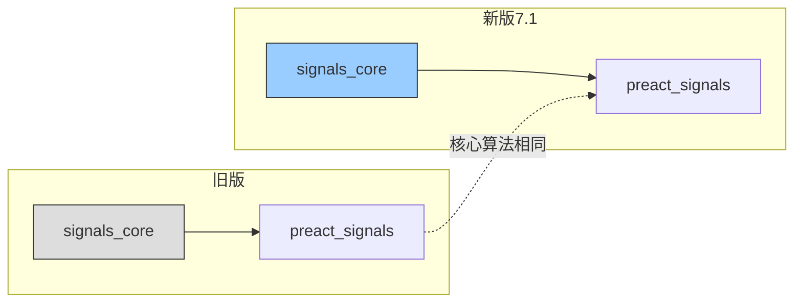
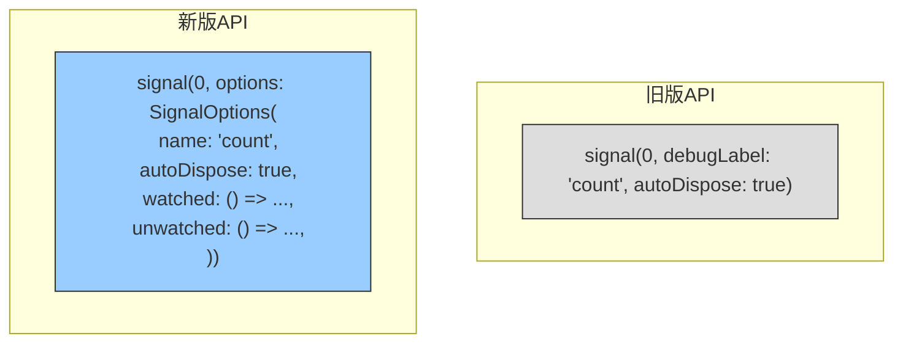
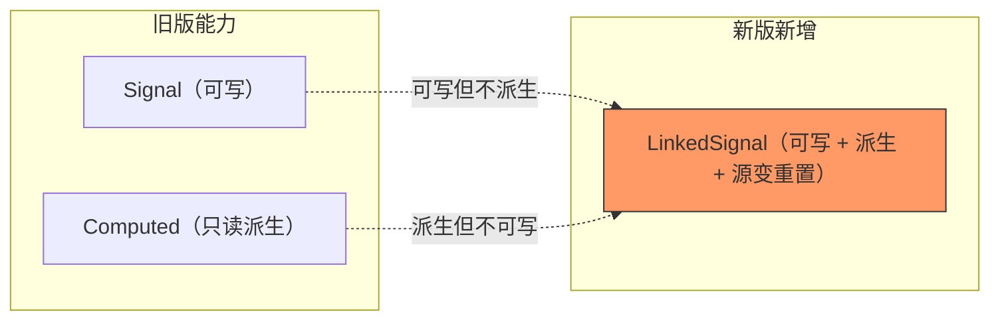
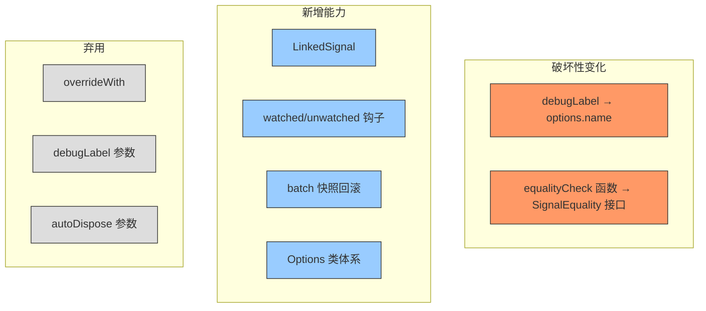
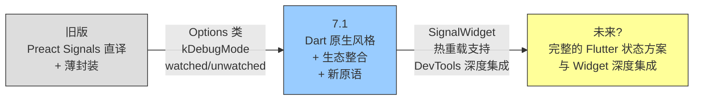

#### 引言：

如果说旧版 Signals.dart 是一把瑞士军刀，功能齐全但接口略显随意；那 7.1 版本就是一把经过工业设计的瑞士军刀，同样的功能，但每个零件的接口都标准化了，还多了几个新工具。

这篇文章不重复讲解 Signals 的核心机制（自动追踪、批量更新等，那些在新版源码分析中已经覆盖），而是聚焦两个版本之间的**架构差异**。如果你从旧版迁移到 7.1，或者想理解 7.1 为什么做了这些改动，这篇文章就是为你准备的。

---

#### 一、总体架构：没变的和变了的

两个版本的核心架构相同：`signals_core` 包裹 `preact_signals`，响应式图的底层算法（Node 链表、evalContext 追踪、flags 位掩码）没有变化。



**没变的：**
- 双层架构（preact_signals 底层 + signals_core 上层）
- Node 双向链表实现依赖追踪
- `evalContext` 全局变量驱动自动订阅
- `batch`/`startBatch`/`endBatch` 批量更新机制
- `Computed` 的懒求值 + 三重快速路径
- `Effect` 的批量调度队列
- `SignalsAutoDisposeMixin` 的自动销毁

**变了的：**
- Options 类体系取代散落的参数
- `SignalEquality<T>` 接口取代 `bool Function(T, T)` 函数类型
- 新增 `LinkedSignal`（可写 Computed）
- Observer 加了 `kDebugMode` 守卫
- `overrideWith` 被标记 `@Deprecated`
- 新增 `watched`/`unwatched` 生命周期钩子
- `batch` 新增快照回滚机制（`reconcileBatchSnapshots`）

---

#### 二、Options 体系：从散落参数到结构化配置

这是 7.1 最显眼的 API 变化。旧版的构造函数参数直接暴露：

```dart
---->[旧版 signal.dart#Signal 构造函数]----
Signal(
  super.internalValue, {
  this.debugLabel,
  bool autoDispose = false,
});
```

新版用 `Options` 类封装：

```dart
---->[新版 signal.dart#Signal 构造函数]----
Signal(
  super.internalValue, {
  SignalOptions<T>? options,
  @Deprecated('Use options: SignalOptions(name: ...) instead')
  String? debugLabel,
  @Deprecated('Use options: SignalOptions(autoDispose: ...) instead')
  bool? autoDispose,
});
```



**为什么做这个改动？**

旧版随着功能演进，构造函数参数越来越多（debugLabel、autoDispose、equality...），每加一个参数都是 breaking change。Options 类解决了这个问题：
- 新增配置项只需要在 Options 类中加字段，不影响现有调用方
- `copyWith` 方法让配置的局部修改更方便
- 类型安全：`SignalOptions<T>` vs `ComputedOptions<T>` vs `EffectOptions` 各有各的配置项

旧版参数暂时保留但标记 `@Deprecated`，给了迁移过渡期。

**我的评价：** 这个改动方向完全正确，但时机略晚。如果从 1.0 就用 Options 类，社区就不需要经历这次迁移。不过，Signals.dart 的早期版本是快速迭代的探索期，用散落参数降低了入门门槛（一眼就能看出有哪些配置），等 API 稳定后再结构化是务实的选择。

值得注意的是，7.1 选择了"新旧共存 + @Deprecated"的渐进策略，而不是直接删掉旧参数。这说明维护者在乎社区的迁移成本，宁可让内部代码稍微丑一点（每个构造函数有一堆 deprecated 参数），也不让用户一次性面对大量 breaking change。

---

#### 三、SignalEquality：从函数到接口

旧版的相等性检查是一个裸函数：

```dart
---->[旧版 signal.dart#Signal]----
bool Function(T a, T b) equalityCheck = identical;
```

新版封装为接口：

```dart
---->[新版 preact_signals/src/equality.dart#SignalEquality]----
abstract class SignalEquality<T> {
  const SignalEquality();
  bool equals(T a, T b);
}

class SignalStandardEquality<T> extends SignalEquality<T> {
  const SignalStandardEquality();
  @override
  bool equals(T a, T b) => identical(a, b);
}
```

差异不大，但接口的好处是：
- 可以用 `const` 构造函数，避免每次创建 Signal 都分配一个闭包
- 语义更明确：`SignalEquality` 比 `bool Function(T, T)` 更有表达力
- 可以在 Options 中通过 `equality` 字段传入，不需要额外暴露字段

**我的猜想：** 这个改动的真正动机可能是 **内存优化**。旧版中每个 Signal 实例都持有一个 `equalityCheck` 闭包引用，即使大多数 Signal 用的都是默认的 `identical`。闭包在 Dart 中是堆分配的对象，而 `const SignalStandardEquality()` 是编译期常量，全局共享一个实例。当应用有成百上千个 Signal 时，这个差异会体现为可观的内存节省。

另一个隐含好处：`SignalEquality` 作为类可以携带状态。比如你可以写一个 `DeepCollectionEquality` 做深度集合比较，内部缓存上次比较的哈希值。函数类型做不到这一点。

---

#### 四、LinkedSignal：7.1 的核心新增

这是旧版完全没有的功能。`LinkedSignal` 是一个"可写的 Computed"：



旧版如果你想要"一个值默认从源派生，但用户可以手动覆盖，源变时覆盖失效"的行为，需要手写一个 Effect + Signal 的组合。新版一行搞定：

```dart
// 旧版：手动组合（容易出 bug）
final source = signal('Alice');
final local = signal(source.value);
effect(() {
  local.value = source.value;  // 问题：用户的覆盖会被立即冲掉
});

// 新版：LinkedSignal 内置支持
final local = linkedSignal(() => source.value);
local.value = 'Bob';        // 手动覆盖
source.value = 'Charlie';   // 源变 → 覆盖被丢弃 → local 自动变为 'Charlie'
```

`LinkedSignal` 的内部实现用三个信号协作（`_trigger` + `_sourceComputed` + `_derivedComputed`），利用 Computed 的依赖追踪来检测"源是否变了"，不需要额外的 diff 逻辑。

**我的评价：** LinkedSignal 的出现说明了一个真实需求——表单编辑场景中"本地状态 vs 远程状态"的同步问题。之前用 Effect 手动同步是脆弱的，因为 Effect 的执行时机不确定（batch 内可能延迟），而且很容易写出"用户刚改完就被远程值覆盖"的 bug。

LinkedSignal 的实现策略很聪明：**不修改底层 preact_signals 的任何代码**，纯粹在 `signals_core` 层通过组合现有原语（Signal + Computed + subscribe）实现。这说明底层的 Node 链表 + evalContext 架构足够通用，能支撑上层的各种高级模式，不需要为每个新需求"开后门"。

不过也有代价：一个 LinkedSignal 内部创建了 3 个额外的信号（`_trigger`、`_sourceComputed`、`_derivedComputed`），意味着 4 倍的 Node 分配和订阅管理。在大量 LinkedSignal 的场景下（比如一个大型表单的每个字段），这个内存开销值得关注。

**我猜测的设计灵感：** Angular Signals 的 `linkedSignal` RFC。两者的语义几乎一致：默认值从源派生，允许手动覆盖，源变时重置。Dart 版可能是看到了 Angular 社区的讨论后"拿来主义"的产物。这不是贬义——好的设计值得跨生态借鉴。

---

#### 五、Observer 的 kDebugMode 守卫

旧版的 `afterCreate` 和 `beforeUpdate` 总是通知 Observer：

```dart
---->[旧版 signal.dart#Signal.afterCreate]----
void afterCreate(T val) {
  SignalsObserver.instance?.onSignalCreated(this, val);   // 每次都调用
  isInitialized = true;
}
```

新版加了 `kDebugMode` 守卫：

```dart
---->[新版 signal.dart#Signal.afterCreate]----
void afterCreate(T val) {
  if (kDebugMode) {                                      // 只在 debug 模式
    SignalsObserver.instance?.onSignalCreated(this, val);
  }
  isInitialized = true;
}
```

这是一个性能优化。release 模式下 Observer 的调用被完全消除（编译器会直接删掉 `if (kDebugMode)` 分支内的代码）。旧版即使在 release 模式下也会走一次 `?.` 空检查，虽然开销极小，但在高频创建/更新 Signal 的场景中可能累积。

**我的猜想：** 这个改动可能源于真实的性能 profiling。Signals 的一个典型使用场景是动画驱动——每帧更新 60 次。如果一个动画由 5 个 Signal 驱动，一秒就是 300 次 `beforeUpdate` 调用。旧版的 `?.` 虽然只是一个空指针检查，但在热循环中每个纳秒都算数。Dart 的 tree-shaker 可以消除 `if (kDebugMode)` 内的整个分支，连条件判断本身都不会出现在机器码中。

这也解释了为什么旧版 `SignalsObserver.instance` 的默认值是 `null`——设计者知道 release 模式下不应该有 Observer，但早期没有用 `kDebugMode` 做编译期消除。7.1 补上了这个"最后一公里"的优化。

---

#### 六、watched/unwatched 生命周期钩子

旧版没有这对钩子。新版的 `ReadonlySignalOptions` 支持：

```dart
SignalOptions<int>(
  watched: () => print('首次被订阅'),     // Signal 获得第一个订阅者时
  unwatched: () => print('不再有订阅者'),  // Signal 失去最后一个订阅者时
)
```

这对钩子在底层 `internalSubscribe` 和 `signalUnsubscribe` 中触发：

```dart
// 当 targets 从 null 变为非 null（首个订阅者）
if (signal.targets == null) {
  untracked(() { signal.watched?.call(); });
}

// 当 targets 从非 null 变为 null（最后一个订阅者离开）
if (next == null) {
  untracked(() { signal.unwatched?.call(); });
}
```

用途：可以在 Signal 获得第一个监听者时开始一些操作（比如连接 WebSocket），失去所有监听者时停止（断开连接）。类似 RxDart 的 `refCount` 行为。

**我的评价：** 这对钩子的引入意味着 Signals 正在从"纯状态容器"向"资源生命周期管理器"演进。旧版的 Signal 只管"值"，新版的 Signal 可以管"值 + 关联资源的生命周期"。

这是一个方向性的转变。对比 Riverpod 的设计：Provider 天然和资源生命周期绑定（`ref.onDispose`），而 Signals 旧版只有 `autoDispose`（被动销毁），缺少"主动感知有人在用我"的能力。`watched`/`unwatched` 补上了这个缺口。

**使用场景举例：**

```dart
final wsMessages = signal<List<Message>>(
  [],
  options: SignalOptions(
    watched: () {
      // 首次有人订阅 → 连接 WebSocket
      _ws = WebSocket.connect(url);
      _ws.listen((msg) => wsMessages.value = [...wsMessages.value, msg]);
    },
    unwatched: () {
      // 所有订阅者离开 → 断开连接
      _ws.close();
    },
  ),
);
```

不过有一个隐患：`watched`/`unwatched` 在 `untracked` 中执行（防止递归订阅），但如果钩子内部抛出异常，目前没有错误处理机制。这在 WebSocket 断连等 IO 场景中可能造成问题。

---

#### 七、Batch 快照回滚

旧版的 `batch` 是纯粹的延迟通知。新版在此基础上加了**快照回滚**：

```dart
---->[新版 preact_signals/src/batch.dart#recordBatchSnapshot]----
void recordBatchSnapshot(Signal source) {
  if (batchDepth == 0 || batchIteration != 0) return;

  if (source.batchSnapshotVersion != currentBatchSnapshotVersion) {
    source.batchSnapshotVersion = currentBatchSnapshotVersion;
    batchSnapshots = BatchSnapshot(
      source: source,
      value: source.internalValue,   // 记录写入前的值
      version: source.version,       // 记录写入前的版本
      next: batchSnapshots,
    );
  }
}
```

batch 结束时 `reconcileBatchSnapshots` 检查：如果一个 Signal 在 batch 内被写了多次，但最终值和 batch 开始时一样，就把 `version` 回滚。这避免了"写了等于没写"的无效通知。

```dart
// 旧版：即使最终值相同，Effect 也会执行
batch(() {
  count.value = 1;
  count.value = 0;  // 回到原值
});
// 旧版：Effect 被触发（因为 version 已经递增了）
// 新版：Effect 不被触发（version 被回滚了）
```

这是一个语义级别的优化：**结果不变 = 没有变化**。

**我的评价：** 这是 7.1 中最"隐蔽"但影响最大的改动。表面上只是几行代码，但它改变了 `batch` 的语义：从"延迟通知"变成"延迟通知 + 结果一致性检查"。

**我猜测的动机：** 状态机场景。考虑一个复杂的业务逻辑，在 batch 内部走了一系列条件分支，最终某些 Signal 可能绕回了原值：

```dart
batch(() {
  if (condition) {
    state.value = 'loading';
    // ... 一些计算 ...
    state.value = 'idle';  // 绕回原值
  }
});
```

旧版中，`state` 的 version 被递增了两次（从 N 到 N+2），即使最终值没变，下游的 Computed 也会重新计算（因为 version 对不上了）。这在有大量 Computed 链的场景中可能导致不必要的计算雪崩。

新版通过快照回滚，让 version 回到 N，下游完全不知道中间发生了什么。这是一种"事务回滚"的思想：只有最终提交的结果算数，中间过程不算。

**代价：** 每次 batch 内的写入都需要 `recordBatchSnapshot`（一次链表头插入 + 三个字段赋值）。对于"batch 内只写一两次"的常见场景，这个开销可忽略。但如果你在 batch 内循环写入同一个 Signal 一万次（不太正常的用法），会创建一万个 BatchSnapshot 节点，batch 结束时需要全部检查一遍。

---

#### 八、overrideWith 的弃用

旧版 `overrideWith` 是正常 API：

```dart
---->[旧版]----
Signal<T> overrideWith(T val) {
  version = 0;
  afterCreate(val);
  internalValue = val;
  return this;
}
```

新版标记为 `@Deprecated`：

```dart
---->[新版]----
@Deprecated(
  'Use direct signal mutation in tests, or wrap signals in Ref from lite_ref...'
)
Signal<T> overrideWith(T val) { ... }
```

弃用原因：`overrideWith` 的语义不清晰（它重置 version 和初始化标记，但不通知订阅者），容易被误用。新版推荐用 `lite_ref` 的 `Ref.overrideWith` 做依赖注入级别的覆盖，或者在测试中直接写 `signal.value = newValue`。

**我的评价：** 这个弃用反映了 Signals.dart 生态的成熟。旧版时期，`overrideWith` 是"万金油"——测试用它 mock 全局状态，DI 用它覆盖依赖，甚至有人用它实现"状态重置"。但"万金油"意味着"没有明确的使用场景"，不同用途的代码看起来一样，可读性差。

新版的态度很明确：**测试用直接赋值，DI 用专门的 DI 工具（lite_ref）。** 这是"关注点分离"的体现。`overrideWith` 做的"不通知订阅者"的行为其实很危险——如果你在运行中的 app 里调用它，下游 Effect 不会重新执行，可能导致 UI 和状态不一致。

弃用而非删除是明智的：给社区时间迁移，同时在文档中明确推荐替代方案。

---

#### 九、迁移总结



| 维度 | 旧版 | 7.1 | 迁移建议 |
|------|------|-----|---------|
| 配置方式 | 散落参数 | Options 类 | 用 `SignalOptions(name: ..., autoDispose: ...)` 替代 |
| 相等性 | `bool Function(T, T)` | `SignalEquality<T>` 接口 | 实现 `SignalEquality` 或用内置 `SignalStandardEquality` |
| 可写派生 | 手动组合 | `LinkedSignal` | 用 `linkedSignal(() => source.value)` |
| Observer | 总是通知 | `kDebugMode` 守卫 | 无需迁移，自动生效 |
| 生命周期 | 无 | `watched`/`unwatched` | 按需使用 |
| overrideWith | 正常 API | @Deprecated | 测试中直接赋值，DI 用 lite_ref |

---

#### 十、演进方向评价：Signals.dart 想成为什么

从旧版到 7.1 的变化，能看出 Signals.dart 的战略方向：

**从"Preact Signals 的 Dart 移植"向"Flutter 生态的原生响应式方案"转型。**

旧版几乎是 Preact Signals 的 1:1 翻译加上一层薄封装。API 风格、命名、行为都带有浓重的 JavaScript 味道。7.1 开始"Dart 化"——Options 类是 Dart 社区惯用的配置模式（参考 `TextStyle`、`BoxDecoration`），`kDebugMode` 守卫是 Flutter 生态的标准做法，`watched`/`unwatched` 对标的是 Riverpod 的生命周期能力。



**我对这个方向的看法：**

优势：
- 底层算法来自 Preact Signals，经过 JavaScript 社区大规模验证，可靠性有保障
- `LinkedSignal` 解决了其他 Dart 状态管理库（Riverpod、Bloc）都没有内置解决的"本地编辑 vs 远程同步"问题
- 细粒度响应式在频繁局部更新的场景（动画、实时数据）中性能优势明显

风险：
- Flutter 社区已经有 Riverpod、Bloc 等成熟方案，Signals 需要找到差异化定位
- `evalContext` 隐式追踪的魔法在出 bug 时调试困难（你不知道为什么某个 Effect 没有/多次重新执行）
- 和 Flutter 的 Widget 重建机制存在"语义阻抗"——Signal 是同步精确通知，Widget 是异步批量重建，两者的配合需要小心处理

**一个有趣的观察：** 7.1 的 `onSignalRead` 全局钩子暴露了 Signal 系统和 Flutter Widget 树集成的核心机制。`SignalWidget` 在 build 期间设置 `onSignalRead = (s) => track(s)`，让读取 Signal 时自动把 Widget 注册为订阅者。这本质上是把整个 Widget 当作一个巨大的 "Effect"。

这个方式的优雅之处在于不需要 `context.watch` 之类的显式 API，但代价是所有 Widget 共享同一个 `onSignalRead` 全局变量，嵌套 build 需要小心上下文管理。这也是为什么 `ReadonlySignalMixin.peek()` 要临时把 `onSignalRead` 设为 null——防止在非响应式上下文中意外订阅。

---

#### 学到了什么

1. **Options 类是 API 演进的标准解法。** 构造函数参数会膨胀，Options 类让新增配置项成为非破坏性变化。代价是调用稍微啰嗦一点，但对库的长期维护来说完全值得。Flutter 自身（`TextStyle`、`InputDecoration`）也是这个模式。

2. **`kDebugMode` 守卫是零成本调试的惯用技法。** Dart 编译器会在 release 模式下完全消除 `if (kDebugMode)` 分支，让调试功能不影响生产性能。这比运行时检查 `assert(() { ... }())` 更灵活——assert 只能包裹语句，`kDebugMode` 可以包裹任意代码块。

3. **batch 快照回滚体现了"结果等价 = 无变化"的设计哲学。** 不关心过程中发生了什么，只关心最终结果是否和开始时不同。这减少了无效通知，代价是 batch 内每次写入都需要一次快照记录。

4. **LinkedSignal 利用现有原语组合出新能力，而不是修改底层。** 不需要给 preact_signals 加新的底层机制，通过组合 Signal + Computed + trigger 就实现了"可写 Computed"。这是框架扩展的理想方式：上层组合，底层不动。

5. **watched/unwatched 让 Signal 从"值容器"升级为"资源管理器"。** 这对标了 Riverpod 的 `ref.onDispose` 能力，让 Signal 可以管理 IO 资源的生命周期，而不只是存储值。代价是增加了 Signal 的职责——它不再是一个"傻"容器了。

6. **渐进式弃用比硬删除更友好。** 旧版参数标记 `@Deprecated` 但保留功能，给社区迁移窗口。同时在弃用信息中明确告诉用户"用什么替代"，而不是只说"别用了"。

---

#### 碎碎念

从旧版到 7.1 的演进不是一次"推倒重来"，而是一次"在保持核心不变的前提下，打磨表面 API 和补充缺失能力"的过程。底层算法一行没改（Node 链表、evalContext、flags 位掩码），改的都是上层的开发者体验。

这种演进策略值得学习：**内核稳定，外壳迭代。** 响应式图的核心算法经过了 Preact Signals 社区的充分验证，不需要动；但 Dart/Flutter 生态有自己的需求（autoDispose、DevTools、LinkedSignal），这些在上层实现就够了。

如果你的项目还在旧版，迁移成本很低：加几个 `options:` 参数，把 `debugLabel` 改成 `name`，就差不多了。`LinkedSignal` 和 `watched`/`unwatched` 是锦上添花，用到的时候再学不迟。
