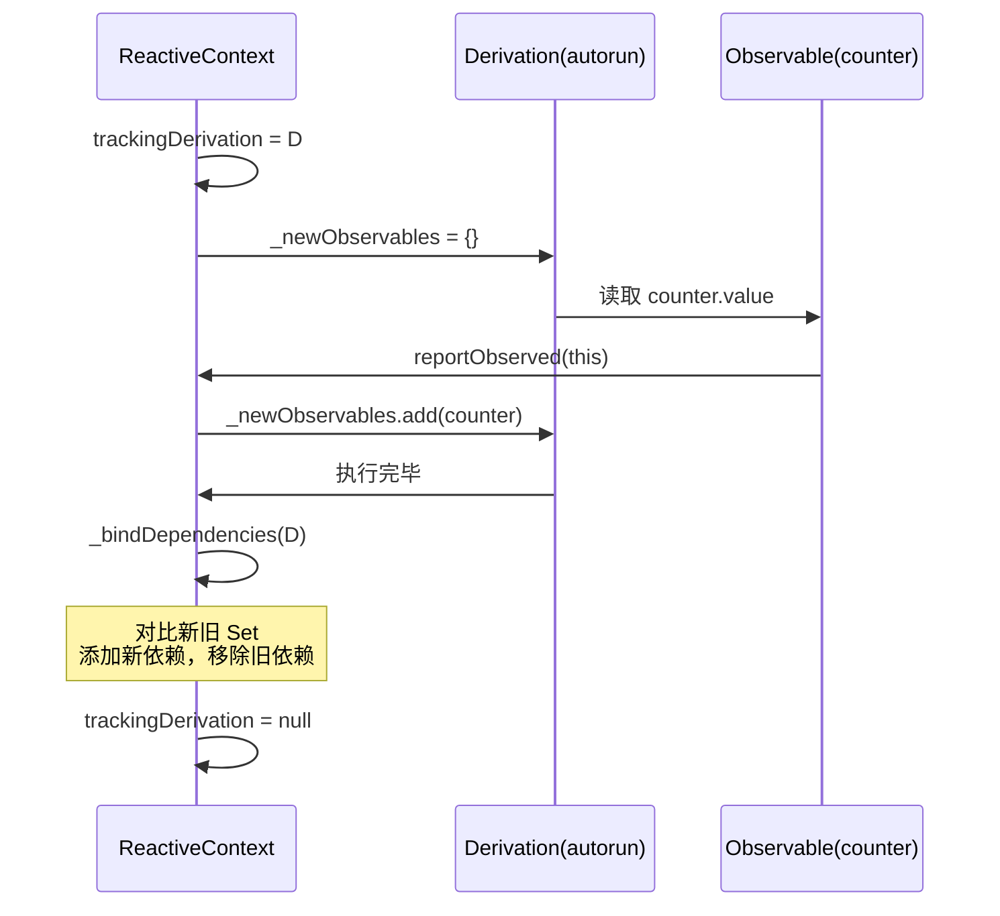
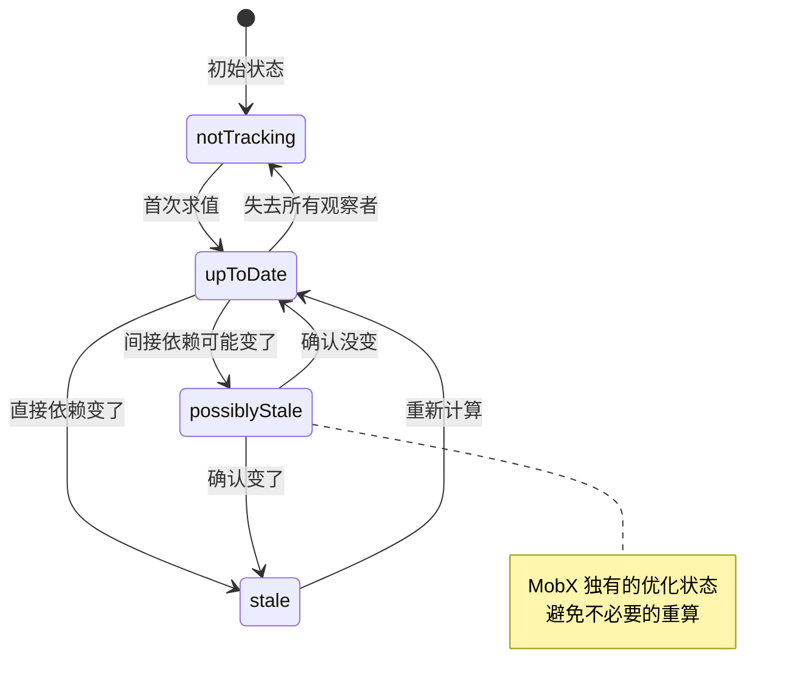
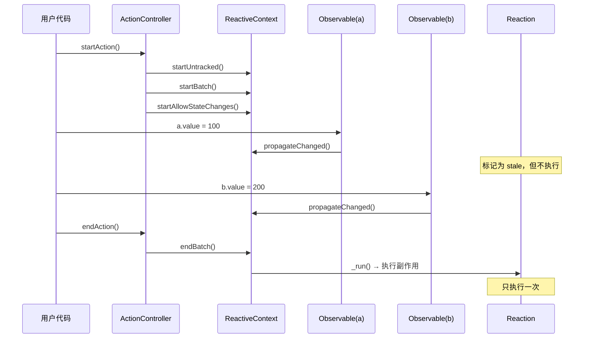

---
theme: cyanosis
---


##### 引言：

你有没有去过那种"无感通行"的高速公路收费站？车开过去，摄像头自动识别车牌，后台自动扣费，你甚至不需要减速。整个过程对你来说是"透明"的——你只管开车，系统替你处理一切。

MobX 的设计哲学就是这个收费站：**你只管读写变量，系统替你处理依赖追踪和 UI 更新。** 不需要 `notifyListeners()`，不需要 `emit()`，不需要 `ref.watch()`。你写 `counter.value++`，依赖了 `counter` 的 UI 自动更新。

如果你看过上一篇 Signals 的源码，会觉得 MobX 的思路很熟悉——都是"隐式依赖追踪"。但 MobX 走了一条完全不同的实现路径：它用 `Set` 而不是链表来管理依赖，用四状态有限状态机而不是版本号来判断是否需要重算，还引入了 `Action` 作为状态变更的事务边界。

更有意思的是，MobX 还有一套代码生成系统（`mobx_codegen`），让你用注解写 Store，编译期自动生成样板代码。这在 Flutter 状态管理方案中是独一份的。

这篇文章带你拆开 MobX.dart 的引擎盖，看看这套"透明魔法"到底是怎么变出来的。

***

#### 一、项目全貌：MobX 三件套

MobX.dart 也是一个 Melos 管理的 monorepo，核心由三个包组成：

| 层级        | 包名             | 职责                                                      |
| --------- | -------------- | ------------------------------------------------------- |
| 核心层       | `mobx`         | 纯 Dart 响应式引擎，Observable、Computed、Reaction、Action        |
| Flutter 层 | `flutter_mobx` | `Observer` Widget，把 Reaction 接入 Flutter 渲染管线            |
| 代码生成      | `mobx_codegen` | 编译期代码生成，把 `@observable`、`@computed`、`@action` 注解翻译成样板代码 |

还有两个辅助包：`mobx_lint`（自定义 lint 规则）和 `mobx_examples`（示例集合）。

和 Signals 的三层架构（引擎 → 核心 → Flutter）不同，MobX 的核心层和引擎层是合在一起的——`mobx` 包既是引擎又是 API。但它多了一个 Signals 没有的东西：**代码生成层**。

```mermaid
graph TB
    subgraph Runtime[&#34;运行时&#34;]
        mobx[&#34;mobx<br/>Observable · Computed · Reaction · Action&#34;]
        flutter_mobx[&#34;flutter_mobx<br/>Observer Widget&#34;]
        flutter_mobx --> mobx
    end

    subgraph BuildTime[&#34;编译期&#34;]
        codegen[&#34;mobx_codegen<br/>@observable → Atom + getter/setter<br/>@computed → Computed<br/>@action → ActionController&#34;]
    end

    codegen -.->|&#34;生成 .g.dart&#34;| mobx
    mobx_lint[&#34;mobx_lint<br/>Lint 规则&#34;] -.-> mobx

    style codegen fill:#e8f5e9
    style Runtime fill:#e3f2fd
```

MobX 的核心哲学可以用官方的一张图概括：**Actions → Observables → Computed → Reactions**。Actions 修改 Observables，Computed 从 Observables 派生，Reactions 响应变化执行副作用。这四个角色构成了一个单向数据流。

***

#### 二、指挥中心 —— ReactiveContext

在 Signals 中，依赖追踪靠一个全局变量 `evalContext`。MobX 把这个全局变量升级成了一个完整的类：`ReactiveContext`。它是整个响应式系统的指挥中心，管理着追踪、批处理、状态传播的全部逻辑。

***

##### 1. 内部状态：\_ReactiveState

`ReactiveContext` 的所有运行时状态都封装在一个 `_ReactiveState` 对象里：

```dart
---->[core/context.dart#_ReactiveState]----
class _ReactiveState {
  int batch = 0;                          // tag1：当前批处理深度
  int nextIdCounter = 0;                  // 自增 ID 计数器
  Derivation? trackingDerivation;         // tag2：当前正在追踪的派生
  List<Reaction> pendingReactions = [];   // tag3：待执行的 Reaction 队列
  bool isRunningReactions = false;        // 是否正在执行 Reactions
  List<Atom> pendingUnobservations = [];  // tag4：待清理的 Atom 队列
  int computationDepth = 0;              // tag5：Computed 嵌套深度
  bool allowStateChanges = true;          // 是否允许修改状态
}
```

`tag1`：`batch` 和 Signals 的 `batchDepth` 是同一个概念——嵌套计数器，只有最外层结束时才真正执行副作用。

`tag2`：`trackingDerivation` 就是 Signals 的 `evalContext`——当前正在执行的 Computed 或 Reaction。任何被读取的 Observable 都会检查这个字段，发现有人在追踪就自动注册依赖。

`tag3`：`pendingReactions` 是待执行的 Reaction 队列。和 Signals 用链表不同，MobX 用的是 `List`。

`tag4`：`pendingUnobservations` 是一个延迟清理队列。当一个 Atom 失去所有观察者时，不立即清理，而是等到当前 batch 结束后统一处理。

`tag5`：`computationDepth` 追踪 Computed 的嵌套深度。MobX 用它来禁止在 Computed 内部修改 Observable——这是一条铁律，违反就抛异常。

***

##### 2. 依赖追踪：trackDerivation

依赖追踪的核心流程和 Signals 的 `evalContext` 机制本质相同，但 MobX 用 `Set` 而不是链表来管理依赖：



源码展开看：

```dart
---->[core/context.dart#ReactiveContext.trackDerivation]----
T? trackDerivation<T>(Derivation d, T Function() fn) {
  final prevDerivation = _startTracking(d);
  T? result;

  try {
    result = fn();                         // tag1：执行函数，触发依赖收集
    d._errorValue = null;
  } on Object catch (e, s) {
    d._errorValue = MobXCaughtException(e, stackTrace: s);
  }

  _endTracking(d, prevDerivation);         // tag2：结束追踪，绑定依赖
  return result;
}

Derivation? _startTracking(Derivation derivation) {
  final prevDerivation = _state.trackingDerivation;
  _state.trackingDerivation = derivation;  // tag3：设置监控摄像头
  _resetDerivationState(derivation);
  derivation._newObservables = {};         // tag4：准备新的依赖集合
  return prevDerivation;
}
```

`tag3`：和 Signals 的 `evalContext = this` 完全对应。

`tag4`：创建一个空的 `Set<Atom>` 来收集新依赖。执行 `fn()` 的过程中，每个被读取的 Observable 都会通过 `reportObserved` 把自己加入这个 Set。

***

##### 3. 依赖绑定：\_bindDependencies

执行完 `fn()` 后，MobX 需要对比新旧依赖集合，添加新的、移除旧的。这是 MobX 和 Signals 最大的实现差异之一：

```dart
---->[core/context.dart#ReactiveContext._bindDependencies]----
void _bindDependencies(Derivation derivation) {
  final staleObservables = derivation._observables
      .difference(derivation._newObservables!);    // tag1：旧有新无 = 过期
  final newObservables = derivation._newObservables!
      .difference(derivation._observables);        // tag2：新有旧无 = 新增

  // 添加新依赖
  for (final observable in newObservables) {
    observable._addObserver(derivation);           // tag3
  }

  // 移除旧依赖
  for (final ob in staleObservables) {
    ob._removeObserver(derivation);                // tag4
  }

  derivation._observables = derivation._newObservables!;
  derivation._newObservables = {};
}
```

`tag1` \~ `tag2`：用 `Set.difference()` 做集合差运算。这比 Signals 的 prepare/cleanup 链表操作更直观，但代价是每次都要创建新的 Set 对象和做 hash 计算。

`tag3` \~ `tag4`：`_addObserver` 把 Derivation 加入 Atom 的观察者集合，`_removeObserver` 把它移除。

停下来想想：Signals 用链表 + version 标记做依赖增删，MobX 用 Set 差运算。哪个更好？

答案是：**各有优劣。** 链表的增删是 O(1) 且零内存分配，但代码复杂度高（prepare/cleanup/rollback）。Set 差运算代码简洁直观，但每次都要分配新 Set 和做 hash 计算。对于依赖数量少（< 10 个）的场景，差异可以忽略；依赖数量大的场景，链表更有优势。

***

#### 三、四大原语 —— Observable、Computed、Reaction、Action

MobX 的四个核心原语比 Signals 的三个（Signal、Computed、Effect）多了一个：**Action**。Action 是 MobX 的独特设计——它把状态变更包裹在一个事务边界里，确保批量修改只触发一次通知。

```mermaid
graph LR
    Action[&#34;Action<br/>事务边界<br/>批量修改&#34;]
    Observable[&#34;Observable<br/>可观察值<br/>数据源&#34;]
    Computed[&#34;Computed<br/>派生值<br/>惰性求值&#34;]
    Reaction[&#34;Reaction<br/>副作用<br/>autorun/when/reaction&#34;]

    Action -->|&#34;修改&#34;| Observable
    Observable -->|&#34;被读取时<br/>自动注册依赖&#34;| Computed
    Observable -->|&#34;被读取时<br/>自动注册依赖&#34;| Reaction
    Computed -->|&#34;被读取时<br/>自动注册依赖&#34;| Reaction
    Observable -.->|&#34;值变化时<br/>propagateChanged&#34;| Computed
    Observable -.->|&#34;值变化时<br/>propagateChanged&#34;| Reaction
    Computed -.->|&#34;值变化时<br/>propagateChangeConfirmed&#34;| Reaction

    style Action fill:#fff3e0
```



***

##### 1. Atom：最底层的可观察单元

在 MobX 中，`Atom` 是所有可观察对象的基类。它不持有值，只负责两件事：**报告被读取**和**报告被修改**。

```dart
---->[core/atom.dart#Atom]----
class Atom {
  final ReactiveContext _context;
  final String name;
  final Set<Derivation> _observers = {};       // tag1：观察者集合
  bool _isBeingObserved = false;
  DerivationState _lowestObserverState = DerivationState.notTracking;

  void reportObserved() {
    _context.reportObserved(this);             // tag2：报告被读取
  }

  void reportChanged() {
    _context
      ..startBatch()
      ..propagateChanged(this)                 // tag3：传播变更
      ..endBatch();
  }
}
```

`tag1`：观察者用 `Set<Derivation>` 存储。和 Signals 的 targets 链表不同，MobX 用 Set 保证不重复。

`tag2`：`reportObserved` 委托给 `ReactiveContext`，后者检查 `trackingDerivation` 是否存在，存在就把这个 Atom 加入 `_newObservables`。

`tag3`：`reportChanged` 先开启 batch，然后传播变更通知，最后结束 batch。`propagateChanged` 会遍历所有观察者，把它们的状态标记为 `stale`。

注意 `_lowestObserverState` 这个字段——它记录了所有观察者中"最低"的状态。这是一个优化：如果最低状态已经是 `stale`，说明所有观察者都已经知道变了，不需要再次传播。

***

##### 2. Observable：带值的 Atom

`Observable` 继承自 `Atom`，加上了值的存储和拦截/监听机制：

```dart
---->[core/observable.dart#Observable]----
class Observable<T> extends Atom
    implements Interceptable<T>, Listenable<ChangeNotification<T>> {

  T _value;

  T get value {
    _context.enforceReadPolicy(this);   // tag1：读策略检查
    reportObserved();                   // tag2：报告被读取
    return _value;
  }

  set value(T value) {
    _context.enforceWritePolicy(this);  // tag3：写策略检查
    final newValue = _prepareNewValue(value);
    if (newValue == WillChangeNotification.unchanged) return;  // tag4

    _value = newValue as T;
    reportChanged();                    // tag5：报告被修改
  }
}
```

`tag1`：读策略检查。如果配置了 `ReactiveReadPolicy.always`，在 Action 和 Reaction 外部读取 Observable 会抛异常。默认是 `never`，不检查。

`tag3`：写策略检查。如果配置了 `ReactiveWritePolicy.observed`（默认），有观察者的 Observable 在 Action 外部被修改会抛异常。这是 MobX 的一个重要设计：**强制你在 Action 内修改状态**。

`tag4`：`_prepareNewValue` 做两件事——先过拦截器（`Interceptable`），再做相等性检查。如果值没变，返回 `unchanged`，跳过通知。

这里有一个和 Signals 的重要区别：Signals 的 `Signal.set` 直接做 `val != internalValue` 检查；MobX 的 `Observable` 支持自定义相等性比较器（`EqualityComparer`）和拦截器（`Interceptor`）。拦截器可以在值写入前修改或拒绝变更——这在 Signals 中没有对应的机制。

***

##### 3. Computed：四状态有限状态机

MobX 的 `Computed` 和 Signals 的 `Computed` 功能相同——惰性求值的派生值。但实现方式完全不同。Signals 用版本号 + 三层快速路径，MobX 用一个四状态有限状态机：



四个状态的含义：

*   **notTracking**：没有在追踪依赖。初始状态，或者失去所有观察者后回到这个状态。
*   **upToDate**：值是最新的，不需要重算。
*   **possiblyStale**：某个间接依赖可能变了，但不确定是否真的影响了这个 Computed。需要进一步检查。
*   **stale**：某个直接依赖确实变了，需要重新计算。

`possiblyStale` 是 MobX 的独特优化。想象一个场景：

```dart
---->[示例代码]----
final a = Observable(1);
final b = Computed(() => a.value * 2);   // b 依赖 a
final c = Computed(() => b.value > 5);   // c 依赖 b
```

当 `a` 从 1 变成 2 时，`b` 从 2 变成 4，但 `c` 的值（`4 > 5 = false`）没变。如果 `a` 从 2 变成 3，`b` 从 4 变成 6，`c` 从 `false` 变成 `true`。

MobX 的处理方式：`a` 变化时，`b` 被标记为 `stale`（直接依赖变了），`c` 被标记为 `possiblyStale`（间接依赖可能变了）。当 `c` 被读取时，先检查 `b` 是否真的变了——如果 `b` 重算后值没变，`c` 直接回到 `upToDate`，不需要重算。

源码中的关键方法是 `_shouldCompute`：

```dart
---->[core/context.dart#ReactiveContext._shouldCompute]----
bool _shouldCompute(Derivation derivation) {
  switch (derivation._dependenciesState) {
    case DerivationState.upToDate:
      return false;                        // tag1：最新的，不用算

    case DerivationState.notTracking:
    case DerivationState.stale:
      return true;                         // tag2：过期了，必须算

    case DerivationState.possiblyStale:
      return untracked(() {                // tag3：不确定，逐个检查
        for (final obs in derivation._observables) {
          if (obs is Computed) {
            obs.value;                     // tag4：强制 Computed 重算
            if (derivation._dependenciesState == DerivationState.stale) {
              return true;                 // tag5：确认变了
            }
          }
        }
        _resetDerivationState(derivation);
        return false;                      // tag6：确认没变
      });
  }
}
```

`tag3` \~ `tag6`：`possiblyStale` 的处理逻辑。遍历所有依赖，如果依赖是 Computed，强制它重新求值（`tag4`）。如果重算后发现值变了，当前 Derivation 会被标记为 `stale`（`tag5`），需要重算。如果所有 Computed 依赖都没变，重置状态为 `upToDate`（`tag6`）。

注意 `tag3` 处的 `untracked()`——在检查过程中不建立新的依赖关系，避免副作用。

***

##### 4. 变更传播：三种 propagate

MobX 的变更传播有三种方式，对应不同的场景：

```dart
---->[core/context.dart#ReactiveContext]----
// Observable 值变了 → 直接观察者标记为 stale
void propagateChanged(Atom atom) {
  for (final observer in atom._observers) {
    if (observer._dependenciesState == DerivationState.upToDate) {
      observer._onBecomeStale();
    }
    observer._dependenciesState = DerivationState.stale;
  }
}

// Computed 可能变了 → 间接观察者标记为 possiblyStale
void _propagatePossiblyChanged(Atom atom) {
  for (final observer in atom._observers) {
    if (observer._dependenciesState == DerivationState.upToDate) {
      observer
        .._dependenciesState = DerivationState.possiblyStale
        .._onBecomeStale();
    }
  }
}

// Computed 确认变了 → 间接观察者从 possiblyStale 升级为 stale
void _propagateChangeConfirmed(Atom atom) {
  for (final observer in atom._observers) {
    if (observer._dependenciesState == DerivationState.possiblyStale) {
      observer._dependenciesState = DerivationState.stale;
    }
  }
}
```

这三种传播方式构成了 MobX 的"两阶段变更传播"：

1.  **第一阶段**：Observable 变化时，直接观察者标记为 `stale`，间接观察者标记为 `possiblyStale`。
2.  **第二阶段**：当 `possiblyStale` 的 Derivation 被读取时，逐个检查依赖的 Computed 是否真的变了，确认后升级为 `stale`。

这个设计避免了"钻石依赖"问题：如果 A 依赖 B 和 C，B 和 C 都依赖 D，D 变化时 A 只需要重算一次，而不是两次。

***

##### 5. Computed 的求值：双模式计算

Computed 的 `value` getter 有两种求值模式，取决于它是否有观察者：

```dart
---->[core/computed.dart#Computed]----
T get value {
  if (_isComputing) {
    throw MobXCyclicReactionException(          // tag1：循环检测
      'Cycle detected in computation $name',
    );
  }

  if (!_context.isWithinBatch && _observers.isEmpty && !_keepAlive) {
    // tag2：无观察者模式 —— 不追踪依赖
    if (_context._shouldCompute(this)) {
      _context.startBatch();
      _value = computeValue(track: false);
      _context.endBatch();
    }
  } else {
    // tag3：有观察者模式 —— 追踪依赖
    reportObserved();
    if (_context._shouldCompute(this)) {
      if (_trackAndCompute()) {
        _context._propagateChangeConfirmed(this);  // tag4
      }
    }
  }

  return _value as T;
}
```

`tag2`：如果没有观察者（没有 Reaction 在监听这个 Computed），就不追踪依赖。直接计算值，用完即弃。这避免了不必要的依赖管理开销。

`tag3`：如果有观察者，走完整的追踪流程。`_trackAndCompute` 会调用 `trackDerivation` 重新收集依赖。

`tag4`：如果值确实变了，调用 `_propagateChangeConfirmed` 通知下游。这就是"两阶段传播"的第二阶段——从 `possiblyStale` 升级为 `stale`。

`_trackAndCompute` 的实现：

```dart
---->[core/computed.dart#Computed._trackAndCompute]----
bool _trackAndCompute() {
  final oldValue = _value;
  final wasSuspended = _dependenciesState == DerivationState.notTracking;
  final hadCaughtException = _context._hasCaughtException(this);

  final newValue = computeValue(track: true);

  final changedException = hadCaughtException != _context._hasCaughtException(this);
  final changed = wasSuspended || changedException || !_isEqual(oldValue, newValue);

  if (changed) {
    _value = newValue;
  }

  return changed;
}
```

注意 `changed` 的判断条件：不仅比较值是否变了，还检查异常状态是否变了（从正常变成异常，或从异常变成正常）。这比 Signals 的纯值比较更全面。

***

#### 四、事务边界 —— Action

Action 是 MobX 区别于 Signals 的独特设计。在 Signals 中，你可以随时修改信号的值；在 MobX 中，修改 Observable 应该在 Action 内部进行。

为什么需要 Action？想象你在银行转账：从 A 账户扣 100，给 B 账户加 100。如果没有事务，扣完 A 还没加 B 的时候，有人读取了余额，就会看到"钱凭空消失了"的中间状态。Action 就是这个事务——确保所有修改要么全部完成后再通知，要么不通知。



源码：

```dart
---->[core/action.dart#ActionController]----
class ActionController {
  final ReactiveContext _context;
  final String name;

  ActionRunInfo startAction({String? name}) {
    final prevDerivation = _context.startUntracked();   // tag1
    _context.startBatch();                              // tag2
    final prevAllowStateChanges =
        _context.startAllowStateChanges(allow: true);   // tag3

    return ActionRunInfo(
      prevDerivation: prevDerivation,
      prevAllowStateChanges: prevAllowStateChanges,
      name: name ?? this.name,
    );
  }

  void endAction(ActionRunInfo info) {
    _context
      ..endAllowStateChanges(allow: info.prevAllowStateChanges)  // tag4
      ..endBatch()                                                // tag5
      ..endUntracked(info.prevDerivation);                        // tag6
  }
}
```

`tag1`：`startUntracked()` 把 `trackingDerivation` 设为 `null`。这意味着 Action 内部读取 Observable 不会建立依赖——Action 是"写"操作，不是"读"操作。

`tag2`：`startBatch()` 递增 batch 计数器。在 batch 内部，Reaction 不会立即执行。

`tag3`：`startAllowStateChanges(allow: true)` 允许修改 Observable。在 Reaction 内部，默认是不允许修改的（防止无限循环）。

`tag5`：`endBatch()` 递减 batch 计数器。如果降到 0，执行所有 `pendingReactions`。

这个设计有一个 Signals 没有的好处：**写策略强制执行**。MobX 可以配置 `ReactiveWritePolicy.observed`，在 Action 外部修改有观察者的 Observable 时抛异常。这在大型项目中能有效防止"野修改"——状态变更必须经过 Action，方便追踪和调试。

***

#### 五、副作用三兄弟 —— autorun、reaction、when

Signals 只有一个 `effect`，MobX 提供了三种不同的副作用 API，适用于不同场景：

| API        | 追踪方式                    | 适用场景                        |
| ---------- | ----------------------- | --------------------------- |
| `autorun`  | 自动追踪回调内读取的所有 Observable | 通用副作用，类似 Signals 的 `effect` |
| `reaction` | 分离"追踪"和"执行"两个函数         | 只在特定值变化时执行副作用               |
| `when`     | 等待条件为 true 后执行一次        | 一次性副作用，如等待数据加载完成            |

***

##### 1. autorun：全自动追踪

`autorun` 是最常用的副作用 API。它的实现基于 `ReactionImpl`：

```dart
---->[core/reaction_helper.dart#createAutorun]----
ReactionDisposer createAutorun(
  ReactiveContext context,
  Function(Reaction) trackingFn, {
  String? name,
  void Function(Object, Reaction)? onError,
}) {
  late ReactionImpl rxn;

  rxn = ReactionImpl(
    context,
    () {
      rxn.track(() => trackingFn(rxn));   // tag1：追踪 + 执行
    },
    name: name ?? context.nameFor('Autorun'),
    onError: onError,
  );

  rxn.schedule();                          // tag2：立即调度
  return ReactionDisposer(rxn);
}
```

`tag1`：`rxn.track()` 内部调用 `trackDerivation`，在执行 `trackingFn` 的过程中收集依赖。下次任何依赖变化时，`rxn` 的 `_onInvalidate` 回调被触发，又会调用 `rxn.track()`，重新收集依赖并执行。

`tag2`：创建后立即调度执行一次，收集初始依赖。

***

##### 2. reaction：分离追踪和执行

`reaction` 把"追踪什么"和"做什么"分成两个函数：

```dart
---->[core/reaction_helper.dart#createReaction]----
ReactionDisposer createReaction<T>(
  ReactiveContext context,
  T Function(Reaction) fn,          // 追踪函数：返回要监听的值
  void Function(T) effect,          // 执行函数：值变化时执行
  // ...
) {
  late ReactionImpl rxn;
  var firstTime = true;
  T? value;

  void reactionRunner() {
    var changed = false;

    rxn.track(() {
      final nextValue = fn(rxn);                    // tag1：追踪
      final isEqual = equals != null
          ? equals(nextValue, value)
          : (nextValue == value);
      changed = firstTime || !isEqual;
      value = nextValue;
    });

    final canInvokeEffect =
        (firstTime && fireImmediately == true) || (!firstTime && changed);

    if (canInvokeEffect) {
      effectAction([value]);                        // tag2：执行
    }
    firstTime = false;
  }
  // ...
}
```

`tag1`：`fn(rxn)` 是追踪函数，它的返回值被缓存。只有返回值变化时才触发 `tag2` 的 effect。

`tag2`：`effectAction` 是一个 `Action`，确保 effect 内部的状态修改也在事务边界内。

这个设计比 Signals 的 `effect` 更精细。在 Signals 中，effect 内部读取的所有信号都是依赖；在 MobX 的 `reaction` 中，你可以精确控制"追踪什么"和"响应什么"。

***

##### 3. Reaction 的调度与执行

`ReactionImpl` 是所有副作用的底层实现。它的调度机制和 Signals 的 batch 队列类似：

```dart
---->[core/reaction.dart#ReactionImpl]----
void _onBecomeStale() {
  schedule();
}

void schedule() {
  if (_isScheduled) return;
  _isScheduled = true;
  _context
    ..addPendingReaction(this)
    ..runReactions();
}

void _run() {
  if (_isDisposed) return;
  _context.startBatch();
  _isScheduled = false;

  if (_context._shouldCompute(this)) {   // tag1：检查是否真的需要执行
    try {
      _onInvalidate();                   // tag2：执行回调
    } on Object catch (e, s) {
      _errorValue = MobXCaughtException(e, stackTrace: s);
      _reportException(_errorValue!, s);
    }
  }

  _context.endBatch();
}
```

`tag1`：执行前还会调用 `_shouldCompute` 做最后一次检查。如果状态是 `possiblyStale`，会先检查依赖的 Computed 是否真的变了。

`tag2`：`_onInvalidate` 是创建 Reaction 时传入的回调。对于 `autorun`，它是 `rxn.track(() => trackingFn(rxn))`；对于 `reaction`，它是 `reactionRunner()`。

`runReactions` 的循环检测和 Signals 类似——超过 `maxIterations`（默认 100）次迭代就抛 `MobXCyclicReactionException`。

***

#### 六、Flutter 集成 —— Observer Widget

`flutter_mobx` 的核心就一个 Widget：`Observer`。它的实现比 Signals 的 `Watch` 更底层——直接在 Element 层面做文章。

```mermaid
graph TD
    subgraph Observer[&#34;Observer Widget&#34;]
        OW[&#34;Observer<br/>extends StatelessObserverWidget&#34;]
        OEM[&#34;ObserverElementMixin<br/>mixin on ComponentElement&#34;]
    end

    subgraph MobX[&#34;mobx 核心&#34;]
        Rxn[&#34;ReactionImpl&#34;]
        RC[&#34;ReactiveContext&#34;]
    end

    subgraph Flutter[&#34;Flutter 框架&#34;]
        CE[&#34;ComponentElement&#34;]
        MNB[&#34;markNeedsBuild()&#34;]
    end

    OW -->|&#34;createElement()&#34;| OEM
    OEM -->|&#34;mount() 时创建&#34;| Rxn
    Rxn -->|&#34;_onInvalidate&#34;| OEM
    OEM -->|&#34;invalidate()&#34;| MNB
    OEM -->|&#34;build() 时&#34;| Rxn
    Rxn -->|&#34;track()&#34;| RC

    style OEM fill:#fff3e0
```

核心逻辑在 `ObserverElementMixin` 中：

```dart
---->[flutter_mobx/lib/src/observer_widget_mixin.dart#ObserverElementMixin]----
mixin ObserverElementMixin on ComponentElement {
  ReactionImpl? _reaction;

  @override
  void mount(Element? parent, dynamic newSlot) {
    _reaction = _widget.createReaction(
      invalidate,                          // tag1：Reaction 触发时调用 invalidate
      onError: (e, _) { /* 错误处理 */ },
    ) as ReactionImpl;
    super.mount(parent, newSlot);
  }

  void invalidate() => _markNeedsBuildImmediatelyOrDelayed();

  void _markNeedsBuildImmediatelyOrDelayed() async {
    final schedulerPhase = SchedulerBinding.instance.schedulerPhase;
    final shouldWait = schedulerPhase != SchedulerPhase.idle
        && schedulerPhase != SchedulerPhase.postFrameCallbacks;
    if (shouldWait) {
      await SchedulerBinding.instance.endOfFrame;    // tag2：等当前帧结束
      if (_reaction == null) return;
    }
    markNeedsBuild();                                // tag3：标记重建
  }

  @override
  Widget build() {
    Widget? built;
    reaction.track(() {
      built = super.build();                         // tag4：在 track 中执行 build
    });
    return built!;
  }

  @override
  void unmount() {
    _reaction!.dispose();                            // tag5：自动清理
    _reaction = null;
    super.unmount();
  }
}
```

`tag1`：Element mount 时创建一个 `ReactionImpl`，它的 `_onInvalidate` 回调是 `invalidate`。

`tag2`：和 Signals 的 `ElementWatcher` 一样，如果当前不在空闲阶段，等到帧结束再触发重建。

`tag4`：这是最关键的一行。`build()` 方法在 `reaction.track()` 内部执行，这意味着 build 过程中读取的所有 Observable 都会被自动追踪。下次任何依赖变化时，`invalidate` 被调用，触发 `markNeedsBuild()`。

`tag5`：Element unmount 时自动 dispose Reaction，清理所有订阅。

和 Signals 的 `Watch` 对比：Signals 用 `Computed<Widget>` 包裹 builder，MobX 直接在 Element 的 `build()` 方法上套 `reaction.track()`。两种方式都能实现自动追踪，但 MobX 的方式更底层——它直接 mixin 到 Element 上，不需要额外的 Widget 层。

***

#### 七、代码生成 —— mobx\_codegen

这是 MobX 独有的杀手锏。你写一个带注解的抽象类，`build_runner` 自动生成所有样板代码。

***

##### 1. 你写的代码 vs 生成的代码

你写的：

```dart
---->[示例代码]----
abstract class _CounterBase with Store {
  @observable
  int count = 0;

  @computed
  bool get isEven => count % 2 == 0;

  @action
  void increment() {
    count++;
  }
}
```

生成的（简化版）：

```dart
---->[示例代码 · 生成的 .g.dart]----
mixin _$Counter on _CounterBase, Store {
  // --- Observable ---
  late final _countAtom = Atom(name: '_CounterBase.count', context: context);

  @override
  int get count {
    _countAtom.reportRead();           // 读取时报告
    return super.count;
  }

  @override
  set count(int value) {
    _countAtom.reportWrite(value, super.count, () {
      super.count = value;             // 写入时报告 + 相等性检查
    });
  }

  // --- Computed ---
  Computed<bool>? _isEvenComputed;

  @override
  bool get isEven =>
      (_isEvenComputed ??= Computed<bool>(
        () => super.isEven,
        name: '_CounterBase.isEven',
      )).value;

  // --- Action ---
  late final _incrementActionController =
      ActionController(name: '_CounterBase.increment', context: context);

  @override
  void increment() {
    final _$actionInfo = _incrementActionController.startAction();
    try {
      return super.increment();
    } finally {
      _incrementActionController.endAction(_$actionInfo);
    }
  }
}
```

```mermaid
flowchart LR
    subgraph UserCode[&#34;你写的代码&#34;]
        A1[&#34;@observable<br/>int count = 0&#34;]
        A2[&#34;@computed<br/>bool get isEven&#34;]
        A3[&#34;@action<br/>void increment()&#34;]
    end

    subgraph Generated[&#34;生成的代码&#34;]
        B1[&#34;Atom + reportRead/reportWrite&#34;]
        B2[&#34;Computed(() => super.isEven)&#34;]
        B3[&#34;ActionController.startAction/endAction&#34;]
    end

    A1 -->|&#34;mobx_codegen&#34;| B1
    A2 -->|&#34;mobx_codegen&#34;| B2
    A3 -->|&#34;mobx_codegen&#34;| B3

    style UserCode fill:#e8f5e9
    style Generated fill:#e3f2fd
```

***

##### 2. 代码生成的原理

`mobx_codegen` 使用 `source_gen` 和 `build_runner`，在编译期扫描带有 `Store` mixin 的类，通过 `StoreClassVisitor` 遍历类的字段和方法：

```dart
---->[mobx_codegen/lib/src/store_class_visitor.dart#StoreClassVisitor]----
class StoreClassVisitor extends SimpleElementVisitor2 {
  final _observableChecker = const TypeChecker.typeNamed(MakeObservable, ...);
  final _computedChecker = const TypeChecker.typeNamed(ComputedMethod, ...);
  final _actionChecker = const TypeChecker.typeNamed(MakeAction, ...);

  void visitFieldElement(FieldElement element) {
    if (!_observableChecker.hasAnnotationOfExact(element)) return;
    // 生成 ObservableTemplate
    _storeTemplate.observables.add(ObservableTemplate(...));
  }

  void visitPropertyAccessorElement(PropertyAccessorElement element) {
    if (!_computedChecker.hasAnnotationOfExact(element)) return;
    // 生成 ComputedTemplate
    _storeTemplate.computeds.add(ComputedTemplate(...));
  }

  void visitMethodElement(MethodElement element) {
    if (!_actionChecker.hasAnnotationOfExact(element)) return;
    // 生成 ActionTemplate 或 AsyncActionTemplate
    _storeTemplate.actions.add(ActionTemplate(...));
  }
}
```

每种注解对应一个模板类（`ObservableTemplate`、`ComputedTemplate`、`ActionTemplate`），模板类的 `toString()` 方法输出生成的代码。

`ObservableTemplate` 生成的 getter 中调用 `_countAtom.reportRead()`，setter 中调用 `_countAtom.reportWrite()`。`reportWrite` 是 `atom_extensions.dart` 中定义的扩展方法：

```dart
---->[core/atom_extensions.dart#AtomSpyReporter.reportWrite]----
void reportWrite<T>(
  T newValue, T oldValue,
  void Function() setNewValue, {
  EqualityComparer<T>? equals,
}) {
  final areEqual = equals ?? (a, b) => equatable(a, b);
  if (areEqual(newValue, oldValue)) return;    // tag1：值没变，跳过

  context.conditionallyRunInAction(() {
    setNewValue();                              // tag2：设置新值
    reportChanged();                            // tag3：报告变更
  }, this);
}
```

`tag1`：相等性检查。值没变就不通知。

`tag2` \~ `tag3`：`conditionallyRunInAction` 会检查当前是否在 batch 内。如果不在，自动创建一个临时 Action 包裹修改操作。这就是为什么即使你不显式写 `@action`，直接赋值 `counter.count = 5` 也能正常工作——codegen 生成的 setter 会自动包裹 Action。

***

#### 八、和其他方案的对比

| 维度      | Bloc         | Provider          | Riverpod            | Signals        | MobX                      |
| ------- | ------------ | ----------------- | ------------------- | -------------- | ------------------------- |
| 依赖追踪    | 手动泛型         | 手动 Consumer       | 手动 ref.watch        | 自动             | **自动**                    |
| 状态变更    | emit()       | notifyListeners() | state =             | signal.value = | **@action**               |
| 派生值     | 手动           | 无内置               | Provider 组合         | computed()     | **@computed**             |
| 代码生成    | 无            | 无                 | riverpod\_generator | 无              | **mobx\_codegen**         |
| 写策略强制   | 无            | 无                 | 无                   | 无              | **enforceWritePolicy**    |
| 拦截器     | 无            | 无                 | 无                   | 无              | **Interceptable**         |
| 副作用 API | BlocListener | 无内置               | ref.listen          | effect()       | **autorun/reaction/when** |
| 核心代码量   | \~500 行      | \~800 行           | \~3000 行            | \~600 行        | **\~1200 行**              |

几个值得注意的点：

**写策略强制**是 MobX 独有的。`ReactiveWritePolicy.observed` 确保有观察者的 Observable 只能在 Action 内修改。这在大型团队中能有效防止"野修改"，但也增加了使用门槛。

**拦截器**（`Interceptable`）允许你在值写入前拦截和修改变更。这在表单验证、数据规范化等场景中很有用，其他方案都没有对应的机制。

**三种副作用 API** 比 Signals 的单一 `effect` 更灵活。`reaction` 的"分离追踪和执行"模式在实际开发中非常实用——你可以精确控制"监听什么"和"做什么"。

**代码生成**是双刃剑。好处是减少样板代码，坏处是增加了构建时间和调试复杂度。`build_runner` 在大型项目中的构建速度一直是社区的痛点。

***

#### 九、源码中值得学习的设计模式

***

##### 1. 四状态有限状态机

MobX 的 `DerivationState`（notTracking → upToDate → possiblyStale → stale）是一个经典的状态机设计。`possiblyStale` 状态避免了不必要的重算——只有当间接依赖的 Computed 确认值变了，才真正标记为 `stale`。

这个模式适用于任何"变更可能传播但不确定是否真的影响了下游"的场景。比如缓存失效策略、增量编译的依赖检查。

***

##### 2. 事务边界（Action）

Action 的 `startBatch/endBatch` + `startUntracked/endUntracked` + `startAllowStateChanges/endAllowStateChanges` 三重保护，确保了：

*   批量修改只触发一次通知
*   Action 内部读取不建立依赖
*   只有 Action 内部才能修改状态

这个"三重保护"模式适用于任何需要事务语义的场景。

***

##### 3. 延迟清理队列

`pendingUnobservations` 是一个延迟清理队列。当 Atom 失去所有观察者时，不立即清理，而是等到 batch 结束后统一处理。这避免了在遍历观察者列表时修改列表导致的并发修改问题。

这个模式在事件系统、观察者模式的实现中很常见——"标记删除，延迟清理"。

***

##### 4. conditionallyRunInAction

`conditionallyRunInAction` 是一个优雅的设计：如果已经在 batch 内，直接执行；如果不在，自动创建一个临时 Action 包裹。这让 codegen 生成的 setter 在任何上下文中都能正确工作，不需要用户手动包裹 Action。

***

#### 碎碎念

MobX 是这个系列中唯一一个"从前端移植过来"的方案。它的 JavaScript 版本（mobx.js）在 React 生态中有着深厚的积累，Dart 版本忠实地移植了核心设计。

和 Signals 对比，两者都走"隐式依赖追踪"的路线，但风格截然不同。Signals 追求极致的轻量——600 行代码，链表 + 版本号，零分配。MobX 追求完备的功能——1200 行代码，Set + 状态机，拦截器 + 写策略 + 代码生成。

如果说 Signals 是一把瑞士军刀——小巧精致，每个零件都打磨到极致；那 MobX 就是一套完整的工具箱——锤子、螺丝刀、扳手一应俱全，虽然重了点，但什么活都能干。

选择哪个，取决于你的项目需要什么。如果你追求极致的轻量和性能，Signals 更合适。如果你需要完备的功能（拦截器、写策略、代码生成）和成熟的生态（从 JavaScript 社区继承的最佳实践），MobX 是更稳妥的选择。

到此状态管理大乱斗就完结了。从 GetX 的全局单例到 MobX 的透明魔法，六种方案，六种哲学。希望这些文章能帮你在选择状态管理方案时，不再只看 API 表面，而是能看到引擎盖下面的东西。
