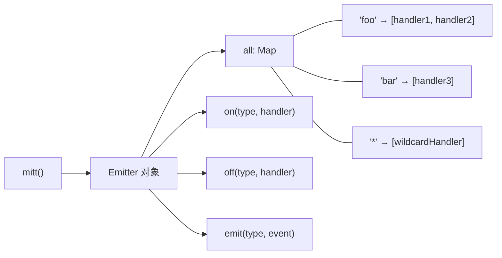
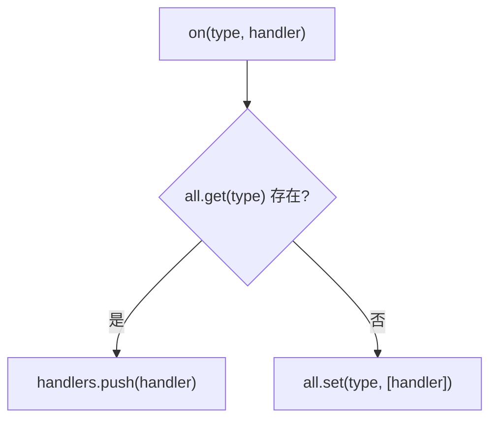
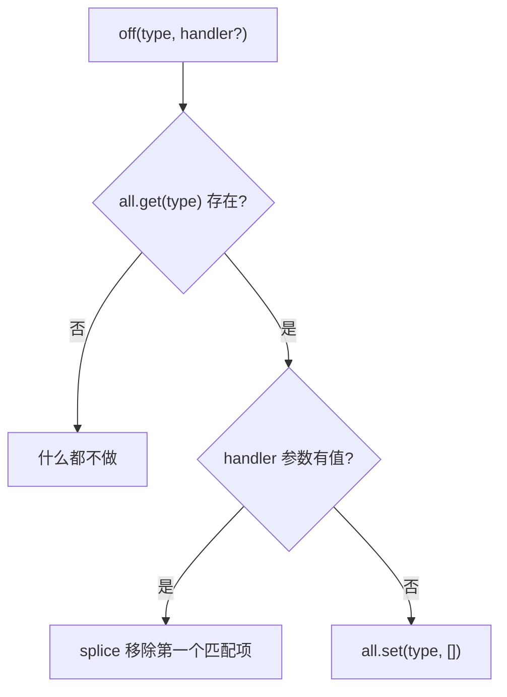
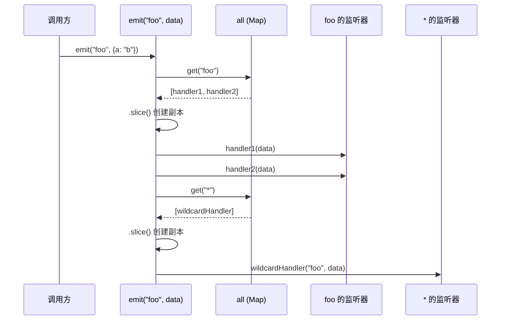
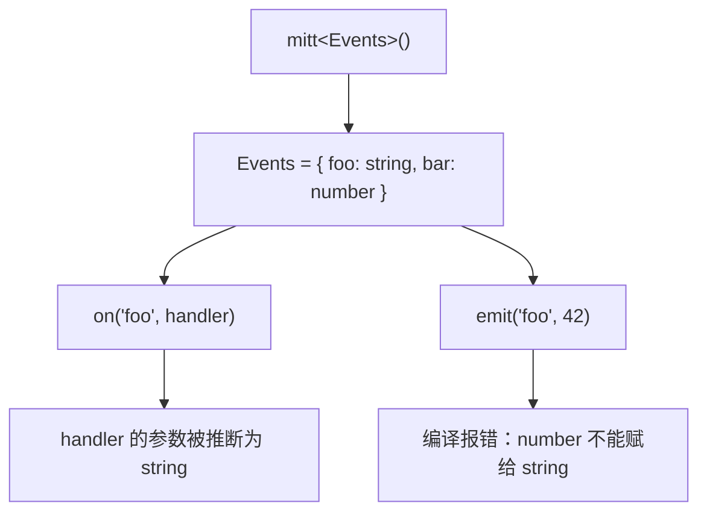
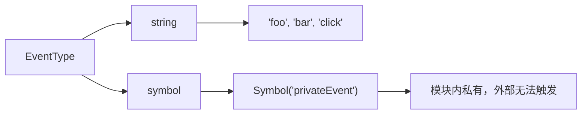
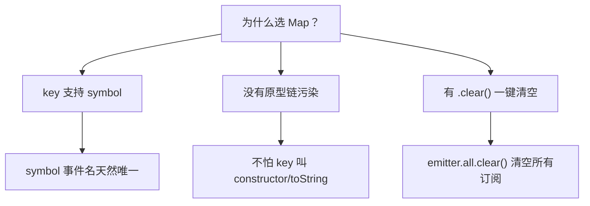

#### 引言：

你调用了一个方法，另一个模块里的回调就执行了。
中间没有 import，没有引用，两段代码甚至不知道彼此的存在。
这根"看不见的线"到底是什么？

想象一个广场上的大喇叭。有人对着喇叭喊了一嗓子"着火了"，所有竖着耳朵的人都听到了，没竖耳朵的人该干嘛干嘛。喊话的人不需要知道谁在听，听的人也不需要知道谁在喊。这就是`发布订阅`的本质：用一个公共的"广播站"解耦生产者和消费者。

mitt 就是这样一个广播站。而且它可能是你能找到的最小的一个，只有几十行代码。

不是因为它功能少，而是因为它把"什么该做、什么不该做"想得比别人透。

但简单的东西往往藏着不简单的决策。为什么用 Map 不用普通对象？为什么删除时用位运算？为什么 emit 要先 slice 再遍历？每一个"为什么"背后，都是设计者权衡过的取舍。

带着这些问题，我们钻进源码里看看。

---

#### 一、全局视角：mitt 的骨架

mitt 的整体结构极其克制。一个工厂函数，返回一个对象，对象上挂三个方法。没有 class，没有 prototype，没有 this。

先用一张图把骨架看清楚：



`all` 是一个 Map，key 是事件名，value 是回调函数数组。三个方法围绕这个 Map 做增删查的操作。就这么简单。

回到广场大喇叭的类比：`all` 就是广场的登记簿，记录了谁在听什么频道。`on` 是登记，`off` 是注销，`emit` 是广播。

---

来看工厂函数本身：

```typescript
---->[src/index.ts#mitt]----
export default function mitt<Events extends Record<EventType, unknown>>(
  all?: EventHandlerMap<Events>
): Emitter<Events> {
  type GenericEventHandler =
    | Handler<Events[keyof Events]>
    | WildcardHandler<Events>;
  all = all || new Map();  // tag1

  return {
    all,
    on(type, handler) { /* ... */ },
    off(type, handler) { /* ... */ },
    emit(type, evt) { /* ... */ }
  };
}
```

`tag1` 处有一个细节值得注意：`all` 参数是可选的。如果你不传，它就 new 一个空 Map；如果你传了一个已有的 Map，它就直接用。这意味着你可以在外部持有事件注册表的引用，甚至可以在多个 emitter 之间共享同一份注册表。

设计者为什么留这个口子？因为有些场景需要"快照"和"恢复"：把当前的 all 存下来，下次传进去就能恢复之前的订阅状态。测试用例里也正是这样验证的。

---

#### 二、注册：on 的实现

注册监听器的逻辑只有几行：



对应的源码：

```typescript
---->[src/index.ts#on]----
on<Key extends keyof Events>(type: Key, handler: GenericEventHandler) {
  const handlers: Array<GenericEventHandler> | undefined = all!.get(type);
  if (handlers) {
    handlers.push(handler);  // tag1
  } else {
    all!.set(type, [handler] as EventHandlerList<Events[keyof Events]>);  // tag2
  }
},
```

`tag1` 处，如果该事件类型已经有监听器了，直接往数组尾部 push。`tag2` 处，如果是第一次注册这个类型，创建一个新数组包裹住 handler，塞进 Map。

停下来想想：同一个 handler 被 on 两次会怎样？

答案是：它会被注册两次。mitt 不做去重。这和 Node.js 的 EventEmitter 行为一致。测试用例里专门验证了这一点：

```typescript
---->[test/index_test.ts#on]----
it('should add duplicate listeners', () => {
  const foo = () => {};
  inst.on('foo', foo);
  inst.on('foo', foo);
  expect(events.get('foo')).to.deep.equal([foo, foo]);
});
```

为什么不去重？因为去重需要遍历数组做查找，是 O(n) 操作。mitt 选择把这个决策权交给使用者：如果你不想重复注册，自己保证别调两次。这是`极简主义`的典型取舍，用更少的代码覆盖更多的场景。

---

#### 三、注销：off 的暗手

off 的逻辑比 on 复杂一点，因为它要处理两种情况：移除特定 handler，或者清空某类型的全部 handler。



源码：

```typescript
---->[src/index.ts#off]----
off<Key extends keyof Events>(type: Key, handler?: GenericEventHandler) {
  const handlers: Array<GenericEventHandler> | undefined = all!.get(type);
  if (handlers) {
    if (handler) {
      handlers.splice(handlers.indexOf(handler) >>> 0, 1);  // tag1
    } else {
      all!.set(type, []);  // tag2
    }
  }
},
```

`tag2` 很好理解：不传 handler 就用空数组替换，相当于清空该类型的所有监听器。

`tag1` 才是这段代码里最值得细品的一行。给你三秒钟，想想 `>>> 0` 在这里干什么。

---

##### `>>> 0` 的巧思

`indexOf` 找不到时返回 -1。如果直接把 -1 传给 `splice`，splice 会把 -1 解读为"倒数第一个元素"，导致误删最后一个 handler。这是一个隐蔽的 bug。

`>>> 0` 是无符号右移零位。它的效果是：正数不变，-1 变成 4294967295（一个巨大的正整数）。当 splice 的起始位置超出数组长度时，什么都不会删。

用一行代码同时处理了"找到就删"和"没找到就跳过"两种情况，连一个 if 判断都省了。


这个技巧在社区里常被叫做"安全 splice"。代价是可读性稍差，收益是少一个分支判断，代码更短。对一个追求极致体积的库来说，这笔账算得过来。

---

还有一点值得注意：off 只移除第一个匹配项。如果同一个 handler 被注册了两次，off 一次只删一个。这和"on 不去重"的设计是对称的，行为可预测。

---

#### 四、广播：emit 的防御式设计

emit 是整个库里逻辑最丰富的方法。它要做两件事：触发精确匹配的 handler，然后触发通配符 `*` 的 handler。



源码：

```typescript
---->[src/index.ts#emit]----
emit<Key extends keyof Events>(type: Key, evt?: Events[Key]) {
  let handlers = all!.get(type);
  if (handlers) {
    (handlers as EventHandlerList<Events[keyof Events]>)
      .slice()  // tag1
      .map((handler) => {
        handler(evt!);  // tag2
      });
  }

  handlers = all!.get('*');  // tag3
  if (handlers) {
    (handlers as WildCardEventHandlerList<Events>)
      .slice()
      .map((handler) => {
        handler(type, evt!);  // tag4
      });
  }
}
```

`tag1` 处的 `.slice()` 是关键。为什么要先拷贝一份再遍历？

---

##### 为什么 emit 要 slice

想象这个场景：handler1 执行时，内部调用了 `off` 把 handler2 注销了。如果直接遍历原数组，handler2 被 splice 掉后，遍历的索引就错乱了，可能跳过元素或者重复执行。

先 slice 一份快照，遍历的是快照，修改的是原数组，两者互不干扰。这是事件系统里经典的"迭代安全"问题。

代价是什么？每次 emit 都会创建一个新数组。对于高频触发的事件，这会产生 GC 压力。但对 mitt 的定位来说（轻量级、非性能极限场景），这个代价完全可以接受。

---

`tag2` 处用 `.map` 来遍历而不是 `forEach`，从功能上看没有区别（返回值被丢弃了）。这是一种风格选择，map 在某些引擎的 minify 后字符更少。

`tag3` 处，精确匹配的 handler 执行完之后，再去找通配符 `*` 的 handler。`tag4` 处，通配符 handler 的签名不同：第一个参数是事件类型，第二个才是事件数据。这样通配符监听器就能区分不同类型的事件。

回到大喇叭的类比：`*` 就像广场上的保安，不管谁喊什么，他都竖着耳朵听。不是为了响应，而是为了记录。实际开发中，通配符最常见的用途就是日志和调试。

---

#### 五、类型体操：TypeScript 的护栏

mitt 的类型设计也值得专门聊聊。它用泛型约束实现了事件名和事件数据的类型绑定。



来看类型定义的核心部分：

```typescript
---->[src/index.ts#types]----
export type EventType = string | symbol;

export type Handler<T = unknown> = (event: T) => void;
export type WildcardHandler<T = Record<string, unknown>> = (
  type: keyof T,
  event: T[keyof T]
) => void;

export interface Emitter<Events extends Record<EventType, unknown>> {
  on<Key extends keyof Events>(type: Key, handler: Handler<Events[Key]>): void;
  on(type: '*', handler: WildcardHandler<Events>): void;

  off<Key extends keyof Events>(type: Key, handler?: Handler<Events[Key]>): void;
  off(type: '*', handler: WildcardHandler<Events>): void;

  emit<Key extends keyof Events>(type: Key, event: Events[Key]): void;
  emit<Key extends keyof Events>(
    type: undefined extends Events[Key] ? Key : never
  ): void;
}
```

几个设计亮点：

第一，`on` 有两个重载签名：一个处理普通事件，一个处理 `*`。这样 TypeScript 能根据你传的是普通事件名还是 `*`，推断出 handler 应该是什么签名。

第二，`emit` 也有两个重载：如果事件数据类型包含 `undefined`（即可选），允许不传第二个参数；否则必须传。看测试里的验证：

```typescript
---->[test/test-types-compilation.ts#emit]----
emitter.emit('foo', 'string');  // foo 是 string 类型，必须传
// @ts-expect-error
emitter.emit('foo');            // 不传就报错

emitter.emit('bar');            // bar 是 number | undefined，可以不传
emitter.emit('bar', 1);        // 传了也行
```

这个 `undefined extends Events[Key] ? Key : never` 的条件类型很精妙：当 `Events[Key]` 包含 undefined 时（即该字段是可选的），条件为真，`Key` 就满足约束，允许省略参数。否则 `never` 让这个重载永远匹配不上，逼你走第一个重载去传参数。

---

第三，事件类型支持 `symbol`。这在 Emitter 接口的 `EventType = string | symbol` 中体现。symbol 作为事件名的好处是全局唯一，不怕命名冲突。



这对设计插件系统特别有用：插件内部用 symbol 定义的事件，外部代码根本拿不到这个 symbol，就无法冒充触发。

---

#### 六、值得学习的设计哲学

从 mitt 这几十行代码里，能提炼出一些通用的设计原则。

##### 1. 函数式优于面向对象

mitt 没有 class，没有 this，没有 new。工厂函数直接返回一个对象字面量。好处是什么？

方法可以被解构出来单独使用，不用担心 this 丢失：

```typescript
---->[示例代码]----
const { on, off, emit } = mitt();
// 随便传到哪，不用 bind
setTimeout(() => emit('tick'), 1000);
```

如果用 class 实现，解构后 this 就指向 undefined 了。mitt 从根上规避了这个问题。

---

##### 2. Map 优于 Object

用 Map 而不是 `{}` 存储事件注册表，有三个好处：



测试里验证了 `constructor` 作为事件名不会出问题。如果用普通对象，`obj['constructor']` 会撞上原型链上的属性。Map 没有这个烦恼。

---

##### 3. 不做多余的事

mitt 有哪些"不做"的决策？

- 不做 handler 去重（省掉查找逻辑）
- 不做 once（可以在外部用高阶函数包装）
- 不做 emit 的返回值（不关心 handler 执行结果）
- 不做异步支持（handler 是同步调用的）
- 不做错误边界（handler 抛异常就抛了，不吞）

每一个"不做"都让代码少了几行。积少成多，才能控制在 200 字节以内。

这背后的哲学是：一个库应该做好一件事，把其余的事留给组合。想要 once？自己写个包装函数。想要错误隔离？自己套个 try-catch。mitt 只负责最核心的事件分发。

---

#### 学到了什么

1. **`>>> 0` 实现安全删除**：用无符号右移把 indexOf 的 -1 变成超大正数，让 splice 在找不到元素时静默跳过，一行代码省掉一个 if 分支。

2. **emit 前 slice 保证迭代安全**：遍历 handler 数组的副本而非原数组，防止 handler 内部调用 on/off 导致迭代错乱。这是所有事件系统都要面对的经典问题。

3. **条件类型实现可选参数约束**：`undefined extends T ? Key : never` 这个模式可以根据类型是否包含 undefined，动态决定参数是否必填。比函数重载更灵活。

4. **函数式工厂 + 对象字面量避免 this 问题**：不用 class 就不存在 this 绑定问题，方法可以随意解构、传递、赋值，对使用者最友好。

---

#### 碎碎念

源码分析做多了会发现一个规律：越是厉害的库，代码量越少。不是因为作者写不出复杂的东西，恰恰是因为他们想清楚了哪些复杂度是不必要的。

mitt 的作者 Jason Miller（也是 Preact 的作者）显然是这类人。他写代码的方式像雕塑家：不是往上堆材料，而是把多余的部分凿掉，直到只剩下必须存在的东西。

如果你在设计一个工具库，不妨问自己：这个功能，真的需要我来做吗？还是可以留给使用者自己组合？

克制，本身就是一种能力。
